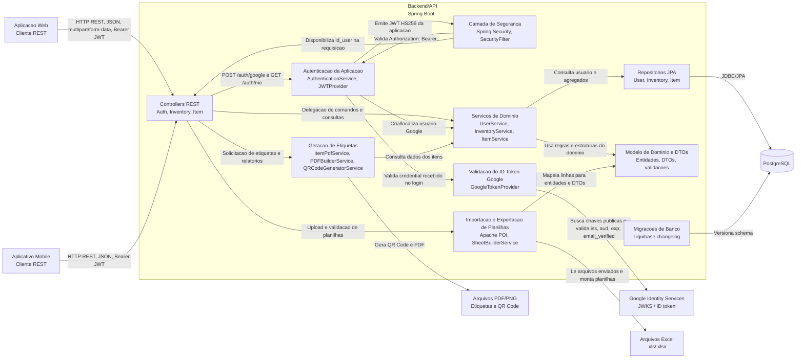
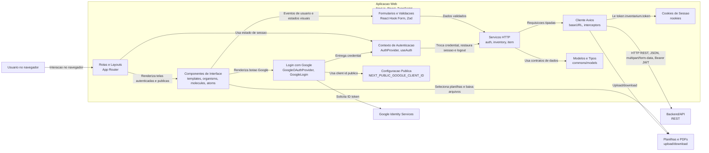
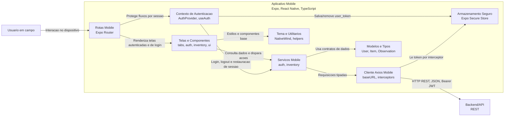

# C4 - Componentes

Este documento registra o nivel 3 do modelo C4 para o Inventarium. A visao de componentes complementa o diagrama de containers, detalhando os principais modulos internos dos containers Backend/API, Aplicacao Web e Aplicativo Mobile.

O objetivo e mostrar responsabilidades arquiteturais, dependencias e formas de comunicacao relevantes, sem representar cada classe, arquivo ou componente visual isoladamente.

## Escopo

Foram documentados os containers que concentram mais responsabilidades internas:

- Backend/API
- Aplicacao Web
- Aplicativo Mobile

O Banco de Dados PostgreSQL permanece documentado no nivel de containers, pois sua estrutura interna deve ser detalhada na documentacao de modelagem de dados.

## Backend/API

O Backend/API centraliza validacao de login com Google, emissao do JWT da aplicacao, regras de negocio, persistencia, importacao e exportacao de dados patrimoniais e geracao de etiquetas.

### Diagrama de Componentes do Backend/API

### Componentes do Backend/API

| Componente | Responsabilidade | Principais dependencias | Interfaces e comunicacao |
| --- | --- | --- | --- |
| Controllers REST | Expor endpoints de login com Google, usuario autenticado, inventarios, itens, upload de planilhas, exportacao e etiquetas. | Servicos de dominio, autenticacao, processamento de arquivos e geracao de etiquetas. | HTTP REST com JSON, `multipart/form-data`, downloads de arquivos e header `Authorization: Bearer`. |
| Camada de Seguranca | Configurar autorizacao das rotas e validar tokens enviados pelos clientes. | Spring Security, `SecurityFilter`, `JWTProvider`. | Filtro HTTP que interpreta `Authorization: Bearer` e injeta informacoes do usuario na requisicao. |
| Validacao do ID Token Google | Validar o ID token emitido pelo Google no login. | Google Identity Services, JWKS do Google, `GOOGLE_OAUTH_CLIENT_ID`. | Decodificacao RS256 via JWKS; validacao de `iss`, `aud`, expiracao e `email_verified`. |
| Autenticacao da Aplicacao | Trocar o ID token valido do Google por um JWT proprio do Inventarium e recuperar o usuario autenticado. | `GoogleTokenProvider`, `UserService`, `JWTProvider`, `SECURITY_TOKEN_SECRET`. | `POST /auth/google`, `GET /auth/me`, JWT HS256 com validade de 24h e Bearer token nas rotas protegidas. |
| Servicos de Dominio | Aplicar regras de negocio de usuarios, inventarios, itens e observacoes. | Repositorios JPA, modelos de dominio e DTOs. | Chamadas internas Java a partir dos controllers e outros servicos. |
| Importacao e Exportacao de Planilhas | Validar, ler e transformar planilhas patrimoniais; montar planilhas de saida. | Apache POI, DTOs, entidades de dominio, servicos de inventario/itens. | Entrada `.xls`/`.xlsx` via upload e saida `.xlsx` por download. |
| Geracao de Etiquetas | Gerar QR Codes e PDFs de etiquetas dos itens patrimoniais. | ZXing, OpenPDF, servicos de item/inventario. | Arquivos PDF/PNG retornados ao cliente para download/impressao. |
| Repositorios JPA | Isolar acesso a dados de usuarios, inventarios e itens. | Spring Data JPA, entidades de dominio. | Chamadas Java internas e conexao JDBC/PostgreSQL. |
| Modelo de Dominio e DTOs | Representar entidades persistidas, objetos de transferencia e respostas de validacao. | JPA, Bean Validation e regras de conversao entre entidade e DTO. | Objetos Java usados internamente e serializados como JSON pelos controllers. |
| Migracoes de Banco | Versionar criacao e evolucao do schema relacional. | Liquibase e changelogs XML. | Execucao automatica no ciclo de inicializacao do backend. |

## Aplicacao Web

A Aplicacao Web concentra a experiencia de navegacao pelo navegador para login com Google, dashboard, inventarios, itens, upload de planilhas, exportacao de relatorios e geracao de etiquetas.

### Diagrama de Componentes da Aplicacao Web

### Componentes da Aplicacao Web

| Componente | Responsabilidade | Principais dependencias | Interfaces e comunicacao |
| --- | --- | --- | --- |
| Rotas e Layouts | Organizar telas publicas, autenticadas, dashboard e inventarios. | Next.js App Router, componentes de interface e contexto de autenticacao. | Navegacao client-side/server-side do Next.js e renderizacao React. |
| Contexto de Autenticacao | Manter usuario autenticado, restaurar sessao, trocar credential do Google pelo JWT da aplicacao e realizar logout. | Servicos de auth, `nookies`, `next/navigation`, toast. | Context API, cookie `inventarium.token` e chamadas REST ao backend. |
| Login com Google | Renderizar o botao oficial do Google e receber o ID token da conta autenticada. | `@react-oauth/google`, `NEXT_PUBLIC_GOOGLE_CLIENT_ID`, Google Identity Services. | OAuth 2.0 / OpenID Connect no navegador; `credential` enviado ao AuthProvider. |
| Componentes de Interface | Compor formularios, modais, tabelas, cabecalhos, layouts autenticados e elementos reutilizaveis. | React, Tailwind CSS, Framer Motion, lucide/react-icons quando aplicavel. | Props React, eventos de UI e composicao entre componentes. |
| Formularios e Validacoes | Coletar dados de inventario, upload e demais interacoes com entrada do usuario; validar entradas antes da chamada HTTP. | React Hook Form, Zod, validadores comuns. | Objetos de formulario enviados para os servicos HTTP. |
| Servicos HTTP | Encapsular chamadas para login com Google, usuario autenticado, inventarios e itens. | Cliente Axios, modelos/tipos de dominio. | Funcoes TypeScript que consomem endpoints REST do backend. |
| Cliente Axios | Centralizar URL base da API, cabecalhos e interceptors de request/response. | Axios e `nookies`. | HTTP para `http://localhost:8080`, JSON, `multipart/form-data`, download de arquivos e Bearer JWT. |
| Modelos e Tipos | Padronizar contratos usados pela UI e pelos servicos. | TypeScript. | Tipos importados por servicos, formularios e componentes. |
| Cookies de Sessao | Persistir o token JWT usado pela web. | `nookies`. | Cookie `inventarium.token`, lido pelo interceptor do Axios. |

## Aplicativo Mobile

O Aplicativo Mobile apoia o uso em campo, com consulta de inventarios e visualizacao de itens patrimoniais em dispositivo movel. A estrutura mobile possui armazenamento seguro para o JWT da aplicacao, mas o fluxo de login com Google esta documentado de forma completa na Aplicacao Web e no Backend/API.

### Diagrama de Componentes do Aplicativo Mobile

### Componentes do Aplicativo Mobile

| Componente | Responsabilidade | Principais dependencias | Interfaces e comunicacao |
| --- | --- | --- | --- |
| Rotas Mobile | Organizar grupos de telas de autenticacao, abas principais, home, configuracao e detalhe de inventario. | Expo Router e contexto de autenticacao. | Navegacao mobile por rotas do Expo Router. |
| Contexto de Autenticacao | Controlar usuario autenticado, restaurar token salvo, realizar login e logout. | Servicos de auth, Axios, Expo Secure Store, Expo Router. | Context API, `user_token` no Secure Store e redirecionamentos mobile. |
| Telas e Componentes | Exibir home, configuracoes, login, inventarios, itens e componentes reutilizaveis de UI. | React Native, NativeWind, componentes comuns e contexto de autenticacao. | Props React Native, eventos de toque e navegacao. |
| Servicos Mobile | Encapsular chamadas de autenticacao e inventario usadas pelo app. | Cliente Axios Mobile e modelos/tipos. | Funcoes TypeScript que consomem endpoints REST do backend. |
| Cliente Axios Mobile | Centralizar URL base local, cabecalhos e interceptors de token/erro. | Axios, Expo Secure Store, Expo Router. | HTTP para `http://10.0.2.2:8080`, JSON e Bearer JWT. |
| Armazenamento Seguro | Persistir o token JWT no dispositivo. | Expo Secure Store. | Chave `user_token`, consultada pelo AuthProvider e pelo interceptor HTTP. |
| Modelos e Tipos | Representar dados de usuario, inventario, item e observacao no cliente mobile. | TypeScript. | Tipos importados por telas, contexto e servicos. |
| Tema e Utilitarios | Padronizar estilos, classes e helpers compartilhados do app. | NativeWind, Tailwind, utilitarios locais. | Classes/funcao utilitaria consumidas por componentes de UI. |

## Comunicacao Entre Componentes

| Fluxo | Componentes envolvidos | Forma de comunicacao |
| --- | --- | --- |
| Login web com Google | GoogleLogin, AuthProvider web, servico `auth`, Axios web, AuthController, AuthenticationService, GoogleTokenProvider, UserService, UserRepository | Google Identity Services emite ID token; web envia `credential` para `POST /auth/google`; backend valida o token no Google e retorna o JWT da aplicacao; web persiste no cookie `inventarium.token`. |
| Requisicao autenticada | Cliente web/mobile, interceptor Axios, SecurityFilter, JWTProvider, controller solicitado | Header `Authorization: Bearer`; validacao do token antes do controller. |
| Criacao e manutencao de inventarios | UI web/mobile, servico `inventory`, InventoryController, InventoryService, InventoryRepository | JSON via HTTP REST; regras de usuario e unicidade aplicadas no backend. |
| Consulta de itens | UI web/mobile, servico de inventario/item, InventoryController/ItemController, ItemService, ItemRepository | HTTP REST com parametros de consulta e resposta JSON paginada/listada. |
| Importacao de planilha | UI web, servico de inventario, Axios web, InventoryController, Apache POI, InventoryService | Upload `multipart/form-data`; leitura `.xls`/`.xlsx`; validacao e persistencia de itens. |
| Exportacao de planilha | UI web, servico de item/inventario, ItemController, SheetBuilderService | Download `.xlsx`. |
| Geracao de etiquetas | UI web, ItemController, ItemPdfService, PDFBuilderService, QRCodeGeneratorService | Requisicao REST e retorno de PDF gerado com QR Code. |

## Tecnologias e Padroes

| Area | Tecnologias ou padroes utilizados |
| --- | --- |
| Backend/API | Spring Boot 3, Java 21, Spring Web, Spring Security, OAuth2 Resource Server, JWT, Spring Data JPA, Bean Validation, Liquibase. |
| Persistencia | PostgreSQL 15, JPA repositories e migracoes XML versionadas por Liquibase. |
| Arquivos | Apache POI para Excel, OpenPDF para PDF e ZXing para QR Code. |
| Web | Next.js 15, React 19, TypeScript, App Router, Context API, Axios, `@react-oauth/google`, React Hook Form, Zod, Tailwind CSS. |
| Mobile | Expo 54, React Native 0.81, TypeScript, Expo Router, Context API, Axios, Expo Secure Store, NativeWind. |
| Comunicacao | HTTP REST, JSON, `multipart/form-data`, downloads de arquivo, OAuth 2.0 / OpenID Connect, JWKS e Bearer JWT. |

## Dependencias Externas de Autenticacao

O login depende do Google Identity Services, de um OAuth Client ID configurado no Google Cloud Console e das variaveis `GOOGLE_OAUTH_CLIENT_ID`, `NEXT_PUBLIC_GOOGLE_CLIENT_ID`, `GOOGLE_ALLOWED_DOMAINS` e `SECURITY_TOKEN_SECRET`.

O ID token do Google e usado somente no `POST /auth/google`. Depois da validacao, o backend emite um JWT proprio do Inventarium, e esse JWT passa a ser o unico token enviado nas rotas protegidas. O backend valida o ID token com as chaves JWKS do Google, confere `iss`, `aud`, expiracao e `email_verified`, e aplica a allowlist de dominios na criacao de usuarios.

Em producao, a origem publica do frontend deve estar autorizada no Google Cloud Console e deve usar HTTPS. Como o Next.js injeta `NEXT_PUBLIC_GOOGLE_CLIENT_ID` em tempo de build, qualquer alteracao desse Client ID exige rebuild da imagem do frontend.

## Observacoes de Revisao

Este documento deve ser revisado por outro integrante no pull request antes do merge na `main`. A revisao deve confirmar se os componentes continuam coerentes com a implementacao atual, se o Aplicativo Mobile permanece no escopo da entrega e se novos modulos internos foram adicionados desde a ultima atualizacao.

## Historico

| Versao | Data | Descricao |
| --- | --- | --- |
| 1.0 | 2026-09-08 | Criacao do diagrama C4 nivel 3 com componentes dos containers Backend/API, Aplicacao Web e Aplicativo Mobile. |
| 1.1 | 2026-09-08 | Atualizacao dos componentes para refletir login com Google, validacao de ID token e JWT proprio da aplicacao. |
