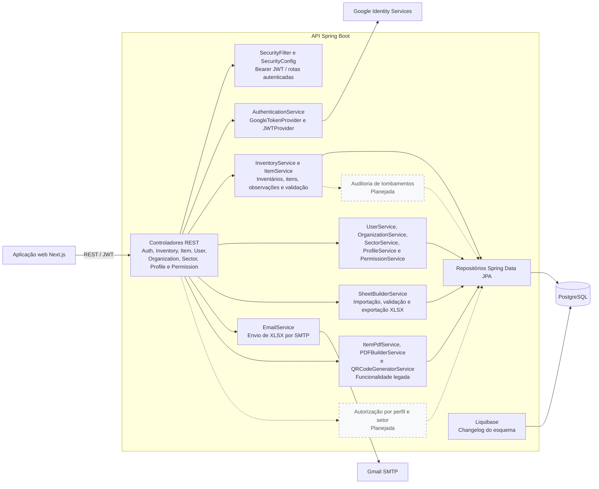

# C4 — Componentes da API

## Escopo deste diagrama

O nível de componentes detalha o container de backend, onde estão as regras de negócio e as integrações sensíveis. A aplicação web é apresentada apenas como cliente da API; sua composição de páginas, contextos e componentes visuais não substitui as regras descritas aqui.

As caixas com borda tracejada representam capacidades planejadas. Elas são exibidas para deixar clara a direção arquitetural, mas não devem ser lidas como componentes já presentes no código.

```mermaid
flowchart LR
    web["Aplicação web Next.js"]

    subgraph api["API Spring Boot"]
        controllers["Controladores REST\nAuth, Inventory, Item, User,\nOrganization, Sector, Profile e Permission"]
        filter["SecurityFilter e SecurityConfig\nBearer JWT / rotas autenticadas"]
        auth["AuthenticationService\nGoogleTokenProvider e JWTProvider"]
        patrimonio["InventoryService e ItemService\nInventários, itens, observações e validação"]
        estrutura["UserService, OrganizationService,\nSectorService, ProfileService e PermissionService"]
        planilhas["SheetBuilderService\nImportação, validação e exportação XLSX"]
        entrega["EmailService\nEnvio de XLSX por SMTP"]
        legado["ItemPdfService, PDFBuilderService\ne QRCodeGeneratorService\nFuncionalidade legada"]
        repos["Repositórios Spring Data JPA"]
        liquibase["Liquibase\nChangelog do esquema"]
        autorizacao["Autorização por perfil e setor\nPlanejada"]
        auditoria["Auditoria de tombamentos\nPlanejada"]
    end

    banco[("PostgreSQL")]
    google["Google Identity Services"]
    smtp["Gmail SMTP"]

    web -->|"REST / JWT"| controllers
    controllers --> filter
    controllers --> auth
    controllers --> patrimonio
    controllers --> estrutura
    controllers --> planilhas
    controllers --> entrega
    controllers --> legado
    auth --> google
    patrimonio --> repos
    estrutura --> repos
    planilhas --> repos
    entrega --> smtp
    legado --> repos
    repos --> banco
    liquibase --> banco
    controllers -.-> autorizacao
    patrimonio -.-> auditoria
    autorizacao -.-> repos
    auditoria -.-> repos

    classDef planned stroke-dasharray: 5 5,fill:#f8f9fa,color:#555;
    class autorizacao,auditoria planned;
```

## Componentes implementados

| Componente | Responsabilidade | Evidência no projeto |
| --- | --- | --- |
| Controladores REST | Traduzem requisições HTTP em operações de aplicação. Há controladores para login, inventários, itens, usuários e a estrutura de organizações, setores, perfis e permissões. | Pacote `backend/src/main/java/clp/inventory/controller`. |
| `SecurityConfig` e `SecurityFilter` | Desabilitam sessão e CSRF para a API stateless, liberam o login Google, a saúde do Actuator e o encaminhamento de erros; validam o Bearer JWT e definem o usuário autenticado no contexto do Spring Security. | Pacote `security`. As demais rotas de negócio requerem autenticação. |
| Autenticação | `AuthenticationService` coordena a validação do ID token Google e a emissão do JWT próprio; os providers isolam cada protocolo. | Pacotes `service/auth` e `providers`. |
| Serviços patrimoniais | `InventoryService` e `ItemService` executam criação, edição, remoção, importação, consulta, observações e validação de itens. Inventários pertencem a um usuário no modelo atual. | Pacote `service` e entidades `Inventory`, `Item` e `Observation`. |
| Serviços da estrutura organizacional | Mantêm organização, setor, perfil, permissão e o vínculo de setor/perfil ao usuário. Setor pode ter setor pai; perfil possui permissões em relação muitos-para-muitos. | `OrganizationService`, `SectorService`, `ProfileService`, `PermissionService` e `UserService`. |
| Processamento de planilhas | Monta XLSX para exportação e e-mail, importa itens e valida planilhas enviadas. | `SheetBuilderService` e rotas de `InventoryController`/`ItemController`. |
| Entrega por e-mail | Envia planilha gerada como anexo via `JavaMailSender`. | `EmailService` e `POST /item/send-email-sheet`. |
| Persistência e migrações | Repositórios JPA abstraem as consultas; Liquibase aplica o changelog XML na partida. | Pacotes `repository` e `resources/db/changelog`. |
| Etiquetas e QR Code legados | Gera PDF de etiquetas e mantém um QR Code no item. | Serviços de PDF/QR e rotas `/item/pdf` e `/item/all-items-pdf`. A existência no código não o torna escopo ativo. |

## Segurança e autorização: realidade atual

O controle de entrada funciona assim: o filtro valida o JWT, usa o identificador do usuário como principal e exige autenticação para as rotas protegidas. Ele cria esse principal com uma coleção vazia de authorities. Consequentemente, **não há, hoje, decisão de acesso por perfil, permissão, organização ou setor**. Por exemplo, os controladores de organização, setor, perfil e permissão indicam em seus próprios comentários que qualquer usuário autenticado ainda pode gerenciá-los.

O componente tracejado de autorização deve evoluir para consultar o perfil e suas permissões, validar o escopo de organização/setor antes das operações patrimoniais e proteger também a atribuição de perfis e setores. Até essa mudança, a documentação não deve afirmar que os perfis “administrador da instituição”, “administrador do setor” e “operador” já são barreiras de segurança efetivas.

## Auditoria: estado atual e desenho necessário

Há dados temporais pontuais no modelo (`createdAt`, `updatedAt` e `validatedAt`) e observações textuais ligadas ao item. Isso não é auditoria completa: a validação não registra, em uma entidade de eventos, qual usuário a executou, qual era o estado anterior nem o motivo da alteração.

Para cumprir o requisito de auditoria, o componente planejado deve persistir um evento imutável contendo ao menos identificador do item, inventário, usuário responsável, data/hora, tipo de ação, estado anterior, estado resultante e observação/motivo quando aplicável. A gravação deve ocorrer na mesma operação transacional que altera o patrimônio e as consultas devem respeitar a futura fronteira de setor.
