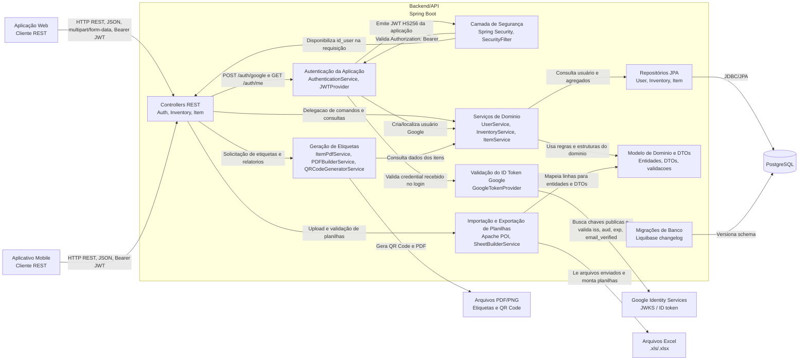
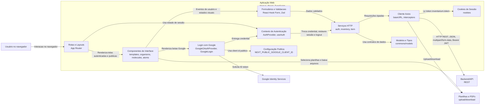
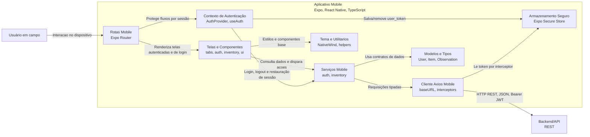

# C4 - Componentes

Este documento registra o nível 3 do modelo C4 para o Inventarium. A visão de componentes complementa o diagrama de containers, detalhando os principais módulos internos dos containers Backend/API, Aplicação Web e Aplicativo Mobile.

> Nota: o aplicativo mobile foi removido do repositório e deixou de fazer parte do escopo ativo. Este documento ainda contem referencias historicas ao mobile e deve ser revisado em uma atualização dedicada da documentação arquitetural.

O objetivo e mostrar responsabilidades arquiteturais, dependências e formas de comunicação relevantes, sem representar cada classe, arquivo ou componente visual isoladamente.

## Escopo

Foram documentados os containers que concentram mais responsabilidades internas:

- Backend/API
- Aplicação Web
- Aplicativo Mobile

O Banco de Dados PostgreSQL permanece documentado no nível de containers, pois sua estrutura interna deve ser detalhada na documentação de modelagem de dados.

## Backend/API

O Backend/API centraliza validação de login com Google, emissão do JWT da aplicação, regras de negocio, persistência, importação e exportação de dados patrimoniais e geração de etiquetas.

### Diagrama de Componentes do Backend/API

```mermaid
flowchart LR
    web["Aplicação Web<br/>Cliente REST"]
    mobile["Aplicativo Mobile<br/>Cliente REST"]

    subgraph backend["Backend/API<br/>Spring Boot"]
        controllers["Controllers REST<br/>Auth, Inventory, Item"]
        security["Camada de Segurança<br/>Spring Security, SecurityFilter"]
        googleAuth["Validação do ID Token Google<br/>GoogleTokenProvider"]
        auth["Autenticação da Aplicação<br/>AuthenticationService, JWTProvider"]
        domainServices["Serviços de Dominio<br/>UserService, InventoryService, ItemService"]
        fileProcessing["Importação e Exportação de Planilhas<br/>Apache POI, SheetBuilderService"]
        labelGeneration["Geração de Etiquetas<br/>ItemPdfService, PDFBuilderService, QRCodeGeneratorService"]
        repositories["Repositórios JPA<br/>User, Inventory, Item"]
        model["Modelo de Dominio e DTOs<br/>Entidades, DTOs, validacoes"]
        migrations["Migrações de Banco<br/>Liquibase changelog"]
    end

    db[("PostgreSQL")]
    google["Google Identity Services<br/>JWKS / ID token"]
    excel["Arquivos Excel<br/>.xls/.xlsx"]
    pdf["Arquivos PDF/PNG<br/>Etiquetas e QR Code"]

    web -->|"HTTP REST, JSON, multipart/form-data, Bearer JWT"| controllers
    mobile -->|"HTTP REST, JSON, Bearer JWT"| controllers

    controllers -->|"Delegacao de comandos e consultas"| domainServices
    controllers -->|"POST /auth/google e GET /auth/me"| auth
    controllers -->|"Upload e validação de planilhas"| fileProcessing
    controllers -->|"Solicitação de etiquetas e relatorios"| labelGeneration

    security -->|"Valida Authorization: Bearer"| auth
    security -->|"Disponibiliza id_user na requisição"| controllers
    auth -->|"Valida credential recebido no login"| googleAuth
    googleAuth -->|"Busca chaves publicas e valida iss, aud, exp, email_verified"| google
    auth -->|"Cria/localiza usuário Google"| domainServices
    auth -->|"Emite JWT HS256 da aplicação"| security
    domainServices -->|"Consulta usuário e agregados"| repositories
    domainServices -->|"Usa regras e estruturas do dominio"| model
    fileProcessing -->|"Le arquivos enviados e monta planilhas"| excel
    fileProcessing -->|"Mapeia linhas para entidades e DTOs"| model
    labelGeneration -->|"Gera QR Code e PDF"| pdf
    labelGeneration -->|"Consulta dados dos itens"| domainServices
    repositories -->|"JDBC/JPA"| db
    migrations -->|"Versiona schema"| db
```

### Componentes do Backend/API

| Componente | Responsabilidade | Principais dependências | Interfaces e comunicação |
| --- | --- | --- | --- |
| Controllers REST | Expor endpoints de login com Google, usuário autenticado, inventários, itens, upload de planilhas, exportação e etiquetas. | Serviços de dominio, autenticação, processamento de arquivos e geração de etiquetas. | HTTP REST com JSON, `multipart/form-data`, downloads de arquivos e header `Authorization: Bearer`. |
| Camada de Segurança | Configurar autorização das rotas e validar tokens enviados pelos clientes. | Spring Security, `SecurityFilter`, `JWTProvider`. | Filtro HTTP que interpreta `Authorization: Bearer` e injeta informações do usuário na requisição. |
| Validação do ID Token Google | Validar o ID token emitido pelo Google no login. | Google Identity Services, JWKS do Google, `GOOGLE_OAUTH_CLIENT_ID`. | Decodificacao RS256 via JWKS; validação de `iss`, `aud`, expiração e `email_verified`. |
| Autenticação da Aplicação | Trocar o ID token valido do Google por um JWT próprio do Inventarium e recuperar o usuário autenticado. | `GoogleTokenProvider`, `UserService`, `JWTProvider`, `SECURITY_TOKEN_SECRET`. | `POST /auth/google`, `GET /auth/me`, JWT HS256 com validade de 24h e Bearer token nas rotas protegidas. |
| Serviços de Dominio | Aplicar regras de negocio de usuários, inventários, itens e observações. | Repositórios JPA, modelos de dominio e DTOs. | Chamadas internas Java a partir dos controllers e outros serviços. |
| Importação e Exportação de Planilhas | Validar, ler e transformar planilhas patrimoniais; montar planilhas de saida. | Apache POI, DTOs, entidades de dominio, serviços de inventário/itens. | Entrada `.xls`/`.xlsx` via upload e saida `.xlsx` por download. |
| Geração de Etiquetas | Gerar QR Codes e PDFs de etiquetas dos itens patrimoniais. | ZXing, OpenPDF, serviços de item/inventário. | Arquivos PDF/PNG retornados ao cliente para download/impressao. |
| Repositórios JPA | Isolar acesso a dados de usuários, inventários e itens. | Spring Data JPA, entidades de dominio. | Chamadas Java internas e conexao JDBC/PostgreSQL. |
| Modelo de Dominio e DTOs | Representar entidades persistidas, objetos de transferencia e respostas de validação. | JPA, Bean Validation e regras de conversao entre entidade e DTO. | Objetos Java usados internamente e serializados como JSON pelos controllers. |
| Migrações de Banco | Versionar criação e evolucao do schema relacional. | Liquibase e changelogs XML. | Execução automatica no ciclo de inicialização do backend. |

## Aplicação Web

A Aplicação Web concentra a experiencia de navegação pelo navegador para login com Google, dashboard, inventários, itens, upload de planilhas, exportação de relatórios e geração de etiquetas.

### Diagrama de Componentes da Aplicação Web

```mermaid
flowchart LR
    usuário["Usuário no navegador"]

    subgraph web["Aplicação Web<br/>Next.js, React, TypeScript"]
        routes["Rotas e Layouts<br/>App Router"]
        authContext["Contexto de Autenticação<br/>AuthProvider, useAuth"]
        googleLogin["Login com Google<br/>GoogleOAuthProvider, GoogleLogin"]
        ui["Componentes de Interface<br/>templates, organisms, molecules, atoms"]
        forms["Formulários e Validacoes<br/>React Hook Form, Zod"]
        services["Serviços HTTP<br/>auth, inventory, item"]
        apiClient["Cliente Axios<br/>baseURL, interceptors"]
        models["Modelos e Tipos<br/>commons/models"]
        cookies["Cookies de Sessão<br/>nookies"]
        env["Configuração Publica<br/>NEXT_PUBLIC_GOOGLE_CLIENT_ID"]
    end

    google["Google Identity Services"]
    backend["Backend/API<br/>REST"]
    files["Planilhas e PDFs<br/>upload/download"]

    usuário -->|"Interacao no navegador"| routes
    routes -->|"Renderiza telas autenticadas e publicas"| ui
    routes -->|"Usa estado de sessão"| authContext
    ui -->|"Renderiza botao Google"| googleLogin
    googleLogin -->|"Solicita ID token"| google
    googleLogin -->|"Entrega credential"| authContext
    googleLogin -->|"Usa client id publico"| env
    ui -->|"Eventos de usuário e estados visuais"| forms
    forms -->|"Dados validados"| services
    authContext -->|"Troca credential, restaura sessão e logout"| services
    services -->|"Requisições tipadas"| apiClient
    services -->|"Usa contratos de dados"| models
    apiClient -->|"Le token inventarium.token"| cookies
    apiClient -->|"HTTP REST, JSON, multipart/form-data, Bearer JWT"| backend
    ui -->|"Seleciona planilhas e baixa arquivos"| files
    apiClient -->|"Upload/download"| files
```

### Componentes da Aplicação Web

| Componente | Responsabilidade | Principais dependências | Interfaces e comunicação |
| --- | --- | --- | --- |
| Rotas e Layouts | Organizar telas públicas, autenticadas, dashboard e inventários. | Next.js App Router, componentes de interface e contexto de autenticação. | Navegação client-side/server-side do Next.js e renderizacao React. |
| Contexto de Autenticação | Manter usuário autenticado, restaurar sessão, trocar credential do Google pelo JWT da aplicação e realizar logout. | Serviços de auth, `nookies`, `next/navigation`, toast. | Context API, cookie `inventarium.token` e chamadas REST ao backend. |
| Login com Google | Renderizar o botao oficial do Google e receber o ID token da conta autenticada. | `@react-oauth/google`, `NEXT_PUBLIC_GOOGLE_CLIENT_ID`, Google Identity Services. | OAuth 2.0 / OpenID Connect no navegador; `credential` enviado ao AuthProvider. |
| Componentes de Interface | Compor formulários, modais, tabelas, cabeçalhos, layouts autenticados e elementos reutilizáveis. | React, Tailwind CSS, Framer Motion, lucide/react-icons quando aplicável. | Props React, eventos de UI e composição entre componentes. |
| Formulários e Validacoes | Coletar dados de inventário, upload e demais interacoes com entrada do usuário; validar entradas antes da chamada HTTP. | React Hook Form, Zod, validadores comuns. | Objetos de formulario enviados para os serviços HTTP. |
| Serviços HTTP | Encapsular chamadas para login com Google, usuário autenticado, inventários e itens. | Cliente Axios, modelos/tipos de dominio. | Funcoes TypeScript que consomem endpoints REST do backend. |
| Cliente Axios | Centralizar URL base da API, cabeçalhos e interceptors de request/response. | Axios e `nookies`. | HTTP para `http://localhost:8080`, JSON, `multipart/form-data`, download de arquivos e Bearer JWT. |
| Modelos e Tipos | Padronizar contratos usados pela UI e pelos serviços. | TypeScript. | Tipos importados por serviços, formulários e componentes. |
| Cookies de Sessão | Persistir o token JWT usado pela web. | `nookies`. | Cookie `inventarium.token`, lido pelo interceptor do Axios. |

## Aplicativo Mobile

O Aplicativo Mobile apoia o uso em campo, com consulta de inventários e visualização de itens patrimoniais em dispositivo móvel. A estrutura mobile possui armazenamento seguro para o JWT da aplicação, mas o fluxo de login com Google está documentado de forma completa na Aplicação Web e no Backend/API.

### Diagrama de Componentes do Aplicativo Mobile

```mermaid
flowchart LR
    usuário["Usuário em campo"]

    subgraph mobile["Aplicativo Mobile<br/>Expo, React Native, TypeScript"]
        routes["Rotas Mobile<br/>Expo Router"]
        authContext["Contexto de Autenticação<br/>AuthProvider, useAuth"]
        screens["Telas e Componentes<br/>tabs, auth, inventory, ui"]
        services["Serviços Mobile<br/>auth, inventory"]
        apiClient["Cliente Axios Mobile<br/>baseURL, interceptors"]
        secureStore["Armazenamento Seguro<br/>Expo Secure Store"]
        models["Modelos e Tipos<br/>User, Item, Observation"]
        theme["Tema e Utilitarios<br/>NativeWind, helpers"]
    end

    backend["Backend/API<br/>REST"]

    usuário -->|"Interacao no dispositivo"| routes
    routes -->|"Renderiza telas autenticadas e de login"| screens
    routes -->|"Protege fluxos por sessão"| authContext
    screens -->|"Consulta dados e dispara acoes"| services
    authContext -->|"Login, logout e restauração de sessão"| services
    services -->|"Requisições tipadas"| apiClient
    services -->|"Usa contratos de dados"| models
    screens -->|"Estilos e componentes base"| theme
    authContext -->|"Salva/remove user_token"| secureStore
    apiClient -->|"Le token por interceptor"| secureStore
    apiClient -->|"HTTP REST, JSON, Bearer JWT"| backend
```

### Componentes do Aplicativo Mobile

| Componente | Responsabilidade | Principais dependências | Interfaces e comunicação |
| --- | --- | --- | --- |
| Rotas Mobile | Organizar grupos de telas de autenticação, abas principais, home, configuração e detalhe de inventário. | Expo Router e contexto de autenticação. | Navegação mobile por rotas do Expo Router. |
| Contexto de Autenticação | Controlar usuário autenticado, restaurar token salvo, realizar login e logout. | Serviços de auth, Axios, Expo Secure Store, Expo Router. | Context API, `user_token` no Secure Store e redirecionamentos mobile. |
| Telas e Componentes | Exibir home, configuracoes, login, inventários, itens e componentes reutilizáveis de UI. | React Native, NativeWind, componentes comuns e contexto de autenticação. | Props React Native, eventos de toque e navegação. |
| Serviços Mobile | Encapsular chamadas de autenticação e inventário usadas pelo app. | Cliente Axios Mobile e modelos/tipos. | Funcoes TypeScript que consomem endpoints REST do backend. |
| Cliente Axios Mobile | Centralizar URL base local, cabeçalhos e interceptors de token/erro. | Axios, Expo Secure Store, Expo Router. | HTTP para `http://10.0.2.2:8080`, JSON e Bearer JWT. |
| Armazenamento Seguro | Persistir o token JWT no dispositivo. | Expo Secure Store. | Chave `user_token`, consultada pelo AuthProvider e pelo interceptor HTTP. |
| Modelos e Tipos | Representar dados de usuário, inventário, item e observação no cliente mobile. | TypeScript. | Tipos importados por telas, contexto e serviços. |
| Tema e Utilitarios | Padronizar estilos, classes e helpers compartilhados do app. | NativeWind, Tailwind, utilitarios locais. | Classes/função utilitaria consumidas por componentes de UI. |

## Comunicacao Entre Componentes

| Fluxo | Componentes envolvidos | Forma de comunicação |
| --- | --- | --- |
| Login web com Google | GoogleLogin, AuthProvider web, servico `auth`, Axios web, AuthController, AuthenticationService, GoogleTokenProvider, UserService, UserRepository | Google Identity Services emite ID token; web envia `credential` para `POST /auth/google`; backend valida o token no Google e retorna o JWT da aplicação; web persiste no cookie `inventarium.token`. |
| Requisição autenticada | Cliente web/mobile, interceptor Axios, SecurityFilter, JWTProvider, controller solicitado | Header `Authorization: Bearer`; validação do token antes do controller. |
| Criação e manutenção de inventários | UI web/mobile, servico `inventory`, InventoryController, InventoryService, InventoryRepository | JSON via HTTP REST; regras de usuário e unicidade aplicadas no backend. |
| Consulta de itens | UI web/mobile, servico de inventário/item, InventoryController/ItemController, ItemService, ItemRepository | HTTP REST com parametros de consulta e resposta JSON paginada/listada. |
| Importação de planilha | UI web, servico de inventário, Axios web, InventoryController, Apache POI, InventoryService | Upload `multipart/form-data`; leitura `.xls`/`.xlsx`; validação e persistência de itens. |
| Exportação de planilha | UI web, servico de item/inventário, ItemController, SheetBuilderService | Download `.xlsx`. |
| Geração de etiquetas | UI web, ItemController, ItemPdfService, PDFBuilderService, QRCodeGeneratorService | Requisição REST e retorno de PDF gerado com QR Code. |

## Tecnologias e Padroes

| Area | Tecnologias ou padroes utilizados |
| --- | --- |
| Backend/API | Spring Boot 3, Java 21, Spring Web, Spring Security, OAuth2 Resource Server, JWT, Spring Data JPA, Bean Validation, Liquibase. |
| Persistência | PostgreSQL 15, JPA repositories e migrações XML versionadas por Liquibase. |
| Arquivos | Apache POI para Excel, OpenPDF para PDF e ZXing para QR Code. |
| Web | Next.js 15, React 19, TypeScript, App Router, Context API, Axios, `@react-oauth/google`, React Hook Form, Zod, Tailwind CSS. |
| Mobile | Expo 54, React Native 0.81, TypeScript, Expo Router, Context API, Axios, Expo Secure Store, NativeWind. |
| Comunicacao | HTTP REST, JSON, `multipart/form-data`, downloads de arquivo, OAuth 2.0 / OpenID Connect, JWKS e Bearer JWT. |

## Dependências Externas de Autenticação

O login depende do Google Identity Services, de um OAuth Client ID configurado no Google Cloud Console e das variáveis `GOOGLE_OAUTH_CLIENT_ID`, `NEXT_PUBLIC_GOOGLE_CLIENT_ID`, `GOOGLE_ALLOWED_DOMAINS` e `SECURITY_TOKEN_SECRET`.

O ID token do Google e usado somente no `POST /auth/google`. Depois da validação, o backend emite um JWT próprio do Inventarium, e esse JWT passa a ser o único token enviado nas rotas protegidas. O backend valida o ID token com as chaves JWKS do Google, confere `iss`, `aud`, expiração e `email_verified`, e aplica a allowlist de dominios na criação de usuários.

Em produção, a origem pública do frontend deve estar autorizada no Google Cloud Console e deve usar HTTPS. Como o Next.js injeta `NEXT_PUBLIC_GOOGLE_CLIENT_ID` em tempo de build, qualquer alteracao desse Client ID exige rebuild da imagem do frontend.

## Observações de Revisão

Este documento deve ser revisado por outro integrante no pull request antes do merge na `main`. A revisão deve confirmar se os componentes continuam coerentes com a implementação atual, se o Aplicativo Mobile permanece no escopo da entrega e se novos módulos internos foram adicionados desde a última atualização.

## Histórico

| Versão | Data | Descrição |
| --- | --- | --- |
| 1.0 | 2026-09-08 | Criação do diagrama C4 nível 3 com componentes dos containers Backend/API, Aplicação Web e Aplicativo Mobile. |
| 1.1 | 2026-09-08 | Atualização dos componentes para refletir login com Google, validação de ID token e JWT próprio da aplicação. |
