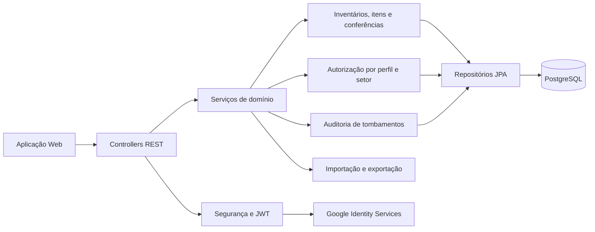

# C4 - Componentes

Este documento descreve os componentes principais da aplicação web e da API. Ele representa o produto alvo; autorização setorial e auditoria permanecem parcialmente planejadas.

```mermaid
flowchart LR
    web["Aplicação Web"] --> controllers["Controllers REST"]
    controllers --> security["Segurança e JWT"]
    controllers --> services["Serviços de domínio"]
    services --> access["Autorização por perfil e setor"]
    services --> inventory["Inventários, itens e conferências"]
    services --> audit["Auditoria de tombamentos"]
    services --> spreadsheet["Importação e exportação"]
    inventory --> repos["Repositórios JPA"]
    access --> repos
    audit --> repos
    repos --> db[("PostgreSQL")]
    security --> google["Google Identity Services"]
```

| Componente | Responsabilidade |
| --- | --- |
| Segurança e JWT | Validar ID token Google, emitir JWT e proteger rotas. |
| Serviços de domínio | Aplicar regras de inventários, itens, usuários e setores. |
| Autorização por perfil e setor | Garantir que administradores institucionais, administradores de setor e operadores tenham apenas os acessos permitidos. |
| Inventários, itens e conferências | Gerenciar cadastro, importação, consulta, validação e futura leitura de código de barras. |
| Auditoria de tombamentos | Registrar usuário, item, data, tipo e resultado de validações e pendências. |
| Importação e exportação | Processar planilhas patrimoniais com validação de dados. |
