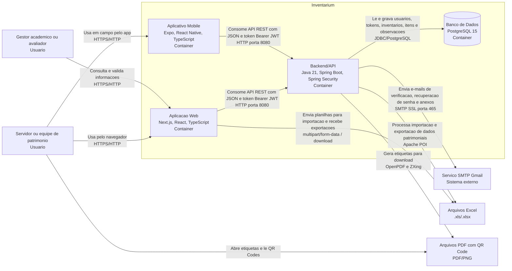

# C4 - Containers

Este documento registra o nivel 2 do modelo C4 para o Inventarium. A visao de containers mostra as principais partes executaveis ou persistentes da solucao, suas responsabilidades, tecnologias e comunicacoes.

## Visao Geral

O Inventarium e composto por aplicacoes cliente, uma API backend, um banco de dados relacional e servicos externos de apoio. A Aplicacao Web e o Aplicativo Mobile concentram a experiencia dos usuarios. O Backend/API centraliza regras de negocio, autenticacao, persistencia, importacao e exportacao de planilhas, geracao de etiquetas e envio de e-mails. O PostgreSQL armazena os dados estruturados do dominio.

## Diagrama de Containers

## Containers

| Container | Tecnologia principal | Responsabilidade |
| --- | --- | --- |
| Aplicacao Web | Next.js 15, React 19, TypeScript, Tailwind CSS, Axios | Oferecer interface web para cadastro, login, recuperacao de senha, verificacao de conta, visualizacao de dashboard, gerenciamento de inventarios, listagem e edicao de itens, upload de planilhas, exportacao de relatorios e solicitacao de etiquetas. |
| Aplicativo Mobile | Expo 54, React Native 0.81, TypeScript, Expo Router, Axios, Expo Secure Store | Apoiar operacoes em campo, permitindo autenticacao, consulta de inventarios e visualizacao de itens patrimoniais em dispositivo movel. Armazena o token do usuario de forma segura no dispositivo. |
| Backend/API | Java 21, Spring Boot 3, Spring Web, Spring Security, JWT, JPA, Liquibase | Expor API REST, autenticar usuarios, aplicar regras de negocio, gerenciar usuarios, inventarios, itens e observacoes, processar planilhas Excel, gerar PDFs com QR Code e acionar envio de e-mails. |
| Banco de Dados | PostgreSQL 15 | Persistir dados estruturados do Inventarium, incluindo usuarios, tokens, inventarios, itens patrimoniais e observacoes. O schema e versionado por Liquibase. |

## Sistemas e Artefatos Externos

| Elemento | Tecnologia ou formato | Uso no Inventarium |
| --- | --- | --- |
| Servico SMTP Gmail | SMTP com SSL na porta 465 | Envio de e-mails transacionais: verificacao de conta, recuperacao de senha e envio de planilhas anexadas. |
| Arquivos Excel | `.xls` e `.xlsx` | Entrada para importacao em lote de itens patrimoniais e saida para exportacao de relatorios. |
| Arquivos PDF com QR Code | PDF e imagens QR Code geradas em PNG | Material de apoio para impressao e identificacao fisica dos bens patrimoniais. |

## Comunicacao Entre Containers

| Origem | Destino | Protocolo/formato | Descricao |
| --- | --- | --- | --- |
| Navegador do usuario | Aplicacao Web | HTTPS/HTTP | Acesso a telas web do Inventarium. Em ambiente local, a aplicacao roda na porta 3000. |
| Dispositivo movel | Aplicativo Mobile | HTTPS/HTTP | Uso do app mobile em dispositivo fisico ou emulador. |
| Aplicacao Web | Backend/API | HTTP, REST, JSON, multipart/form-data, Bearer JWT | Requisicoes para autenticacao, usuarios, inventarios, itens, upload de planilhas, download de planilhas e PDFs. |
| Aplicativo Mobile | Backend/API | HTTP, REST, JSON, Bearer JWT | Requisicoes autenticadas para login, consulta de usuario, inventarios e itens. No emulador Android local, usa `http://10.0.2.2:8080`. |
| Backend/API | Banco de Dados | JDBC/PostgreSQL | Persistencia e consulta de dados relacionais. Em Docker Compose, o banco atende o backend como `postgres:5432`. |
| Backend/API | Servico SMTP Gmail | SMTP SSL | Envio assincrono de e-mails operacionais. |
| Backend/API | Arquivos Excel | Leitura/escrita `.xls` e `.xlsx` | Importacao e validacao de planilhas recebidas dos usuarios; geracao de planilhas para download ou envio por e-mail. |
| Backend/API | Arquivos PDF com QR Code | PDF/PNG | Geracao de etiquetas patrimoniais com QR Code para impressao, download e leitura por ferramentas externas. |

## Responsabilidades Por Fluxo

1. **Autenticacao:** Web ou Mobile envia credenciais para o Backend/API; a API valida o usuario, verifica situacao de e-mail e retorna token JWT.
2. **Gerenciamento de inventarios:** Web ou Mobile envia requisicoes REST autenticadas; o Backend/API aplica regras de negocio e persiste dados no PostgreSQL.
3. **Importacao de itens:** Web envia planilha por `multipart/form-data`; o Backend/API le o arquivo com Apache POI, valida os campos esperados e grava os itens no banco.
4. **Exportacao de dados:** Web solicita exportacao; o Backend/API gera planilha `.xlsx` e retorna o arquivo para download ou envia por e-mail via SMTP.
5. **Etiquetas patrimoniais:** Web solicita etiquetas; o Backend/API gera QR Codes com ZXing, monta PDF com OpenPDF e retorna o arquivo.
6. **Recuperacao e verificacao de conta:** Backend/API gera tokens operacionais, persiste dados necessarios e envia links por e-mail usando o servico SMTP configurado.

## Observacoes de Revisao

Este diagrama deve ser revisado pela equipe no pull request antes do merge na `main`. A revisao deve confirmar se o Aplicativo Mobile continua no escopo da solucao, se os protocolos refletem o ambiente atual e se novos servicos externos foram adicionados.

## Historico

| Versao | Data | Descricao |
| --- | --- | --- |
| 1.0 | 2026-09-02 | Criacao do diagrama C4 nivel 2 com containers, tecnologias, responsabilidades e comunicacoes. |
