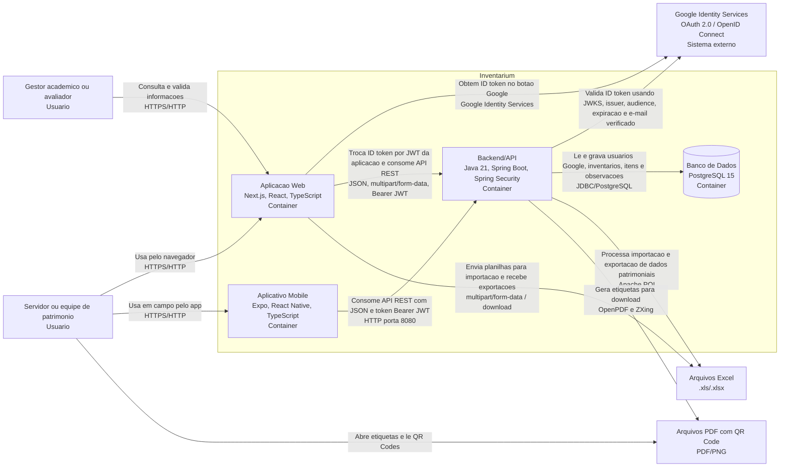

# C4 - Containers

Este documento registra o nivel 2 do modelo C4 para o Inventarium. A visao de containers mostra as principais partes executaveis ou persistentes da solucao, suas responsabilidades, tecnologias e comunicacoes.

## Visao Geral

O Inventarium e composto por aplicacoes cliente, uma API backend, um banco de dados relacional e servicos externos de apoio. A Aplicacao Web concentra o login com Google e a experiencia principal dos usuarios. O Aplicativo Mobile apoia operacoes em campo. O Backend/API centraliza regras de negocio, validacao do ID token do Google, emissao do JWT da aplicacao, persistencia, importacao e exportacao de planilhas e geracao de etiquetas. O PostgreSQL armazena os dados estruturados do dominio.

## Diagrama de Containers

## Containers

| Container | Tecnologia principal | Responsabilidade |
| --- | --- | --- |
| Aplicacao Web | Next.js 15, React 19, TypeScript, Tailwind CSS, Axios, `@react-oauth/google` | Oferecer interface web para login com Google, visualizacao de dashboard, gerenciamento de inventarios, listagem e edicao de itens, upload de planilhas, exportacao de relatorios e solicitacao de etiquetas. |
| Aplicativo Mobile | Expo 54, React Native 0.81, TypeScript, Expo Router, Axios, Expo Secure Store | Apoiar operacoes em campo, permitindo consulta de inventarios e visualizacao de itens patrimoniais em dispositivo movel. Armazena o JWT da aplicacao de forma segura no dispositivo quando ha sessao autenticada. |
| Backend/API | Java 21, Spring Boot 3, Spring Web, Spring Security, OAuth2 Resource Server, JWT, JPA, Liquibase | Expor API REST, validar login com Google, emitir JWT proprio da aplicacao, aplicar regras de negocio, gerenciar usuarios, inventarios, itens e observacoes, processar planilhas Excel e gerar PDFs com QR Code. |
| Banco de Dados | PostgreSQL 15 | Persistir dados estruturados do Inventarium, incluindo usuarios vinculados ao Google, inventarios, itens patrimoniais e observacoes. O schema e versionado por Liquibase. |

## Sistemas e Artefatos Externos

| Elemento | Tecnologia ou formato | Uso no Inventarium |
| --- | --- | --- |
| Google Identity Services | OAuth 2.0 / OpenID Connect, Google Cloud OAuth Client ID e JWKS | Autenticacao externa dos usuarios. A web recebe um ID token do Google e o backend valida assinatura, `iss`, `aud`, expiracao e `email_verified` antes de emitir o JWT proprio do Inventarium. |
| Arquivos Excel | `.xls` e `.xlsx` | Entrada para importacao em lote de itens patrimoniais e saida para exportacao de relatorios. |
| Arquivos PDF com QR Code | PDF e imagens QR Code geradas em PNG | Material de apoio para impressao e identificacao fisica dos bens patrimoniais. |

## Comunicacao Entre Containers

| Origem | Destino | Protocolo/formato | Descricao |
| --- | --- | --- | --- |
| Navegador do usuario | Aplicacao Web | HTTPS/HTTP | Acesso a telas web do Inventarium. Em ambiente local, a aplicacao roda na porta 3000. |
| Dispositivo movel | Aplicativo Mobile | HTTPS/HTTP | Uso do app mobile em dispositivo fisico ou emulador. |
| Aplicacao Web | Google Identity Services | HTTPS, OAuth 2.0 / OpenID Connect | Carrega o botao de login do Google e recebe um ID token para a conta autenticada. Em producao, exige origem autorizada no Google Cloud Console e HTTPS. |
| Aplicacao Web | Backend/API | HTTP, REST, JSON, multipart/form-data, Bearer JWT | Envia `POST /auth/google` com o ID token do Google para receber o JWT da aplicacao; depois consome usuarios, inventarios, itens, upload de planilhas, download de planilhas e PDFs. |
| Aplicativo Mobile | Backend/API | HTTP, REST, JSON, Bearer JWT | Requisicoes autenticadas para consulta de usuario, inventarios e itens. No emulador Android local, usa `http://10.0.2.2:8080`. |
| Backend/API | Banco de Dados | JDBC/PostgreSQL | Persistencia e consulta de dados relacionais. Em Docker Compose, o banco atende o backend como `postgres:5432`. |
| Backend/API | Google Identity Services | HTTPS/JWKS | Valida o ID token recebido no login contra as chaves publicas do Google e contra o `GOOGLE_OAUTH_CLIENT_ID` configurado. |
| Backend/API | Arquivos Excel | Leitura/escrita `.xls` e `.xlsx` | Importacao e validacao de planilhas recebidas dos usuarios; geracao de planilhas para download. |
| Backend/API | Arquivos PDF com QR Code | PDF/PNG | Geracao de etiquetas patrimoniais com QR Code para impressao, download e leitura por ferramentas externas. |

## Responsabilidades Por Fluxo

1. **Autenticacao web:** Web usa Google Identity Services para obter um ID token, envia esse token para `POST /auth/google`, o Backend/API valida o token no Google, cria ou localiza o usuario e retorna o JWT proprio da aplicacao.
2. **Gerenciamento de inventarios:** Web ou Mobile envia requisicoes REST autenticadas; o Backend/API aplica regras de negocio e persiste dados no PostgreSQL.
3. **Importacao de itens:** Web envia planilha por `multipart/form-data`; o Backend/API le o arquivo com Apache POI, valida os campos esperados e grava os itens no banco.
4. **Exportacao de dados:** Web solicita exportacao; o Backend/API gera planilha `.xlsx` e retorna o arquivo para download.
5. **Etiquetas patrimoniais:** Web solicita etiquetas; o Backend/API gera QR Codes com ZXing, monta PDF com OpenPDF e retorna o arquivo.
6. **Sessao autenticada:** Depois do login, os clientes enviam apenas o JWT da aplicacao como `Authorization: Bearer`; o ID token do Google e usado somente na troca inicial.

## Dependencias Externas de Autenticacao

O login depende de configuracao no Google Cloud Console e das variaveis `GOOGLE_OAUTH_CLIENT_ID`, `GOOGLE_ALLOWED_DOMAINS` e `SECURITY_TOKEN_SECRET`. O `GOOGLE_OAUTH_CLIENT_ID` precisa ser o mesmo no frontend e no backend: a web usa esse valor para solicitar o ID token e o backend confere o claim `aud` contra ele.

Em producao, a origem publica do frontend deve estar cadastrada nas origens JavaScript autorizadas do OAuth Client ID e deve usar HTTPS. Mudancas em `NEXT_PUBLIC_GOOGLE_CLIENT_ID` exigem rebuild do frontend, pois o Next.js injeta variaveis `NEXT_PUBLIC_*` no bundle em tempo de build.

## Observacoes de Revisao

Este diagrama deve ser revisado pela equipe no pull request antes do merge na `main`. A revisao deve confirmar se o Aplicativo Mobile continua no escopo da solucao, se os protocolos refletem o ambiente atual e se novos servicos externos foram adicionados.

## Historico

| Versao | Data | Descricao |
| --- | --- | --- |
| 1.0 | 2026-09-02 | Criacao do diagrama C4 nivel 2 com containers, tecnologias, responsabilidades e comunicacoes. |
| 1.1 | 2026-09-08 | Atualizacao da visao de containers para login com Google e remocao dos fluxos antigos de credenciais, verificacao e recuperacao de senha. |
