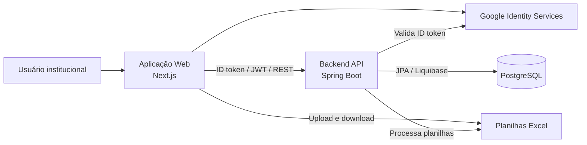

# C4 - Containers

O Inventarium possui uma aplicação web, uma API backend e um banco PostgreSQL. O aplicativo mobile e a geração de etiquetas/QR Code não fazem parte do escopo ativo.

```mermaid
flowchart LR
    user["Usuário institucional"] --> web["Aplicação Web\nNext.js"]
    web -->|"ID token / JWT / REST"| api["Backend API\nSpring Boot"]
    web --> google["Google Identity Services"]
    api -->|"Valida ID token"| google
    api -->|"JPA / Liquibase"| db[("PostgreSQL")]
    web -->|"Upload e download"| excel["Planilhas Excel"]
    api -->|"Processa planilhas"| excel
```

| Container | Responsabilidade |
| --- | --- |
| Aplicação Web | Login Google, inventários, itens, importação/exportação e futura leitura de código de barras. |
| Backend API | Autenticação, regras patrimoniais, autorização, processamento de planilhas e auditoria. |
| PostgreSQL | Usuários, organizações, setores, perfis, permissões, inventários, itens e histórico futuro. |
| Google Identity Services | Emite ID token usado no login institucional. |

No produto alvo, a API deve aplicar permissões e fronteiras de setor antes de expor ou alterar recursos patrimoniais.
