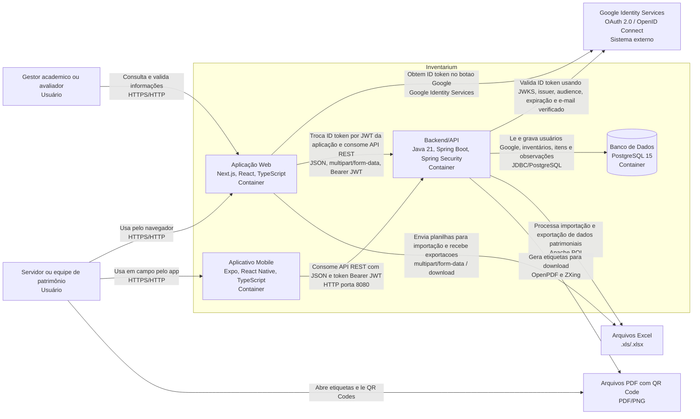

# C4 - Containers

Este documento registra o nível 2 do modelo C4 para o Inventarium. A visão de containers mostra as principais partes executáveis ou persistentes da solucao, suas responsabilidades, tecnologias e comunicações.

> Nota: o aplicativo mobile foi removido do repositório e deixou de fazer parte do escopo ativo. Este diagrama ainda contem referencias historicas ao mobile e deve ser revisado em uma atualização dedicada da documentação arquitetural.

## Visão Geral

O Inventarium e composto por aplicações cliente, uma API backend, um banco de dados relacional e serviços externos de apoio. A Aplicação Web concentra o login com Google e a experiencia principal dos usuários. O Aplicativo Mobile apoia operações em campo. O Backend/API centraliza regras de negocio, validação do ID token do Google, emissão do JWT da aplicação, persistência, importação e exportação de planilhas e geração de etiquetas. O PostgreSQL armazena os dados estruturados do dominio.

## Diagrama de Containers

```mermaid
flowchart LR
    usuário["Servidor ou equipe de patrimônio<br/>Usuário"]
    gestor["Gestor academico ou avaliador<br/>Usuário"]

    subgraph inventarium["Inventarium"]
        web["Aplicação Web<br/>Next.js, React, TypeScript<br/>Container"]
        mobile["Aplicativo Mobile<br/>Expo, React Native, TypeScript<br/>Container"]
        api["Backend/API<br/>Java 21, Spring Boot, Spring Security<br/>Container"]
        db[("Banco de Dados<br/>PostgreSQL 15<br/>Container")]
    end

    google["Google Identity Services<br/>OAuth 2.0 / OpenID Connect<br/>Sistema externo"]
    excel["Arquivos Excel<br/>.xls/.xlsx"]
    pdf["Arquivos PDF com QR Code<br/>PDF/PNG"]

    usuário -->|"Usa pelo navegador<br/>HTTPS/HTTP"| web
    usuário -->|"Usa em campo pelo app<br/>HTTPS/HTTP"| mobile
    gestor -->|"Consulta e valida informações<br/>HTTPS/HTTP"| web

    web -->|"Obtem ID token no botao Google<br/>Google Identity Services"| google
    web -->|"Troca ID token por JWT da aplicação e consome API REST<br/>JSON, multipart/form-data, Bearer JWT"| api
    mobile -->|"Consome API REST com JSON e token Bearer JWT<br/>HTTP porta 8080"| api

    api -->|"Valida ID token usando JWKS, issuer, audience, expiração e e-mail verificado"| google
    api -->|"Le e grava usuários Google, inventários, itens e observações<br/>JDBC/PostgreSQL"| db
    web -->|"Envia planilhas para importação e recebe exportacoes<br/>multipart/form-data / download"| excel
    api -->|"Processa importação e exportação de dados patrimoniais<br/>Apache POI"| excel
    api -->|"Gera etiquetas para download<br/>OpenPDF e ZXing"| pdf
    usuário -->|"Abre etiquetas e le QR Codes"| pdf
```

## Containers

| Container | Tecnologia principal | Responsabilidade |
| --- | --- | --- |
| Aplicação Web | Next.js 15, React 19, TypeScript, Tailwind CSS, Axios, `@react-oauth/google` | Oferecer interface web para login com Google, visualização de dashboard, gerenciamento de inventários, listagem e edição de itens, upload de planilhas, exportação de relatórios e solicitação de etiquetas. |
| Aplicativo Mobile | Expo 54, React Native 0.81, TypeScript, Expo Router, Axios, Expo Secure Store | Apoiar operações em campo, permitindo consulta de inventários e visualização de itens patrimoniais em dispositivo móvel. Armazena o JWT da aplicação de forma segura no dispositivo quando ha sessão autenticada. |
| Backend/API | Java 21, Spring Boot 3, Spring Web, Spring Security, OAuth2 Resource Server, JWT, JPA, Liquibase | Expor API REST, validar login com Google, emitir JWT próprio da aplicação, aplicar regras de negocio, gerenciar usuários, inventários, itens e observações, processar planilhas Excel e gerar PDFs com QR Code. |
| Banco de Dados | PostgreSQL 15 | Persistir dados estruturados do Inventarium, incluindo usuários vinculados ao Google, inventários, itens patrimoniais e observações. O schema e versionado por Liquibase. |

## Sistemas e Artefatos Externos

| Elemento | Tecnologia ou formato | Uso no Inventarium |
| --- | --- | --- |
| Google Identity Services | OAuth 2.0 / OpenID Connect, Google Cloud OAuth Client ID e JWKS | Autenticação externa dos usuários. A web recebe um ID token do Google e o backend valida assinatura, `iss`, `aud`, expiração e `email_verified` antes de emitir o JWT próprio do Inventarium. |
| Arquivos Excel | `.xls` e `.xlsx` | Entrada para importação em lote de itens patrimoniais e saida para exportação de relatórios. |
| Arquivos PDF com QR Code | PDF e imagens QR Code geradas em PNG | Material de apoio para impressao e identificação fisica dos bens patrimoniais. |

## Comunicacao Entre Containers

| Origem | Destino | Protocolo/formato | Descrição |
| --- | --- | --- | --- |
| Navegador do usuário | Aplicação Web | HTTPS/HTTP | Acesso a telas web do Inventarium. Em ambiente local, a aplicação roda na porta 3000. |
| Dispositivo móvel | Aplicativo Mobile | HTTPS/HTTP | Uso do app mobile em dispositivo fisico ou emulador. |
| Aplicação Web | Google Identity Services | HTTPS, OAuth 2.0 / OpenID Connect | Carrega o botao de login do Google e recebe um ID token para a conta autenticada. Em produção, exige origem autorizada no Google Cloud Console e HTTPS. |
| Aplicação Web | Backend/API | HTTP, REST, JSON, multipart/form-data, Bearer JWT | Envia `POST /auth/google` com o ID token do Google para receber o JWT da aplicação; depois consome usuários, inventários, itens, upload de planilhas, download de planilhas e PDFs. |
| Aplicativo Mobile | Backend/API | HTTP, REST, JSON, Bearer JWT | Requisições autenticadas para consulta de usuário, inventários e itens. No emulador Android local, usa `http://10.0.2.2:8080`. |
| Backend/API | Banco de Dados | JDBC/PostgreSQL | Persistência e consulta de dados relacionais. Em Docker Compose, o banco atende o backend como `postgres:5432`. |
| Backend/API | Google Identity Services | HTTPS/JWKS | Valida o ID token recebido no login contra as chaves públicas do Google e contra o `GOOGLE_OAUTH_CLIENT_ID` configurado. |
| Backend/API | Arquivos Excel | Leitura/escrita `.xls` e `.xlsx` | Importação e validação de planilhas recebidas dos usuários; geração de planilhas para download. |
| Backend/API | Arquivos PDF com QR Code | PDF/PNG | Geração de etiquetas patrimoniais com QR Code para impressao, download e leitura por ferramentas externas. |

## Responsabilidades Por Fluxo

1. **Autenticação web:** Web usa Google Identity Services para obter um ID token, envia esse token para `POST /auth/google`, o Backend/API valida o token no Google, cria ou localiza o usuário e retorna o JWT próprio da aplicação.
2. **Gerenciamento de inventários:** Web ou Mobile envia requisições REST autenticadas; o Backend/API aplica regras de negocio e persiste dados no PostgreSQL.
3. **Importação de itens:** Web envia planilha por `multipart/form-data`; o Backend/API le o arquivo com Apache POI, valida os campos esperados e grava os itens no banco.
4. **Exportação de dados:** Web solicita exportação; o Backend/API gera planilha `.xlsx` e retorna o arquivo para download.
5. **Etiquetas patrimoniais:** Web solicita etiquetas; o Backend/API gera QR Codes com ZXing, monta PDF com OpenPDF e retorna o arquivo.
6. **Sessão autenticada:** Depois do login, os clientes enviam apenas o JWT da aplicação como `Authorization: Bearer`; o ID token do Google e usado somente na troca inicial.

## Dependências Externas de Autenticação

O login depende de configuração no Google Cloud Console e das variáveis `GOOGLE_OAUTH_CLIENT_ID`, `GOOGLE_ALLOWED_DOMAINS` e `SECURITY_TOKEN_SECRET`. O `GOOGLE_OAUTH_CLIENT_ID` precisa ser o mesmo no frontend e no backend: a web usa esse valor para solicitar o ID token e o backend confere o claim `aud` contra ele.

Em produção, a origem pública do frontend deve estar cadastrada nas origens JavaScript autorizadas do OAuth Client ID e deve usar HTTPS. Mudanças em `NEXT_PUBLIC_GOOGLE_CLIENT_ID` exigem rebuild do frontend, pois o Next.js injeta variáveis `NEXT_PUBLIC_*` no bundle em tempo de build.

## Observações de Revisão

Este diagrama deve ser revisado pela equipe no pull request antes do merge na `main`. A revisão deve confirmar se o Aplicativo Mobile continua no escopo da solucao, se os protocolos refletem o ambiente atual e se novos serviços externos foram adicionados.

## Histórico

| Versão | Data | Descrição |
| --- | --- | --- |
| 1.0 | 2026-09-02 | Criação do diagrama C4 nível 2 com containers, tecnologias, responsabilidades e comunicações. |
| 1.1 | 2026-09-08 | Atualização da visão de containers para login com Google e remocao dos fluxos antigos de credenciais, verificação e recuperação de senha. |
