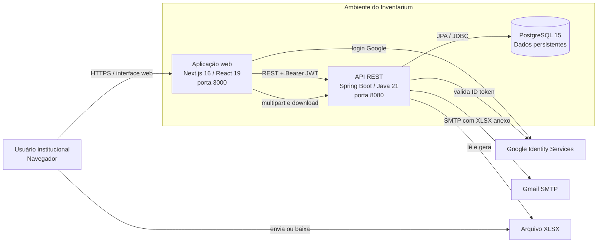

# C4 — Containers

## Visão de execução

Este nível separa o Inventarium em aplicações executáveis e armazenamento. Atualmente a solução é uma aplicação web Next.js que consome uma API REST em Spring Boot; a API persiste os dados no PostgreSQL. Em desenvolvimento, os três containers são orquestrados pelo Docker Compose. Não há aplicativo mobile no repositório.

```mermaid
flowchart LR
    usuario["Usuário institucional\nNavegador"]

    subgraph runtime["Ambiente do Inventarium"]
        web["Aplicação web\nNext.js 16 / React 19\nporta 3000"]
        api["API REST\nSpring Boot / Java 21\nporta 8080"]
        banco[("PostgreSQL 15\nDados persistentes")]
    end

    google["Google Identity Services"]
    smtp["Gmail SMTP"]
    xlsx["Arquivo XLSX"]

    usuario -->|"HTTPS / interface web"| web
    web -->|"login Google"| google
    web -->|"REST + Bearer JWT"| api
    api -->|"valida ID token"| google
    api -->|"JPA / JDBC"| banco
    usuario -->|"envia ou baixa"| xlsx
    web -->|"multipart e download"| api
    api -->|"lê e gera"| xlsx
    api -->|"SMTP com XLSX anexo"| smtp
```

## Containers

| Container | Tecnologia e localização | Responsabilidades implementadas |
| --- | --- | --- |
| Aplicação web | Next.js 16.3, React 19, TypeScript e Tailwind CSS; diretório `frontend`. | Exibe login, painel de inventários, detalhes de itens e modais de importação, edição, observações e envio de planilha. Armazena o JWT em cookie e o envia nas chamadas à API. |
| API REST | Spring Boot 3, Java 21, Spring Security, JPA e Liquibase; diretório `backend`. | Expõe endpoints de autenticação, inventários, itens, usuários, organizações, setores, perfis e permissões. Também processa XLSX, gera PDF de etiquetas legado e encaminha a planilha por e-mail. |
| Banco de dados | PostgreSQL 15; serviço `postgres` no `docker-compose.yml`. | Armazena usuários, organização, setor, perfil, permissão, inventário, item e observação. O esquema é criado/evoluído por changelogs Liquibase. |

## Comunicação entre containers

1. No login, a aplicação web obtém uma credencial do Google e a envia para `POST /auth/google`. A API valida o ID token, encontra ou cria o usuário local e retorna um JWT da aplicação.
2. Nas demais requisições, o frontend envia `Authorization: Bearer <JWT>` para a API. A API é stateless; não mantém sessão de servidor.
3. A API usa JPA para ler e gravar no PostgreSQL. O Liquibase é executado na inicialização para aplicar o changelog configurado.
4. Para importação e validação, o navegador envia XLSX em `multipart/form-data`. Para exportação, a API devolve o arquivo; para compartilhamento, monta o XLSX e o entrega ao SMTP como anexo de forma assíncrona.

## Operação local e saúde

O Compose publica frontend na porta `3000` e backend na `8080`; o PostgreSQL fica disponível na porta configurável `5433` do host. O backend só inicia depois da verificação de saúde do banco e possui healthcheck em `/actuator/health/liveness`. A aplicação depende de variáveis de ambiente para a conexão do banco, senha SMTP, segredo de assinatura do JWT e client ID do Google. Em especial, `SECURITY_TOKEN_SECRET` não tem valor padrão no Compose: a inicialização falha se ele não for informado.

## Limites conhecidos

Os endpoints de administração da estrutura organizacional existem na API, mas o frontend atual não contém telas administrativas correspondentes. Além disso, o JWT protege o acesso autenticado, mas ainda não carrega ou aplica permissões por perfil e não restringe recursos pelo setor. Essas são lacunas de implementação, não responsabilidades já entregues.

O código ainda contém geração de QR Code e endpoints para PDF de etiquetas. Eles são funcionalidades legadas presentes no fonte, porém não fazem parte do escopo ativo definido para o produto; a leitura de código de barras também ainda não foi implementada.
