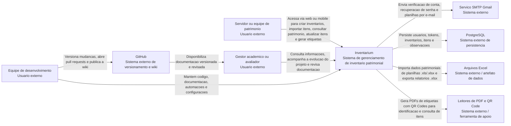

# C4 - Contexto

Este documento registra o nivel 1 do modelo C4 para o Inventarium. O objetivo e mostrar o sistema no seu contexto, identificando quem usa a solucao, quais sistemas externos participam do fluxo e quais relacoes principais existem entre esses elementos.

## Sistema Principal

**Inventarium** e uma plataforma academica para apoio ao tombamento e gerenciamento de patrimonio institucional do IFPE. A solucao reune uma aplicacao web, um aplicativo mobile e uma API backend para centralizar autenticacao, inventarios, itens patrimoniais, observacoes, importacao e exportacao de planilhas, geracao de etiquetas em PDF com QR Code e envio de e-mails operacionais.

## Diagrama de Contexto

## Atores

| Ator | Descricao | Principais necessidades |
| --- | --- | --- |
| Servidor ou equipe de patrimonio | Usuario responsavel por cadastrar, consultar e acompanhar inventarios e itens patrimoniais. | Centralizar informacoes, importar planilhas, editar dados, registrar observacoes, gerar etiquetas e consultar itens em campo. |
| Gestor academico ou avaliador | Pessoa interessada na visao do produto, no andamento do projeto e na qualidade da documentacao. | Entender o escopo, validar entregas, acompanhar decisoes e revisar artefatos do projeto. |
| Equipe de desenvolvimento | Integrantes que implementam, mantem e documentam o Inventarium. | Evoluir backend, frontend, mobile, infraestrutura, automacoes e documentacao versionada. |

## Sistemas Externos

| Sistema externo | Descricao | Relacao com o Inventarium |
| --- | --- | --- |
| Servico SMTP Gmail | Provedor usado pelo backend para envio de mensagens. | Recebe requisicoes de envio de e-mail para verificacao de conta, recuperacao de senha e compartilhamento de planilhas com anexo. |
| PostgreSQL | Banco de dados relacional usado pela aplicacao. | Armazena usuarios, tokens, inventarios, itens patrimoniais e observacoes. |
| Arquivos Excel | Planilhas `.xls` e `.xlsx` usadas como entrada e saida de dados patrimoniais. | Sao importadas para cadastro em lote de itens e exportadas como relatorios de patrimonio. |
| Leitores de PDF e QR Code | Ferramentas externas usadas pelos usuarios para abrir etiquetas e ler identificadores. | Consomem PDFs e QR Codes gerados pelo Inventarium para apoiar identificacao fisica dos bens. |
| GitHub | Plataforma de versionamento, pull requests, workflows e wiki. | Guarda o codigo-fonte, documentacao versionada e fluxo de revisao/publicacao da wiki. |

## Principais Interacoes

1. O servidor ou equipe de patrimonio acessa o Inventarium pela aplicacao web ou mobile e se autentica com credenciais.
2. O Inventarium valida a autenticacao, emite tokens de acesso e consulta os dados persistidos no PostgreSQL.
3. O usuario cria inventarios, cadastra itens manualmente ou importa itens a partir de uma planilha Excel.
4. O Inventarium valida os dados importados, registra itens e observacoes no PostgreSQL e disponibiliza consulta paginada dos itens do inventario.
5. O usuario solicita etiquetas em PDF; o Inventarium gera o arquivo com QR Codes para apoiar a identificacao fisica dos bens.
6. O usuario exporta uma planilha de patrimonio ou solicita o envio da planilha por e-mail.
7. O Inventarium usa o servico SMTP Gmail para enviar verificacao de conta, recuperacao de senha e planilhas anexadas.
8. A equipe de desenvolvimento mantem codigo e documentacao no GitHub, abrindo pull requests para revisao antes da publicacao da wiki.

## Observacoes de Revisao

Este documento deve ser revisado por outro integrante no pull request antes do merge na `main`. A revisao deve verificar se os atores, sistemas externos e relacoes descritas continuam coerentes com o escopo atual do Inventarium.

## Historico

| Versao | Data | Descricao |
| --- | --- | --- |
| 1.0 | 2026-09-02 | Criacao do diagrama de contexto C4 nivel 1 e das descricoes associadas. |
