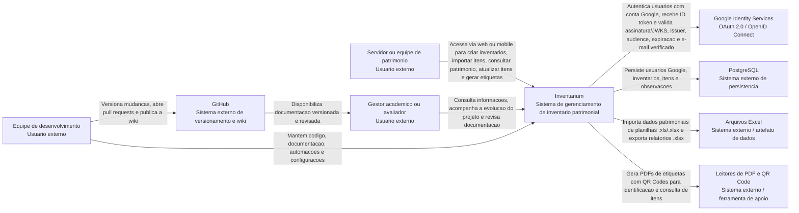

# C4 - Contexto

Este documento registra o nivel 1 do modelo C4 para o Inventarium. O objetivo e mostrar o sistema no seu contexto, identificando quem usa a solucao, quais sistemas externos participam do fluxo e quais relacoes principais existem entre esses elementos.

## Sistema Principal

**Inventarium** e uma plataforma academica para apoio ao tombamento e gerenciamento de patrimonio institucional do IFPE. A solucao reune uma aplicacao web, um aplicativo mobile e uma API backend para centralizar autenticacao via Google, inventarios, itens patrimoniais, observacoes, importacao e exportacao de planilhas e geracao de etiquetas em PDF com QR Code.

## Diagrama de Contexto

## Atores

| Ator | Descricao | Principais necessidades |
| --- | --- | --- |
| Servidor ou equipe de patrimonio | Usuario responsavel por cadastrar, consultar e acompanhar inventarios e itens patrimoniais. | Centralizar informacoes, importar planilhas, editar dados, registrar observacoes, gerar etiquetas e consultar itens em campo. |
| Gestor academico ou avaliador | Pessoa interessada na visao do produto, no andamento do projeto e na qualidade da documentacao. | Entender o escopo, validar entregas, acompanhar decisoes e revisar artefatos do projeto. |
| Equipe de desenvolvimento | Integrantes que implementam, mantem e documentam o Inventarium. | Evoluir backend, frontend, mobile, infraestrutura, automacoes e documentacao versionada. |

## Sistemas Externos

| Sistema externo | Descricao | Relacao com o Inventarium |
| --- | --- | --- |
| Google Identity Services | Provedor externo usado para login com Google por OAuth 2.0 / OpenID Connect. | Autentica a conta Google do usuario, emite ID token assinado e publica chaves JWKS usadas pelo backend para validar o token. |
| PostgreSQL | Banco de dados relacional usado pela aplicacao. | Armazena usuarios vinculados ao Google, inventarios, itens patrimoniais e observacoes. |
| Arquivos Excel | Planilhas `.xls` e `.xlsx` usadas como entrada e saida de dados patrimoniais. | Sao importadas para cadastro em lote de itens e exportadas como relatorios de patrimonio. |
| Leitores de PDF e QR Code | Ferramentas externas usadas pelos usuarios para abrir etiquetas e ler identificadores. | Consomem PDFs e QR Codes gerados pelo Inventarium para apoiar identificacao fisica dos bens. |
| GitHub | Plataforma de versionamento, pull requests, workflows e wiki. | Guarda o codigo-fonte, documentacao versionada e fluxo de revisao/publicacao da wiki. |

## Principais Interacoes

1. O servidor ou equipe de patrimonio acessa o Inventarium e se autentica com uma conta Google autorizada.
2. O Google Identity Services autentica o usuario e devolve um ID token para a aplicacao cliente.
3. O Inventarium valida o ID token do Google no backend, cria ou localiza o usuario pelo e-mail e emite um JWT proprio da aplicacao.
4. O usuario cria inventarios, cadastra itens manualmente ou importa itens a partir de uma planilha Excel.
5. O Inventarium valida os dados importados, registra itens e observacoes no PostgreSQL e disponibiliza consulta paginada dos itens do inventario.
6. O usuario solicita etiquetas em PDF; o Inventarium gera o arquivo com QR Codes para apoiar a identificacao fisica dos bens.
7. O usuario exporta uma planilha de patrimonio.
8. A equipe de desenvolvimento mantem codigo e documentacao no GitHub, abrindo pull requests para revisao antes da publicacao da wiki.

## Dependencias Externas de Autenticacao

O login depende diretamente do Google Identity Services e de um Client ID OAuth configurado no Google Cloud Console. Em producao, a origem publica do frontend precisa estar cadastrada nas origens JavaScript autorizadas do Client ID e ser servida por HTTPS. O backend valida o ID token contra as chaves JWKS do Google e confere `iss`, `aud`, expiracao e `email_verified`.

Depois da troca inicial, as rotas protegidas nao usam o token do Google. O backend emite um JWT proprio do Inventarium, assinado por `SECURITY_TOKEN_SECRET`, e os clientes passam a envia-lo como `Authorization: Bearer`.

## Observacoes de Revisao

Este documento deve ser revisado por outro integrante no pull request antes do merge na `main`. A revisao deve verificar se os atores, sistemas externos e relacoes descritas continuam coerentes com o escopo atual do Inventarium.

## Historico

| Versao | Data | Descricao |
| --- | --- | --- |
| 1.0 | 2026-09-02 | Criacao do diagrama de contexto C4 nivel 1 e das descricoes associadas. |
| 1.1 | 2026-09-08 | Atualizacao da visao de contexto para destacar a autenticacao via Google Identity Services. |
