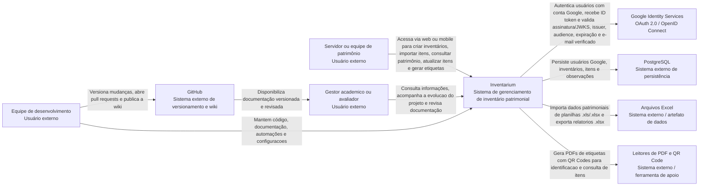

# C4 - Contexto

Este documento registra o nível 1 do modelo C4 para o Inventarium. O objetivo e mostrar o sistema no seu contexto, identificando quem usa a solucao, quais sistemas externos participam do fluxo e quais relacoes principais existem entre esses elementos.

> Nota: o aplicativo mobile foi removido do repositório e deixou de fazer parte do escopo ativo. Este diagrama ainda contem referencias historicas ao mobile e deve ser revisado em uma atualização dedicada da documentação arquitetural.

## Sistema Principal

**Inventarium** e uma plataforma academica para apoio ao tombamento e gerenciamento de patrimônio institucional do IFPE. A solucao reune uma aplicação web, um aplicativo mobile e uma API backend para centralizar autenticação via Google, inventários, itens patrimoniais, observações, importação e exportação de planilhas e geração de etiquetas em PDF com QR Code.

## Diagrama de Contexto

```mermaid
flowchart LR
    servidor["Servidor ou equipe de patrimônio<br/>Usuário externo"]
    gestor["Gestor academico ou avaliador<br/>Usuário externo"]
    dev["Equipe de desenvolvimento<br/>Usuário externo"]

    inventarium["Inventarium<br/>Sistema de gerenciamento de inventário patrimonial"]

    google["Google Identity Services<br/>OAuth 2.0 / OpenID Connect"]
    postgres["PostgreSQL<br/>Sistema externo de persistência"]
    planilhas["Arquivos Excel<br/>Sistema externo / artefato de dados"]
    pdf["Leitores de PDF e QR Code<br/>Sistema externo / ferramenta de apoio"]
    github["GitHub<br/>Sistema externo de versionamento e wiki"]

    servidor -->|"Acessa via web ou mobile para criar inventários, importar itens, consultar patrimônio, atualizar itens e gerar etiquetas"| inventarium
    gestor -->|"Consulta informações, acompanha a evolucao do projeto e revisa documentação"| inventarium
    dev -->|"Mantem código, documentação, automações e configuracoes"| inventarium

    inventarium -->|"Autentica usuários com conta Google, recebe ID token e valida assinatura/JWKS, issuer, audience, expiração e e-mail verificado"| google
    inventarium -->|"Persiste usuários Google, inventários, itens e observações"| postgres
    inventarium -->|"Importa dados patrimoniais de planilhas .xls/.xlsx e exporta relatorios .xlsx"| planilhas
    inventarium -->|"Gera PDFs de etiquetas com QR Codes para identificacao e consulta de itens"| pdf
    dev -->|"Versiona mudanças, abre pull requests e publica a wiki"| github
    github -->|"Disponibiliza documentação versionada e revisada"| gestor
```

## Atores

| Ator | Descrição | Principais necessidades |
| --- | --- | --- |
| Servidor ou equipe de patrimônio | Usuário responsável por cadastrar, consultar e acompanhar inventários e itens patrimoniais. | Centralizar informações, importar planilhas, editar dados, registrar observações, gerar etiquetas e consultar itens em campo. |
| Gestor academico ou avaliador | Pessoa interessada na visão do produto, no andamento do projeto e na qualidade da documentação. | Entender o escopo, validar entregas, acompanhar decisões e revisar artefatos do projeto. |
| Equipe de desenvolvimento | Integrantes que implementam, mantem e documentam o Inventarium. | Evoluir backend, frontend, mobile, infraestrutura, automações e documentação versionada. |

## Sistemas Externos

| Sistema externo | Descrição | Relação com o Inventarium |
| --- | --- | --- |
| Google Identity Services | Provedor externo usado para login com Google por OAuth 2.0 / OpenID Connect. | Autentica a conta Google do usuário, emite ID token assinado e pública chaves JWKS usadas pelo backend para validar o token. |
| PostgreSQL | Banco de dados relacional usado pela aplicação. | Armazena usuários vinculados ao Google, inventários, itens patrimoniais e observações. |
| Arquivos Excel | Planilhas `.xls` e `.xlsx` usadas como entrada e saida de dados patrimoniais. | São importadas para cadastro em lote de itens e exportadas como relatórios de patrimônio. |
| Leitores de PDF e QR Code | Ferramentas externas usadas pelos usuários para abrir etiquetas e ler identificadores. | Consomem PDFs e QR Codes gerados pelo Inventarium para apoiar identificação fisica dos bens. |
| GitHub | Plataforma de versionamento, pull requests, workflows e wiki. | Guarda o código-fonte, documentação versionada e fluxo de revisão/publicação da wiki. |

## Principais Interacoes

1. O servidor ou equipe de patrimônio acessa o Inventarium e se autentica com uma conta Google autorizada.
2. O Google Identity Services autentica o usuário e devolve um ID token para a aplicação cliente.
3. O Inventarium valida o ID token do Google no backend, cria ou localiza o usuário pelo e-mail e emite um JWT próprio da aplicação.
4. O usuário cria inventários, cadastra itens manualmente ou importa itens a partir de uma planilha Excel.
5. O Inventarium valida os dados importados, registra itens e observações no PostgreSQL e disponibiliza consulta paginada dos itens do inventário.
6. O usuário solicita etiquetas em PDF; o Inventarium gera o arquivo com QR Codes para apoiar a identificação fisica dos bens.
7. O usuário exporta uma planilha de patrimônio.
8. A equipe de desenvolvimento mantem código e documentação no GitHub, abrindo pull requests para revisão antes da publicação da wiki.

## Dependências Externas de Autenticação

O login depende diretamente do Google Identity Services e de um Client ID OAuth configurado no Google Cloud Console. Em produção, a origem pública do frontend precisa estar cadastrada nas origens JavaScript autorizadas do Client ID e ser servida por HTTPS. O backend valida o ID token contra as chaves JWKS do Google e confere `iss`, `aud`, expiração e `email_verified`.

Depois da troca inicial, as rotas protegidas não usam o token do Google. O backend emite um JWT próprio do Inventarium, assinado por `SECURITY_TOKEN_SECRET`, e os clientes passam a envia-lo como `Authorization: Bearer`.

## Observações de Revisão

Este documento deve ser revisado por outro integrante no pull request antes do merge na `main`. A revisão deve verificar se os atores, sistemas externos e relacoes descritas continuam coerentes com o escopo atual do Inventarium.

## Histórico

| Versão | Data | Descrição |
| --- | --- | --- |
| 1.0 | 2026-09-02 | Criação do diagrama de contexto C4 nível 1 e das descricoes associadas. |
| 1.1 | 2026-09-08 | Atualização da visão de contexto para destacar a autenticação via Google Identity Services. |
