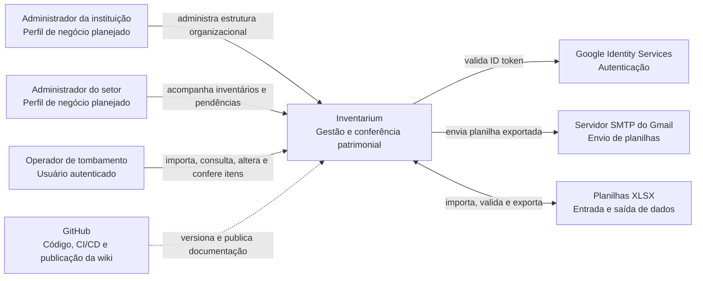

# C4 — Contexto do sistema

## Propósito

O Inventarium é uma aplicação web para realizar a gestão e a conferência de patrimônios institucionais. Ela permite autenticar usuários institucionais, criar inventários, importar seus itens por planilha, consultar e atualizar os dados dos bens, registrar observações, validar planilhas e exportar ou encaminhar o resultado por e-mail.

O diagrama abaixo apresenta o sistema como uma única caixa e mostra as pessoas e os sistemas externos que interagem com ele. Ele não descreve telas, classes nem tecnologias internas; esses detalhes aparecem nos níveis de [containers](C4-Containers) e [componentes](C4-Componentes).

```mermaid
flowchart LR
    adminOrg["Administrador da instituição\nPerfil de negócio planejado"]
    adminSetor["Administrador do setor\nPerfil de negócio planejado"]
    operador["Operador de tombamento\nUsuário autenticado"]
    sistema["Inventarium\nGestão e conferência patrimonial"]
    google["Google Identity Services\nAutenticação"]
    smtp["Servidor SMTP do Gmail\nEnvio de planilhas"]
    planilhas["Planilhas XLSX\nEntrada e saída de dados"]
    github["GitHub\nCódigo, CI/CD e publicação da wiki"]

    adminOrg -->|"administra estrutura organizacional"| sistema
    adminSetor -->|"acompanha inventários e pendências"| sistema
    operador -->|"importa, consulta, altera e confere itens"| sistema
    sistema -->|"valida ID token"| google
    sistema -->|"envia planilha exportada"| smtp
    sistema <-->|"importa, valida e exporta"| planilhas
    github -.->|"versiona e publica documentação"| sistema
```

## Pessoas e responsabilidades

| Pessoa | Objetivo no produto | Situação no código atual |
| --- | --- | --- |
| Administrador da instituição | Manter organizações, setores, perfis, permissões e a visão institucional dos patrimônios. | A API já possui operações para organizações, setores, perfis, permissões e atribuição de perfil/setor ao usuário. A interface administrativa e a restrição por perfil ainda não estão evidenciadas no frontend nem aplicadas pelo backend. |
| Administrador do setor | Acompanhar os inventários do setor, distribuir atividades e tratar pendências. | É um papel previsto pelo modelo de negócio. O vínculo usuário–setor existe, porém o escopo do setor ainda não limita as consultas e alterações de inventários. |
| Operador de tombamento | Executar o levantamento: importar itens, localizar um patrimônio, registrar observações e confirmar a conferência. | O fluxo de inventário, item, observações e validação já está disponível na aplicação web. A leitura de código de barras é requisito futuro; não há integração de câmera/leitor no repositório. |

## Sistemas externos e fronteiras

| Sistema externo | Integração | Finalidade |
| --- | --- | --- |
| Google Identity Services | O frontend obtém um ID token; a API o valida antes de criar ou localizar o usuário local e emitir o JWT próprio. | Login institucional sem senha local. |
| Gmail SMTP | A API usa o envio de e-mail do Spring para encaminhar uma planilha XLSX como anexo. | Compartilhar o resultado de um inventário. |
| Planilhas XLSX | Arquivos enviados pelo usuário e arquivos gerados pela API. Não é um serviço remoto. | Carga, validação, exportação e compartilhamento de dados patrimoniais. |
| GitHub | Repositório, pull requests, validações de CI/CD, releases e sincronização da wiki. | Suportar a engenharia e a publicação da documentação; não participa do fluxo de uso do patrimônio em tempo de execução. |

## Estado atual e evolução planejada

O modelo persistido já contém **organização**, **setor** (inclusive setor pai), **perfil**, **permissão** e a associação de perfil e setor a um usuário. No entanto, a cadeia de segurança atual autentica o JWT e protege as rotas apenas no nível “usuário autenticado”: o `SecurityFilter` cria a autenticação sem authorities, e os controladores administrativos registram explicitamente que a restrição por permissão será implementada depois. Portanto, os três perfis deste diagrama representam o comportamento de negócio desejado, não uma garantia de autorização já imposta pela aplicação.

Da mesma forma, a auditoria de tombamentos — identificar quem realizou uma ação, em qual item e quando — está definida como requisito e ainda precisa de uma estrutura de eventos/histórico própria. Hoje há `createdAt` e `updatedAt` em algumas entidades e `validatedAt` no item, mas não há registro completo do autor e da ação de auditoria.
