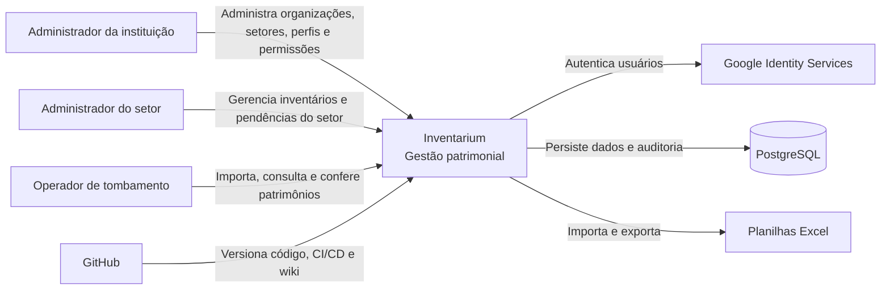

# C4 - Contexto

O Inventarium é uma aplicação web para gestão e conferência de patrimônio institucional. A plataforma usa login Google, importa e exporta planilhas, mantém inventários e itens, e evolui para autorização por organização, setor e perfil.

```mermaid
flowchart LR
    adminOrg["Administrador da instituição"]
    adminSetor["Administrador do setor"]
    operador["Operador de tombamento"]
    inventarium["Inventarium\nGestão patrimonial"]
    google["Google Identity Services"]
    postgres[("PostgreSQL")]
    excel["Planilhas Excel"]
    github["GitHub"]
    adminOrg -->|"Administra organizações, setores, perfis e permissões"| inventarium
    adminSetor -->|"Gerencia inventários e pendências do setor"| inventarium
    operador -->|"Importa, consulta e confere patrimônios"| inventarium
    inventarium -->|"Autentica usuários"| google
    inventarium -->|"Persiste dados e auditoria"| postgres
    inventarium -->|"Importa e exporta"| excel
    github -->|"Versiona código, CI/CD e wiki"| inventarium
```

| Ator | Responsabilidade no produto alvo |
| --- | --- |
| Administrador da instituição | Mantém organização, setores, perfis e permissões; possui visão institucional. |
| Administrador do setor | Gerencia inventários do setor, usuários vinculados e pendências recebidas. |
| Operador de tombamento | Realiza levantamento em campo, busca ou lê código de barras e registra conferências. |

O controle efetivo por perfil e setor ainda é evolução planejada; a estrutura de organização, setor, perfil e permissão já existe no modelo de dados.
