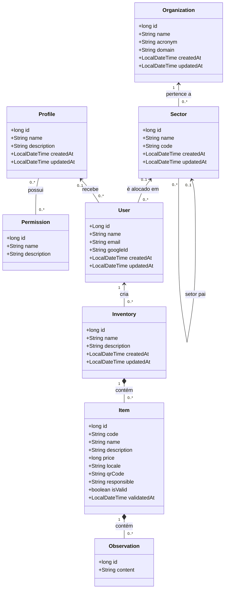

# Diagrama de Classes

## Papel deste artefato

O diagrama de classes é um artefato UML complementar aos diagramas C4; ele não se encaixa em nenhum dos níveis C4. Enquanto o C4 de Componentes explica como as partes da API colaboram, este documento detalha as classes de domínio persistidas, seus atributos e relacionamentos.

O escopo é deliberadamente o pacote `backend/src/main/java/clp/inventory/model`. DTOs, controllers, serviços, repositórios e classes de segurança não aparecem porque não representam o modelo de negócio persistente. A fonte de verdade do banco é o changelog Liquibase em `backend/src/main/resources/db/changelog/changes/0.0.xml`; as entidades JPA foram conferidas junto com ele.

## Diagrama UML do modelo atual

## Classes e responsabilidades

| Classe | Tabela | Responsabilidade e regras atuais |
| --- | --- | --- |
| `Organization` | `im_organization` | Representa a instituição. O nome é obrigatório e único; sigla e domínio são opcionais. |
| `Sector` | `im_sector` | Representa setor, departamento, campus ou unidade. Sempre pertence a uma organização e pode apontar para outro setor como pai, formando uma hierarquia. |
| `Profile` | `im_profile` | Define um perfil funcional. Nome obrigatório e único; reúne permissões pela tabela associativa `im_profile_permission`. |
| `Permission` | `im_permission` | Representa uma capacidade granular, como gerir setores ou validar item. Nome obrigatório e único. |
| `User` | `im_user` | Usuário autenticado pelo Google. E-mail e `googleId` são únicos; setor e perfil são opcionais no schema atual. |
| `Inventory` | `im_inventory` | Agrupa os itens de um levantamento. Possui nome, descrição e usuário criador obrigatórios; a regra da aplicação impede nomes repetidos para o mesmo criador. |
| `Item` | `im_item` | Representa o bem patrimonial. Possui código, dados descritivos, valor em centavos, localização, responsável, status de validação, data de validação e QR Code legado. |
| `Observation` | `im_observation` | Registro textual associado a um item. Não contém autor nem data; por isso não constitui auditoria. |

## Relacionamentos e cardinalidades

| Relação | Cardinalidade | Implementação |
| --- | --- | --- |
| Organização–setor | Uma organização possui zero ou mais setores; cada setor pertence a uma organização. | FK obrigatória `im_sector.id_organization`. |
| Setor–setor | Um setor pode ter zero ou um setor pai; um setor pode ser pai de vários outros. | FK opcional autorreferente `im_sector.id_parent_sector`. |
| Setor–usuário | Um usuário pode não estar alocado ou estar em um setor; um setor pode ter vários usuários. | FK opcional `im_user.id_sector`. |
| Perfil–usuário | Um usuário pode não ter perfil ou ter um perfil; um perfil pode ser atribuído a vários usuários. | FK opcional `im_user.id_profile`. |
| Perfil–permissão | Um perfil possui várias permissões e uma permissão pode compor vários perfis. | Tabela N:N `im_profile_permission`, com chave primária composta. |
| Usuário–inventário | Um usuário cria vários inventários; cada inventário tem um criador. | FK obrigatória `im_inventory.id_user`. |
| Inventário–item | Um inventário contém vários itens; cada item pertence a um inventário. | FK obrigatória `im_item.id_inventory`; remoção órfã é configurada na entidade. |
| Item–observação | Um item contém várias observações; cada observação pertence a um item. | FK obrigatória `im_observation.id_item`; remoção órfã é configurada na entidade. |

## Restrições e particularidades

- `User.email`, `User.googleId`, `Organization.name`, `Profile.name` e `Permission.name` possuem unicidade no schema.
- `Item.price` é armazenado como `long`, em centavos, para evitar erros de arredondamento de ponto flutuante.
- O QR Code é um UUID textual criado antes da persistência do item. A geração de QR/etiquetas continua no código, mas é funcionalidade legada fora do escopo ativo.
- `Inventory`, `Organization`, `Sector`, `Profile` e `User` possuem timestamps de criação e atualização. `Item` possui apenas `validatedAt`; `Observation` não possui timestamps.
- O schema faz `im_item.id_inventory` obrigatório. A anotação JPA correspondente não define `nullable = false`; o comportamento efetivo do banco, portanto, é o obrigatório.
- A entidade `Item` declara `isValid` como `unique = true`, mas o changelog Liquibase não cria essa restrição. O schema atual permite vários itens com o mesmo estado de validação; a anotação deve ser corrigida antes de uma geração futura de schema depender dela.

## Limites do modelo atual e evolução

O modelo já representa a estrutura institucional e as permissões, mas ainda não expressa toda a regra de negócio desejada:

1. `Inventory` não possui `id_sector`; o vínculo ao setor é apenas indireto, pelo usuário criador.
2. Perfil e setor de `User` são opcionais, e o backend ainda não aplica as permissões nem o escopo setorial na autorização.
3. Não existe uma classe ou tabela de histórico de validações/auditoria. Para atender ao requisito, será necessário um evento imutável com item, inventário, usuário responsável, instante, ação, estados anterior e resultante e motivo/observação.
4. A leitura de código de barras ainda não possui classes nem integração no repositório.

Essas lacunas são intencionais neste diagrama: ele descreve o que existe hoje e aponta o que precisa ser modelado, sem antecipar classes que ainda não foram implementadas.

## Relação com os demais documentos

- [C4 — Contexto](./C4-Contexto): pessoas e sistemas externos.
- [C4 — Containers](./C4-Containers): aplicações executáveis e integrações.
- [C4 — Componentes](./C4-Componentes): componentes internos da API.
- [Documento de Modelagem de Dados](./Documento-de-Modelagem-de-Dados): visão relacional do schema, migrations e plano de evolução.
