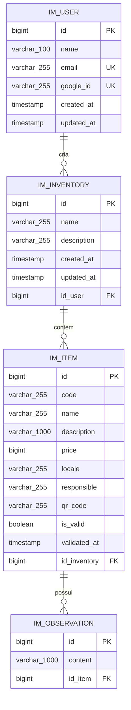

# Documento de Modelagem de Dados

Este documento descreve o modelo de dados atual do Inventarium conforme o changelog Liquibase em `backend/src/main/resources/db/changelog/changes/0.0.xml` e as entidades JPA em `backend/src/main/java/clp/inventory/model`.

O objetivo e registrar as entidades principais, relacionamentos, cardinalidades, chaves, restricoes relevantes e decisoes de modelagem que impactam o funcionamento do sistema.

## Visao Geral

O modelo atual organiza os dados patrimoniais em quatro entidades principais:

- Usuario autenticado via Google
- Inventario criado por um usuario
- Item patrimonial pertencente a um inventario
- Observacao associada a um item

As tabelas sao criadas e versionadas por Liquibase. Os identificadores sao gerados por sequences PostgreSQL especificas para cada tabela.

## Diagrama Entidade-Relacionamento

## Tabelas e Colunas

### `im_user`

Representa uma pessoa autenticada pelo Google. Nao ha senha local, token de verificacao ou fluxo proprio de cadastro.

| Coluna | Tipo | Chave | Obrigatoria | Restricoes/observacoes |
| --- | --- | --- | --- | --- |
| `id` | `bigint` | PK | Sim | Gerado pela sequence `im_user_id`. |
| `name` | `VARCHAR(100)` | - | Sim | Nome recebido do Google; limitado a 100 caracteres no schema. |
| `email` | `VARCHAR(255)` | UK | Sim | E-mail unico, usado para localizar usuario existente. |
| `google_id` | `VARCHAR(255)` | UK | Sim | Armazena o `sub` do Google; nao e usado sozinho para autenticar. |
| `created_at` | `TIMESTAMP` | - | Sim | Preenchido pela aplicacao via `@CreationTimestamp`. |
| `updated_at` | `TIMESTAMP` | - | Sim | Atualizado pela aplicacao via `@UpdateTimestamp`. |

### `im_inventory`

Representa um inventario patrimonial criado por um usuario.

| Coluna | Tipo | Chave | Obrigatoria | Restricoes/observacoes |
| --- | --- | --- | --- | --- |
| `id` | `bigint` | PK | Sim | Gerado pela sequence `im_inventory_id`. |
| `name` | `VARCHAR(255)` | - | Sim | Obrigatorio. A unicidade por usuario e validada na aplicacao, nao por constraint composta no banco. |
| `description` | `VARCHAR(255)` | - | Nao | Descricao livre do inventario. |
| `created_at` | `TIMESTAMP` | - | Sim | Preenchido pela aplicacao via `@CreationTimestamp`. |
| `updated_at` | `TIMESTAMP` | - | Sim | Default `CURRENT_TIMESTAMP` no Liquibase e atualizado pela aplicacao via `@UpdateTimestamp`. |
| `id_user` | `BIGINT` | FK | Sim | Referencia `im_user.id`. |

### `im_item`

Representa um bem patrimonial pertencente a um inventario.

| Coluna | Tipo | Chave | Obrigatoria | Restricoes/observacoes |
| --- | --- | --- | --- | --- |
| `id` | `bigint` | PK | Sim | Gerado pela sequence `im_item_id`. |
| `code` | `VARCHAR(255)` | - | Sim | Codigo patrimonial informado/importado. A duplicidade dentro do inventario e validada na aplicacao ao importar planilhas. |
| `name` | `VARCHAR(255)` | - | Nao | Nome do item. |
| `description` | `VARCHAR(1000)` | - | Nao | Descricao do item. |
| `price` | `BIGINT` | - | Nao | Valor armazenado em centavos para evitar arredondamento de ponto flutuante. |
| `locale` | `VARCHAR(255)` | - | Nao | Localizacao fisica do item. |
| `responsible` | `VARCHAR(255)` | - | Nao | Responsavel pelo item. |
| `qr_code` | `VARCHAR(255)` | - | Sim | UUID gerado pela aplicacao antes de persistir quando ausente. |
| `is_valid` | `BOOLEAN` | - | Sim | Default `false`. Indica se o item foi validado. |
| `validated_at` | `TIMESTAMP` | - | Nao | Data/hora em que o item foi validado, quando aplicavel. |
| `id_inventory` | `BIGINT` | FK | Sim | Referencia `im_inventory.id`. |

### `im_observation`

Representa uma observacao textual ligada a um item patrimonial.

| Coluna | Tipo | Chave | Obrigatoria | Restricoes/observacoes |
| --- | --- | --- | --- | --- |
| `id` | `bigint` | PK | Sim | Gerado pela sequence `im_observation_id`. |
| `content` | `VARCHAR(1000)` | - | Sim | Texto da observacao. |
| `id_item` | `BIGINT` | FK | Sim | Referencia `im_item.id`; possui indice `ix_0031251303422`. |

## Relacionamentos e Cardinalidades

| Origem | Destino | Cardinalidade | Chave estrangeira | Descricao |
| --- | --- | --- | --- | --- |
| `im_user` | `im_inventory` | 1:N | `im_inventory.id_user -> im_user.id` | Um usuario pode criar nenhum ou varios inventarios. Cada inventario pertence a exatamente um usuario. |
| `im_inventory` | `im_item` | 1:N | `im_item.id_inventory -> im_inventory.id` | Um inventario pode conter nenhum ou varios itens. Cada item pertence a exatamente um inventario. |
| `im_item` | `im_observation` | 1:N | `im_observation.id_item -> im_item.id` | Um item pode possuir nenhuma ou varias observacoes. Cada observacao pertence a exatamente um item. |

## Chaves e Indices

| Tipo | Nome | Tabela | Colunas |
| --- | --- | --- | --- |
| PK | `pk_user` | `im_user` | `id` |
| PK | `pk_inventory` | `im_inventory` | `id` |
| PK | `pk_item` | `im_item` | `id` |
| PK | `pk_observation` | `im_observation` | `id` |
| FK | `fk_9553013621156` | `im_inventory` | `id_user -> im_user.id` |
| FK | `fk_4475173894937` | `im_item` | `id_inventory -> im_inventory.id` |
| FK | `fk_9506536018245` | `im_observation` | `id_item -> im_item.id` |
| UK | `uk_3602435580614` | `im_user` | `email` |
| UK | `uk_4471209836512` | `im_user` | `google_id` |
| Index | `ix_0031251303422` | `im_observation` | `id_item` |

## Sequences

| Sequence | Tabela relacionada | Incremento | Inicio |
| --- | --- | --- | --- |
| `im_user_id` | `im_user` | 1 | 1 |
| `im_inventory_id` | `im_inventory` | 1 | 1 |
| `im_item_id` | `im_item` | 1 | 1 |
| `im_observation_id` | `im_observation` | 1 | 1 |

## Restricoes Relevantes

| Restricao | Onde esta aplicada | Observacao |
| --- | --- | --- |
| Usuario deve ter `name`, `email`, `google_id`, `created_at` e `updated_at`. | Banco e entidade JPA. | Reflete que todo usuario nasce a partir do login com Google. |
| `email` e `google_id` sao unicos. | Banco e entidade JPA. | Evita duplicidade de conta local para o mesmo e-mail ou `sub` do Google. |
| Inventario deve pertencer a um usuario. | Banco e entidade JPA. | `id_user` e obrigatorio. |
| Item deve pertencer a um inventario. | Banco. | `id_inventory` e obrigatorio no Liquibase. |
| Observacao deve pertencer a um item. | Banco e entidade JPA. | `id_item` e obrigatorio. |
| `is_valid` inicia como `false`. | Banco e entidade JPA. | `validated_at` permanece nulo ate haver validacao. |
| Nome de inventario nao pode ser vazio. | Aplicacao. | Validado em `InventoryService`; nao ha constraint `CHECK` no banco. |
| Nome de inventario deve ser unico por usuario. | Aplicacao. | Validado por `existsByNameAndUser_Id`; nao ha unique composta em banco. |
| Codigo do item nao pode ser vazio nem exceder 30 caracteres na importacao. | Aplicacao. | Validado no fluxo de planilha em `InventoryController`. |
| Preco do item nao pode ser negativo na importacao. | Aplicacao. | Validado antes de persistir itens importados. |
| Codigo de item nao pode repetir dentro do mesmo inventario na importacao. | Aplicacao. | Validado em `InventoryService.addItemToInventory`; nao ha unique composta em banco. |
| Dominio do e-mail pode restringir criacao de usuarios. | Aplicacao. | Controlado por `GOOGLE_ALLOWED_DOMAINS` no fluxo de login com Google. |

## Decisoes de Modelagem

1. **Autenticacao delegada ao Google:** a tabela `im_user` nao possui senha, telefone, verificacao de e-mail nem tokens de recuperacao. A posse do e-mail e validada pelo Google, e o backend persiste apenas os dados necessarios para vincular a conta local ao usuario Google.
2. **`google_id` obrigatorio e unico:** o campo armazena o claim `sub` do Google. Ele ajuda a rastrear a identidade externa, mas nao substitui a validacao criptografica do ID token no login.
3. **Valores monetarios em centavos:** `im_item.price` usa `BIGINT` para evitar problemas de precisao de ponto flutuante. A conversao para reais e feita na entrada/saida da aplicacao.
4. **QR Code persistido como identificador textual:** `im_item.qr_code` guarda um UUID gerado pela aplicacao. As imagens de QR Code e PDFs sao artefatos gerados a partir desse valor, nao arquivos persistidos no banco.
5. **Historico simples de observacoes:** observacoes pertencem diretamente ao item. O modelo atual nao registra autor, data de criacao ou edicao da observacao.
6. **Exclusao em cascata controlada pela aplicacao:** as entidades JPA usam `cascade = CascadeType.ALL` e `orphanRemoval = true` para itens de inventario e observacoes de item. O changelog Liquibase atual nao declara `ON DELETE CASCADE` nas FKs.
7. **Regras de unicidade de negocio fora do banco:** unicidade de nome de inventario por usuario e de codigo de item por inventario sao regras aplicadas nos servicos. Caso o sistema passe a ter concorrencia maior ou escrita por multiplos caminhos, pode ser necessario promover essas regras para constraints compostas no banco.

## Observacoes de Consistencia

- A entidade `Item` possui `@Column(unique = true)` em `isValid`, mas o changelog Liquibase atual nao cria unique constraint para `im_item.is_valid`. Como o modelo de dados versionado e definido pelo Liquibase, este documento considera o banco atual sem essa unicidade.
- As colunas `created_at` e `updated_at` existem apenas em `im_user` e `im_inventory`. Itens e observacoes nao possuem timestamps no schema atual.
- O campo `qr_code` e obrigatorio no banco, mas a aplicacao gera o valor automaticamente antes da persistencia quando ele esta ausente.

## Observacoes de Revisao

Este documento deve ser revisado por outro integrante no pull request antes do merge na `main`. A revisao deve confirmar se o diagrama esta coerente com o changelog Liquibase atual, se as cardinalidades refletem as entidades JPA e se as regras de negocio documentadas continuam sendo aplicadas pela aplicacao.

## Historico

| Versao | Data | Descricao |
| --- | --- | --- |
| 1.0 | 2026-09-08 | Criacao do documento de modelagem de dados com entidades, relacionamentos, chaves, restricoes e decisoes de modelagem. |
