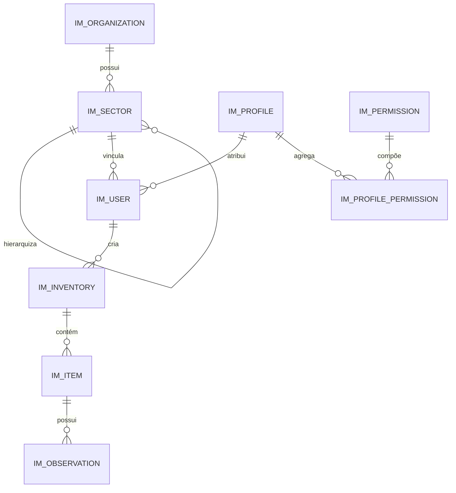

# Documento de Modelagem de Dados

Este documento descreve o modelo de dados implementado no Inventarium. A fonte de verdade é o changelog Liquibase em `backend/src/main/resources/db/changelog/changes/0.0.xml`, conferido com as entidades JPA em `backend/src/main/java/clp/inventory/model`.

O schema incorporou organizações, setores hierárquicos, perfis, permissões e a vinculação opcional de usuário a setor e perfil. O vínculo setorial de inventário e o histórico de validações ainda não foram implementados.

## Visão Geral

```mermaid
erDiagram
    IM_ORGANIZATION ||--o{ IM_SECTOR : possui
    IM_SECTOR ||--o{ IM_SECTOR : hierarquiza
    IM_SECTOR ||--o{ IM_USER : vincula
    IM_PROFILE ||--o{ IM_USER : atribui
    IM_PROFILE ||--o{ IM_PROFILE_PERMISSION : agrega
    IM_PERMISSION ||--o{ IM_PROFILE_PERMISSION : compõe
    IM_USER ||--o{ IM_INVENTORY : cria
    IM_INVENTORY ||--o{ IM_ITEM : contém
    IM_ITEM ||--o{ IM_OBSERVATION : possui
```

## Tabelas Implementadas

| Tabela | Finalidade | Relações e regras principais |
| --- | --- | --- |
| `im_organization` | Organização ou instituição. | Possui setores; `name` é único. |
| `im_sector` | Setor, departamento, campus ou unidade. | Pertence a uma organização e pode possuir setor pai. |
| `im_profile` | Perfil funcional. | Possui permissões por associação N:N; `name` é único. |
| `im_permission` | Permissão granular. | É atribuída a perfis; `name` é único. |
| `im_profile_permission` | Associação perfil-permissão. | Chave primária composta por `id_profile` e `id_permission`. |
| `im_user` | Pessoa autenticada pelo Google. | `email` e `google_id` são únicos; setor e perfil são opcionais na migração. |
| `im_inventory` | Inventário patrimonial. | Pertence ao usuário criador por `id_user`. |
| `im_item` | Bem de um inventário. | Código, QR Code e inventário são obrigatórios; inicia não validado. |
| `im_observation` | Observação textual de um item. | Conteúdo e item são obrigatórios. |

## Perfis e Permissões

O Liquibase cria permissões de gestão de organização e setor, associação de usuário, operação de inventários, importação, validação e exportação. Os perfis iniciais são `ADMIN_ORGANIZATION`, `GESTOR_SETOR`, `OPERADOR_CAMPO` e `CONSULTA`.

`ADMIN_ORGANIZATION` recebe todas as permissões. `GESTOR_SETOR` e `OPERADOR_CAMPO` recebem subconjuntos operacionais. `CONSULTA` existe, mas ainda não possui permissão explícita de leitura; as rotas atuais também não aplicam autorização baseada nesses perfis.

## Aderência ao Modelo Alvo

| Elemento | Situação | Evidência |
| --- | --- | --- |
| Organizações | Implementado | Tabela, entidade, serviço e controlador. |
| Setores e hierarquia | Implementado | `id_organization` e `id_parent_sector`. |
| Perfis, permissões e associação N:N | Implementado | Tabelas, seeds Liquibase e entidades JPA. |
| Usuário com setor e perfil | Implementado parcialmente | FKs e endpoints existem, mas os campos são opcionais. |
| Inventário pertencente a setor | Pendente | `im_inventory` ainda possui apenas `id_user`. |
| Autorização por setor e permissão | Pendente | O serviço de inventários valida ownership pelo usuário criador. |
| Histórico e pendências entre setores | Pendente | Não há `im_validation_history` nem fluxo correspondente. |

## Regras de Negócio Atuais

- A autenticação é delegada ao Google; não há senha local em `im_user`.
- `GOOGLE_ALLOWED_DOMAINS` pode restringir a criação de usuários.
- O nome do inventário é único por usuário na aplicação.
- O código do item não pode se repetir no mesmo inventário durante a importação.
- Valores monetários são armazenados em centavos; QR Codes são UUIDs textuais persistidos.

## Próximas Evoluções

1. Adicionar `id_sector` obrigatório em `im_inventory`.
2. Tornar setor e perfil obrigatórios em `im_user` após saneamento dos dados.
3. Implementar `im_validation_history` e pendências entre setores.
4. Aplicar autorização por setor e permissão em todas as rotas patrimoniais.
5. Criar uma permissão explícita de leitura para `CONSULTA`.

## Histórico

| Versão | Data | Descrição |
| --- | --- | --- |
| 1.0 | 2026-09-08 | Criação do documento inicial. |
| 2.0 | 2026-09-27 | Atualização para organizações, setores, perfis e permissões. |
