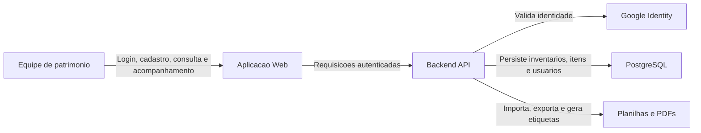

# Documento de Visao

## Produto

O **Inventarium** e uma plataforma de apoio ao inventario patrimonial do IFPE. A solucao nasceu no contexto academico da disciplina de Engenharia de Software e foi organizada como um monorepo com backend, aplicacao web e documentacao versionada.

A proposta e reduzir trabalho manual no tombamento e na conferencia de bens, reunindo cadastro de inventarios, importacao de planilhas, consulta de itens, geracao de etiquetas com QR Code e autenticacao institucional via Google.

## Problema

O controle patrimonial depende de informacoes confiaveis sobre bens, responsaveis, localizacao e situacao dos itens. Quando esse processo fica espalhado em planilhas, registros manuais e ferramentas desconectadas, a equipe perde rastreabilidade e gasta mais tempo em conferencias repetidas.

O Inventarium busca atacar esse ponto: centralizar dados operacionais do inventario e facilitar o uso em campo, sem tentar substituir todos os sistemas administrativos institucionais.

## Objetivo

Oferecer uma ferramenta simples e rastreavel para apoiar equipes de patrimonio no cadastro, consulta, conferencia e documentacao de bens patrimoniais.

O produto deve permitir que a equipe:

- crie e acompanhe inventarios;
- importe itens a partir de planilhas;
- consulte e edite dados patrimoniais;
- registre observacoes;
- gere etiquetas em PDF com QR Code;
- exporte informacoes em planilha;
- use autenticacao institucional com conta Google;
- opere com frontend web e backend API.

## Publico-Alvo

| Publico | Necessidade principal |
| --- | --- |
| Equipe de patrimonio | Registrar, conferir e consultar bens com menos retrabalho. |
| Servidores envolvidos no levantamento | Acessar informacoes de inventario e apoiar a validacao fisica dos itens. |
| Gestores, docentes e avaliadores | Entender escopo, andamento, arquitetura e qualidade dos artefatos do projeto. |
| Equipe de desenvolvimento | Evoluir o sistema com branch, PR, CI/CD, documentacao e releases rastreaveis. |

## Escopo Atual

O escopo atual cobre:

- backend em Spring Boot com API REST;
- frontend web em Next.js;
- PostgreSQL como banco de dados;
- login com Google;
- JWT proprio da aplicacao;
- importacao e exportacao de planilhas;
- geracao de PDF de etiquetas;
- conteinerizacao com Docker;
- publicacao de imagens no GHCR;
- wiki versionada em `docs/wiki`.

## Fora do Escopo Atual

O Inventarium ainda nao se propoe a cobrir todo o ciclo administrativo de patrimonio. Estao fora do escopo atual:

- substituicao completa de sistemas institucionais como SUAP ou SIPAC;
- fluxo formal de transferencia, baixa, acautelamento ou desfazimento de bens;
- modulo financeiro ou contabil;
- gestao de contratos;
- integracao automatica com sistemas administrativos externos;
- deploy totalmente automatizado em producao;
- observabilidade completa de producao.

Esses pontos podem ser avaliados em ciclos futuros, se fizerem sentido para o uso real do projeto.

## Visao de Uso

## Stakeholders

| Stakeholder | Interesse no projeto |
| --- | --- |
| Demandante academica | Acompanhar se a solucao atende ao problema proposto. |
| Equipe de patrimonio | Usar a ferramenta para reduzir esforco operacional. |
| Equipe de desenvolvimento | Manter codigo, documentacao, seguranca e automacoes. |
| Avaliadores do projeto | Verificar clareza, rastreabilidade e maturidade tecnica. |
| Instituicao | Avaliar potencial de evolucao para apoiar processos patrimoniais. |

## Requisitos e Backlog

O backlog e os requisitos operacionais devem ficar no **GitHub Project**, porque e la que o trabalho muda de estado, recebe responsaveis, prioridade, issues e acompanhamento do ciclo.

A wiki nao deve duplicar esse backlog. O papel dela e registrar a visao do produto, decisoes tecnicas, arquitetura, seguranca, operacao e links para a fonte operacional quando necessario.

## Criterios de Sucesso

O projeto e considerado bem encaminhado quando:

- a equipe consegue subir o ambiente local pelo guia operacional;
- os artefatos principais da wiki estao publicados e navegaveis;
- as mudancas passam por issue, branch, PR e revisao;
- as imagens de backend e frontend sao buildadas e escaneadas;
- a autenticacao Google e as permissoes sao tratadas no backend;
- riscos de seguranca conhecidos estao documentados e priorizados;
- a release pode ser promovida de `development` para `main` com rastreabilidade.

## Historico

| Versao | Data | Descricao |
| --- | --- | --- |
| 1.0 | 2026-09-15 | Criacao do documento de visao do projeto. |
