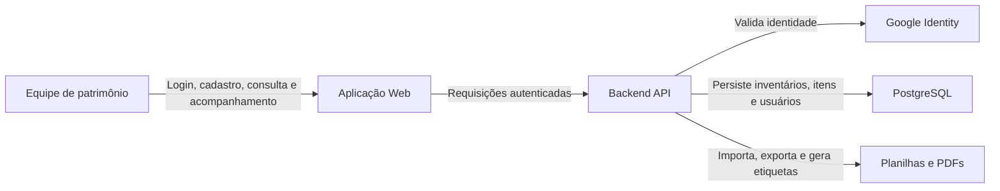

# Documento de Visão

## Produto

O **Inventarium** e uma plataforma de apoio ao inventário patrimonial do IFPE. A solucao nasceu no contexto academico da disciplina de Engenharia de Software e foi organizada como um monorepo com backend, aplicação web e documentação versionada.

A proposta e reduzir trabalho manual no tombamento e na conferencia de bens, reunindo cadastro de inventários, importação de planilhas, consulta de itens, geração de etiquetas com QR Code e autenticação institucional via Google.

## Problema

O controle patrimonial depende de informações confiáveis sobre bens, responsáveis, localização e situação dos itens. Quando esse processo fica espalhado em planilhas, registros manuais e ferramentas desconectadas, a equipe perde rastreabilidade e gasta mais tempo em conferências repetidas.

O Inventarium busca atacar esse ponto: centralizar dados operacionais do inventário e facilitar o uso em campo, sem tentar substituir todos os sistemas administrativos institucionais.

## Objetivo

Oferecer uma ferramenta simples e rastreavel para apoiar equipes de patrimônio no cadastro, consulta, conferencia e documentação de bens patrimoniais.

O produto deve permitir que a equipe:

- crie e acompanhe inventários;
- importe itens a partir de planilhas;
- consulte e edite dados patrimoniais;
- registre observações;
- gere etiquetas em PDF com QR Code;
- exporte informações em planilha;
- use autenticação institucional com conta Google;
- opere com frontend web e backend API.

## Publico-Alvo

| Publico | Necessidade principal |
| --- | --- |
| Equipe de patrimônio | Registrar, conferir e consultar bens com menos retrabalho. |
| Servidores envolvidos no levantamento | Acessar informações de inventário e apoiar a validação fisica dos itens. |
| Gestores, docentes e avaliadores | Entender escopo, andamento, arquitetura e qualidade dos artefatos do projeto. |
| Equipe de desenvolvimento | Evoluir o sistema com branch, PR, CI/CD, documentação e releases rastreaveis. |

## Escopo Atual

O escopo atual cobre:

- backend em Spring Boot com API REST;
- frontend web em Next.js;
- PostgreSQL como banco de dados;
- login com Google;
- JWT próprio da aplicação;
- importação e exportação de planilhas;
- geração de PDF de etiquetas;
- conteinerizacao com Docker;
- publicação de imagens no GHCR;
- wiki versionada em `docs/wiki`.

## Fora do Escopo Atual

O Inventarium ainda não se propoe a cobrir todo o ciclo administrativo de patrimônio. Estao fora do escopo atual:

- substituição completa de sistemas institucionais como SUAP ou SIPAC;
- fluxo formal de transferencia, baixa, acautelamento ou desfazimento de bens;
- módulo financeiro ou contábil;
- gestão de contratos;
- integração automatica com sistemas administrativos externos;
- deploy totalmente automatizado em produção;
- observabilidade completa de produção.

Esses pontos podem ser avaliados em ciclos futuros, se fizerem sentido para o uso real do projeto.

## Visão de Uso

```mermaid
flowchart LR
    equipe["Equipe de patrimônio"]
    web["Aplicação Web"]
    api["Backend API"]
    banco["PostgreSQL"]
    google["Google Identity"]
    arquivos["Planilhas e PDFs"]

    equipe -->|"Login, cadastro, consulta e acompanhamento"| web
    web -->|"Requisições autenticadas"| api
    api -->|"Valida identidade"| google
    api -->|"Persiste inventários, itens e usuários"| banco
    api -->|"Importa, exporta e gera etiquetas"| arquivos
```

## Stakeholders

| Stakeholder | Interesse no projeto |
| --- | --- |
| Demandante academica | Acompanhar se a solucao atende ao problema proposto. |
| Equipe de patrimônio | Usar a ferramenta para reduzir esforco operacional. |
| Equipe de desenvolvimento | Manter código, documentação, segurança e automações. |
| Avaliadores do projeto | Verificar clareza, rastreabilidade e maturidade técnica. |
| Instituicao | Avaliar potencial de evolucao para apoiar processos patrimoniais. |

## Requisitos e Backlog

O backlog e os requisitos operacionais devem ficar no **GitHub Project**, porque e lá que o trabalho muda de estado, recebe responsáveis, prioridade, issues e acompanhamento do ciclo.

A wiki não deve duplicar esse backlog. O papel dela e registrar a visão do produto, decisões técnicas, arquitetura, segurança, operação e links para a fonte operacional quando necessário.

## Critérios de Sucesso

O projeto e considerado bem encaminhado quando:

- a equipe consegue subir o ambiente local pelo guia operacional;
- os artefatos principais da wiki estao publicados e navegaveis;
- as mudanças passam por issue, branch, PR e revisão;
- as imagens de backend e frontend são buildadas e escaneadas;
- a autenticação Google e as permissões são tratadas no backend;
- riscos de segurança conhecidos estao documentados e priorizados;
- cada release pode ser gerada a partir de um pull request rastreavel para `main`.

## Histórico

| Versão | Data | Descrição |
| --- | --- | --- |
| 1.0 | 2026-09-15 | Criação do documento de visão do projeto. |
