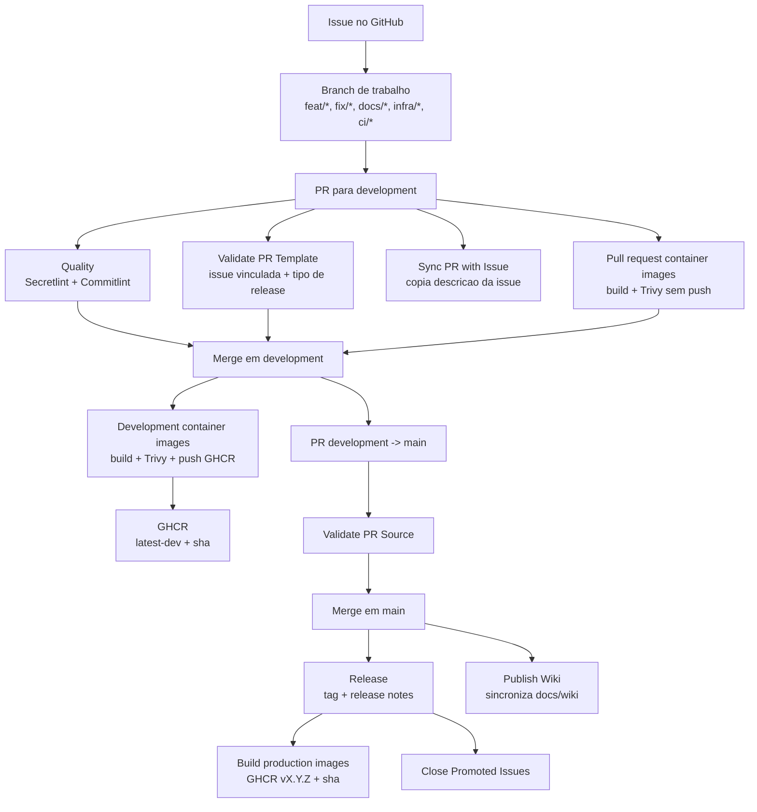
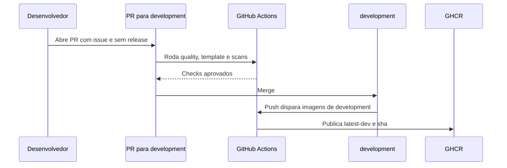
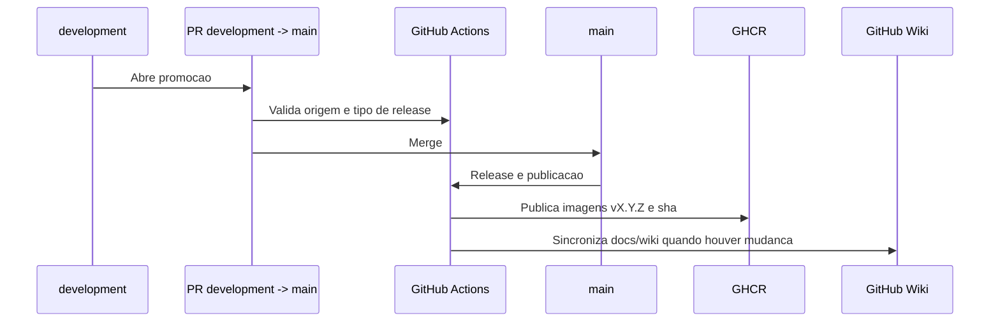
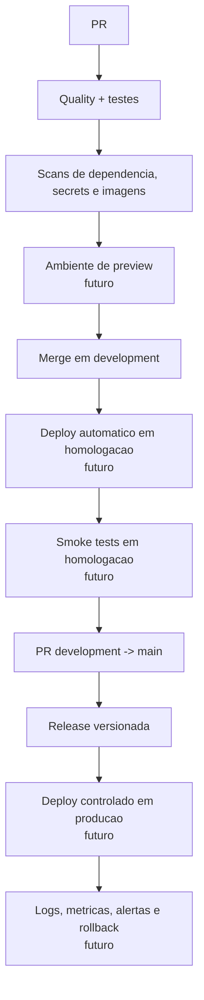

# Esteira de CI/CD

Esta pagina mostra a esteira atual do Inventarium e a direcao desejada para evolucao. Ela complementa o guia de desenvolvimento seguro e a estrategia de branches.

## Estado Atual

Hoje a esteira cobre validacao de pull requests, build e scan de imagens, publicacao de imagens no GHCR, criacao de releases e publicacao da wiki.

## O Que Ja Existe

| Parte | Situacao atual |
| --- | --- |
| Validacao de secrets | `Quality` roda Secretlint em pull requests. |
| Validacao de commits | `Quality` roda Commitlint em PRs, exceto Dependabot e promocao `development` -> `main`. |
| Validacao de template | `Validate PR Template` confere issue vinculada e tipo de release esperado. |
| Sincronizacao PR/issue | `Sync PR with Issue` copia a descricao da issue para o PR quando aplicavel. |
| Controle de origem para `main` | `Validate PR Source` aceita apenas `development` ou `hotfix/*`. |
| Build e scan em PR | `Pull request container images` builda e escaneia imagens afetadas sem publicar. |
| Imagens de development | Push em `development` publica imagens `latest-dev` e `sha-<commit-sha>` no GHCR. |
| Release | Merge em `main` vindo de `development` ou `hotfix/*` cria tag e GitHub Release quando o PR nao esta como `sem release`. |
| Imagens produtivas | Release publica imagens versionadas no GHCR. |
| Wiki | Push em `main` com mudanca em `docs/wiki` sincroniza a GitHub Wiki. |
| Fechamento de issues | `Close Promoted Issues` fecha issues promovidas quando `development` entra em `main`. |

## Fluxo de Homologacao Atual

## Fluxo de Release Atual

## Direcao Desejada

A esteira ainda nao faz deploy automatico de ambiente, rollback operacional completo nem validacao funcional ponta a ponta. O desenho abaixo mostra a direcao desejada sem dizer que tudo isso ja existe.

## Pontos Ainda Manuais

| Ponto | Como esta hoje |
| --- | --- |
| Deploy em VM | As imagens sao publicadas no GHCR, mas a atualizacao da stack ainda depende de operacao externa ou manual. |
| Evidencia de ambiente | Ainda nao ha smoke test automatizado contra uma URL de homologacao. |
| Observabilidade | Logs, metricas, alertas e dashboards ainda nao estao fechados como artefato de infraestrutura. |
| Rollback operacional | As tags `sha-<commit-sha>` permitem rollback de imagem, mas o procedimento operacional ainda precisa ser consolidado. |
| Dependabot sem criticos | A evidencia vem da aba Security/Dependabot do GitHub, nao apenas dos arquivos versionados. |

## Historico

| Versao | Data | Descricao |
| --- | --- | --- |
| 1.0 | 2026-09-15 | Criacao da pagina da esteira de CI/CD com visao atual e direcao futura. |
