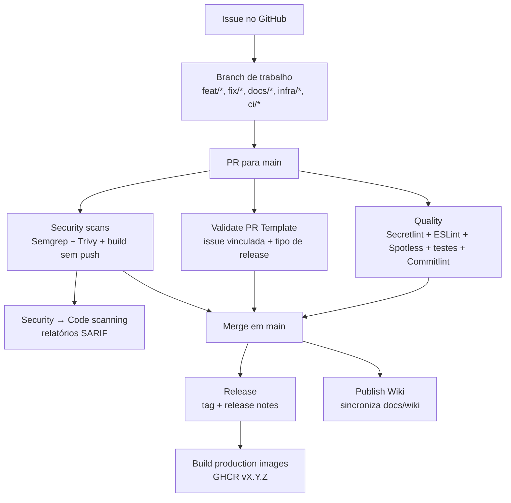
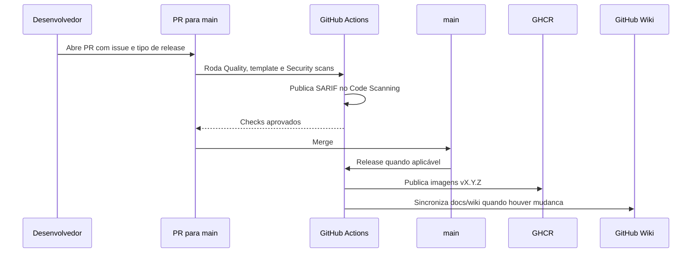
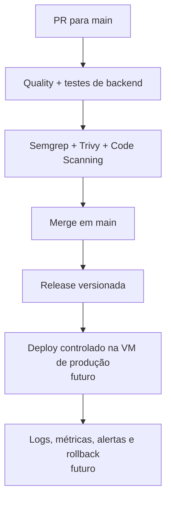

# Esteira de CI/CD

Esta página descreve a esteira atual do Inventarium. O repositório usa `main` como única branch de integração e entrega.

## Fluxo Atual

```mermaid
flowchart TD
    issue["Issue no GitHub"]
    branch["Branch de trabalho<br/>feat/*, fix/*, docs/*, infra/*, ci/*"]
    pr["PR para main"]
    quality["Quality<br/>Secretlint + ESLint + Spotless + testes + Commitlint"]
    prtemplate["Validate PR Template<br/>issue vinculada + tipo de release"]
    security["Security scans<br/>Semgrep + Trivy + build sem push"]
    codeScanning["Security → Code scanning<br/>relatórios SARIF"]
    merge["Merge em main"]
    release["Release<br/>tag + release notes"]
    prodImages["Build production images<br/>GHCR vX.Y.Z"]
    wiki["Publish Wiki<br/>sincroniza docs/wiki"]

    issue --> branch --> pr
    pr --> quality
    pr --> prtemplate
    pr --> security
    quality --> merge
    prtemplate --> merge
    security --> codeScanning
    security --> merge
    merge --> release
    merge --> wiki
    release --> prodImages
```

## O Que Ja Existe

| Parte | Situação atual |
| --- | --- |
| Qualidade da aplicação | `Quality` roda Secretlint, ESLint no frontend, Spotless e testes Gradle/Testcontainers no backend. Commitlint é executado em PRs humanos. |
| Validação de template | `Validate PR Template` confere issue vinculada e tipo de release. |
| Segurança em PR | `Security scans` executa Semgrep e Trivy. O Trivy verifica secrets, dependências e imagens; as imagens são construídas no runner, sem publicação no GHCR. |
| Relatórios de segurança | Semgrep e Trivy geram SARIF para Security → Code scanning e artifacts temporários por 14 dias. Semgrep está em baseline até a triagem dos achados. |
| Release | Merge em `main` cria tag e GitHub Release quando o PR humano não está como `sem release`; Dependabot gera `patch` automaticamente. |
| Imagens produtivas | Release publica imagens versionadas no GHCR usando somente a tag `vX.Y.Z`, depois dos scans. |
| Wiki | Push em `main` com mudança em `docs/wiki` sincroniza a GitHub Wiki. |
| Fechamento de issues | O GitHub fecha a issue vinculada quando o PR entra em `main`. |

## Fluxo de Pull Request e Release

```mermaid
sequenceDiagram
    participant Dev as Desenvolvedor
    participant PR as PR para main
    participant CI as GitHub Actions
    participant Main as main
    participant GHCR as GHCR
    participant Wiki as GitHub Wiki

    Dev->>PR: Abre PR com issue e tipo de release
    PR->>CI: Roda Quality, template e Security scans
    CI->>CI: Publica SARIF no Code Scanning
    CI-->>PR: Checks aprovados
    PR->>Main: Merge
    Main->>CI: Release quando aplicável
    CI->>GHCR: Publica imagens vX.Y.Z
    CI->>Wiki: Sincroniza docs/wiki quando houver mudanca
```

PRs do Dependabot são dispensados da issue e do template; ao serem mergeados, o workflow de release os trata como `patch`.

## Direção Desejada

A esteira ainda não faz deploy automático de ambiente, rollback operacional completo nem testes automatizados de frontend. O desenho abaixo mostra a direção desejada sem dizer que tudo isso já existe.

```mermaid
flowchart TD
    pr["PR para main"]
    quality["Quality + testes de backend"]
    scans["Semgrep + Trivy + Code Scanning"]
    merge["Merge em main"]
    release["Release versionada"]
    deployProd["Deploy controlado na VM de produção<br/>futuro"]
    monitor["Logs, métricas, alertas e rollback<br/>futuro"]

    pr --> quality --> scans --> merge --> release --> deployProd --> monitor
```

## Pontos Ainda Manuais

| Ponto | Como está hoje |
| --- | --- |
| Deploy em VM | As imagens são publicadas no GHCR, mas a atualização da stack ainda depende de operação externa ou manual. |
| Evidência de ambiente | Ainda não há smoke test automatizado contra a URL de produção. |
| Testes de frontend | O frontend ainda não possui suíte automatizada; o ESLint é o check atual dessa aplicação. |
| Observabilidade | Logs, métricas, alertas e dashboards ainda não estão fechados como artefato de infraestrutura. |
| Rollback operacional | O rollback deve usar a troca para uma tag versionada anterior, mas o procedimento operacional ainda precisa ser consolidado. |
| Vulnerabilidades abertas | A evidência vem das abas Security/Dependabot e Security/Code scanning do GitHub, não apenas dos arquivos versionados. |

## Histórico

| Versão | Data | Descrição |
| --- | --- | --- |
| 1.0 | 2026-09-15 | Criação da página da esteira de CI/CD com visão atual e direção futura. |
| 1.1 | 2026-09-19 | Simplificação da esteira para publicar imagens somente em releases promovidas para main. |
| 1.2 | 2026-09-27 | Adoção de `main` como única branch de integração e entrega. |
| 1.3 | 2026-09-28 | Inclusão de lint, formatação, testes de backend, Semgrep, Trivy, SARIF e Code Scanning na esteira de PR. |
