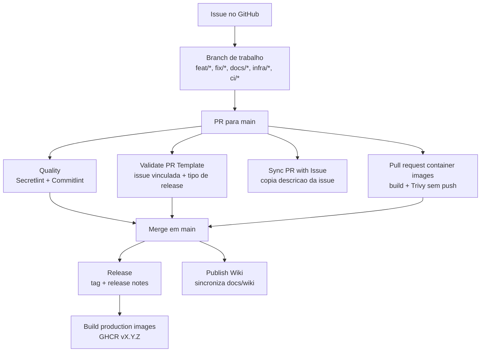
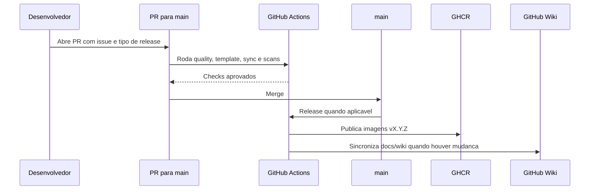
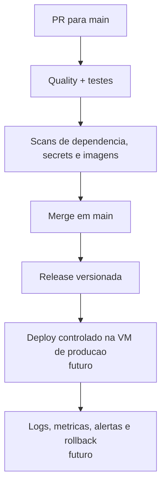

# Esteira de CI/CD

Esta pagina descreve a esteira atual do Inventarium. O repositorio usa `main` como unica branch de integracao e entrega.

## Fluxo Atual

```mermaid
flowchart TD
    issue["Issue no GitHub"]
    branch["Branch de trabalho<br/>feat/*, fix/*, docs/*, infra/*, ci/*"]
    pr["PR para main"]
    quality["Quality<br/>Secretlint + Commitlint"]
    prtemplate["Validate PR Template<br/>issue vinculada + tipo de release"]
    syncissue["Sync PR with Issue<br/>copia descricao da issue"]
    images["Pull request container images<br/>build + Trivy sem push"]
    merge["Merge em main"]
    release["Release<br/>tag + release notes"]
    prodImages["Build production images<br/>GHCR vX.Y.Z"]
    wiki["Publish Wiki<br/>sincroniza docs/wiki"]

    issue --> branch --> pr
    pr --> quality
    pr --> prtemplate
    pr --> syncissue
    pr --> images
    quality --> merge
    prtemplate --> merge
    images --> merge
    merge --> release
    merge --> wiki
    release --> prodImages
```

## O Que Ja Existe

| Parte | Situacao atual |
| --- | --- |
| Validacao de secrets | `Quality` roda Secretlint em pull requests. |
| Validacao de commits | `Quality` roda Commitlint em PRs humanos. |
| Validacao de template | `Validate PR Template` confere issue vinculada e tipo de release. |
| Sincronizacao PR/issue | `Sync PR with Issue` copia a descricao da issue para PRs humanos. |
| Build e scan em PR | `Pull request container images` builda e escaneia imagens afetadas sem publicar. |
| Release | Merge em `main` cria tag e GitHub Release quando o PR humano nao esta como `sem release`; Dependabot gera `patch` automaticamente. |
| Imagens produtivas | Release publica imagens versionadas no GHCR usando somente a tag `vX.Y.Z`. |
| Wiki | Push em `main` com mudanca em `docs/wiki` sincroniza a GitHub Wiki. |
| Fechamento de issues | O GitHub fecha a issue vinculada quando o PR entra em `main`. |

## Fluxo de Pull Request e Release

```mermaid
sequenceDiagram
    participant Dev as Desenvolvedor
    participant PR as PR para main
    participant CI as GitHub Actions
    participant Main as main
    participant GHCR as GHCR
    participant Wiki as GitHub Wiki

    Dev->>PR: Abre PR com issue e tipo de release
    PR->>CI: Roda quality, template, sync e scans
    CI-->>PR: Checks aprovados
    PR->>Main: Merge
    Main->>CI: Release quando aplicavel
    CI->>GHCR: Publica imagens vX.Y.Z
    CI->>Wiki: Sincroniza docs/wiki quando houver mudanca
```

PRs do Dependabot sao dispensados da issue e do template; ao serem mergeados, o workflow de release os trata como `patch`.

## Direcao Desejada

A esteira ainda nao faz deploy automatico de ambiente, rollback operacional completo nem validacao funcional ponta a ponta. O desenho abaixo mostra a direcao desejada sem dizer que tudo isso ja existe.

```mermaid
flowchart TD
    pr["PR para main"]
    quality["Quality + testes"]
    scans["Scans de dependencia, secrets e imagens"]
    merge["Merge em main"]
    release["Release versionada"]
    deployProd["Deploy controlado na VM de producao<br/>futuro"]
    monitor["Logs, metricas, alertas e rollback<br/>futuro"]

    pr --> quality --> scans --> merge --> release --> deployProd --> monitor
```

## Pontos Ainda Manuais

| Ponto | Como esta hoje |
| --- | --- |
| Deploy em VM | As imagens sao publicadas no GHCR, mas a atualizacao da stack ainda depende de operacao externa ou manual. |
| Evidencia de ambiente | Ainda nao ha smoke test automatizado contra a URL de producao. |
| Observabilidade | Logs, metricas, alertas e dashboards ainda nao estao fechados como artefato de infraestrutura. |
| Rollback operacional | O rollback deve usar a troca para uma tag versionada anterior, mas o procedimento operacional ainda precisa ser consolidado. |
| Dependabot sem criticos | A evidencia vem da aba Security/Dependabot do GitHub, nao apenas dos arquivos versionados. |

## Historico

| Versao | Data | Descricao |
| --- | --- | --- |
| 1.0 | 2026-09-15 | Criacao da pagina da esteira de CI/CD com visao atual e direcao futura. |
| 1.1 | 2026-09-19 | Simplificacao da esteira para publicar imagens somente em releases promovidas para main. |
| 1.2 | 2026-09-27 | Adocao de `main` como unica branch de integracao e entrega. |
