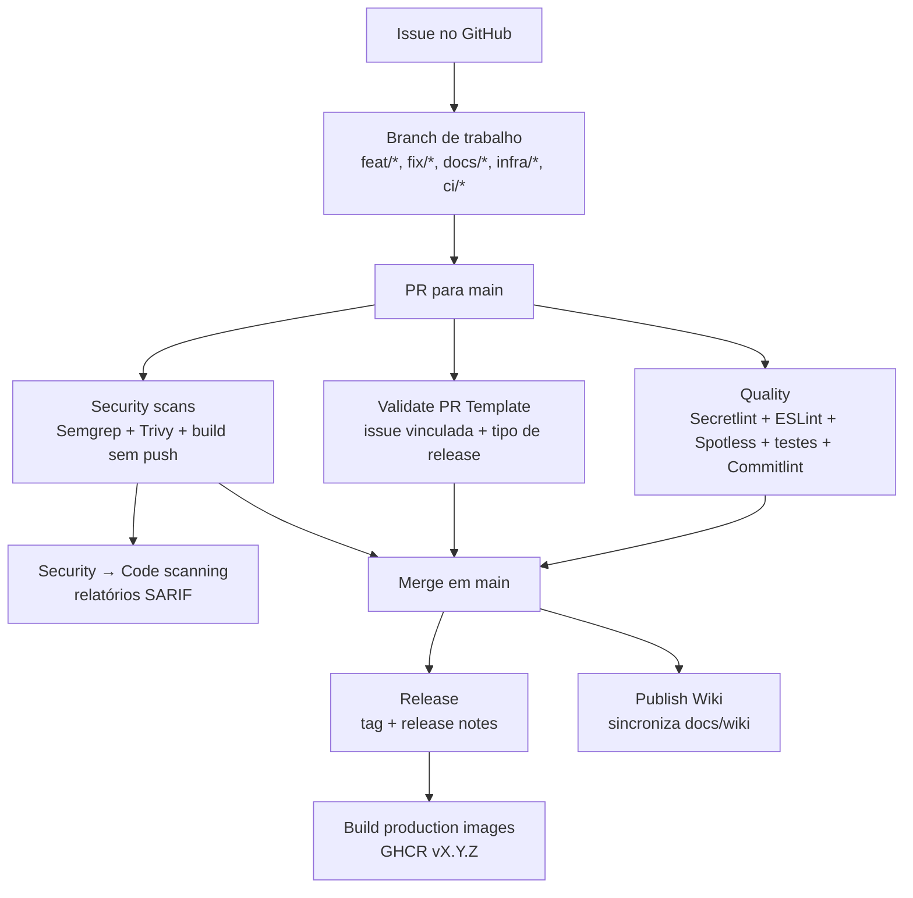
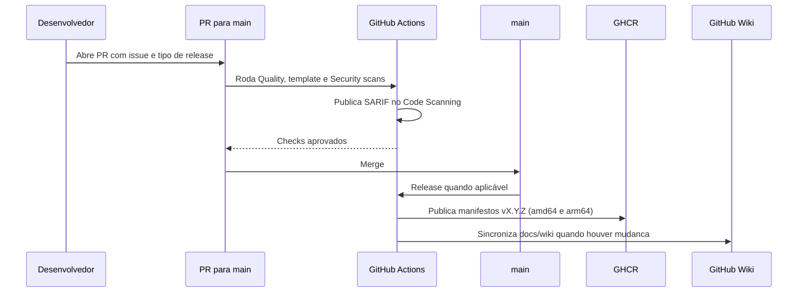
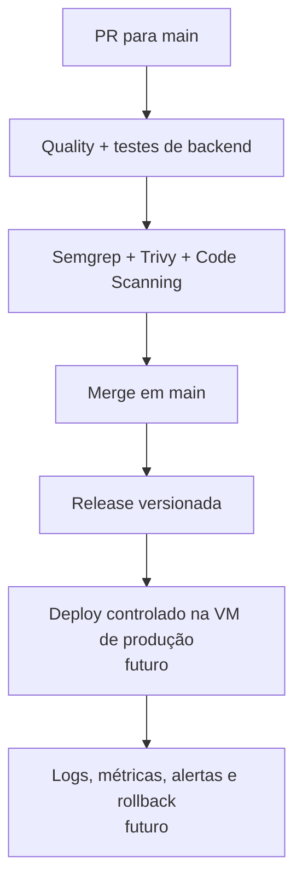

# Esteira de CI/CD

Esta página descreve a esteira atual do Inventarium. O repositório usa `main` como única branch de integração e entrega.

## Fluxo Atual

```mermaid
flowchart TD
    issue["Issue no GitHub"]
    branch["Branch de trabalho<br/>feat/*, fix/*, docs/*, infra/*, ci/*"]
    pr["PR para main"]
    quality["Quality<br/>Secretlint + ESLint + Spotless + testes + Commitlint"]
    prtemplate["Validate PR Template<br/>issue vinculada + tipo de release"]
    security["Security scans<br/>Semgrep + Trivy + build sem push"]
    codeScanning["Security → Code scanning<br/>relatórios SARIF"]
    merge["Merge em main"]
    release["Release<br/>tag + release notes"]
    prodImages["Build production images<br/>GHCR vX.Y.Z"]
    wiki["Publish Wiki<br/>sincroniza docs/wiki"]

    issue --> branch --> pr
    pr --> quality
    pr --> prtemplate
    pr --> security
    quality --> merge
    prtemplate --> merge
    security --> codeScanning
    security --> merge
    merge --> release
    merge --> wiki
    release --> prodImages
```

## O Que Ja Existe

| Parte | Situação atual |
| --- | --- |
| Qualidade da aplicação | `Quality` roda Secretlint, ESLint no frontend, Spotless e testes Gradle/Testcontainers no backend. Commitlint é executado em PRs humanos. |
| Validação de template | `Validate PR Template` confere issue vinculada e tipo de release. |
| Segurança em PR | `Security scans` executa Semgrep e Trivy. O Trivy verifica secrets, dependências e imagens; as imagens são construídas no runner, sem publicação no GHCR. |
| Relatórios de segurança | Semgrep e Trivy geram SARIF para Security → Code scanning, uma tabela no resumo do job e artifacts temporários por 14 dias. Semgrep está em baseline até a triagem dos achados. |
| Changelog | A pessoa autora atualiza o `CHANGELOG.md` manualmente na PR antes do merge; a entrada é revisada junto com a entrega. |
| Release | Merge em `main` cria tag e GitHub Release quando o PR humano não está como `sem release`; Dependabot gera `patch` automaticamente. |
| Imagens produtivas | A release reconstrói as imagens a partir da tag `vX.Y.Z`, executa os scans novamente e só então publica no GHCR um manifesto para `linux/amd64` e `linux/arm64`. A imagem transitória da PR nunca é promovida. |
| Wiki | Push em `main` com mudança em `docs/wiki` sincroniza a GitHub Wiki. |
| Fechamento de issues | O GitHub fecha a issue vinculada quando o PR entra em `main`. |

## Execução Sensível ao Escopo da Mudança

Nem toda PR precisa consumir o mesmo tempo de runner. A esteira identifica os arquivos alterados antes de iniciar validações custosas:

| Tipo de alteração | Validações executadas além das regras de processo e segredos |
| --- | --- |
| Apenas documentação, template ou arquivos não executáveis | Não executa lint do frontend, testes do backend, Semgrep nem build/scan de imagens. |
| `frontend/`, manifestos npm ou workflow `Quality` | Executa ESLint do frontend. |
| `backend/` ou workflow `Quality` | Executa Spotless e testes do backend. |
| `backend/src/`, `frontend/src/` ou `.github/` | Executa Semgrep. |
| Frontend, backend, Docker Compose, `.env.example` ou workflow de imagens/segurança | Constrói as imagens afetadas e executa Trivy. |

Independentemente do escopo, a PR continua executando a validação do template, Commitlint e Secretlint. Isso preserva rastreabilidade e evita que uma alteração documental exponha segredos. Jobs condicionais aparecem como *skipped* quando não se aplicam; o GitHub os considera concluídos com sucesso, inclusive quando são checks exigidos no ruleset.

O CodeQL configurado pelo GitHub é independente desses workflows do repositório. Como ele está em configuração padrão da plataforma, seus jobs podem continuar aparecendo em PRs documentais; reduzir esse comportamento exigiria substituir a configuração padrão por um workflow CodeQL customizado, decisão que não faz parte desta etapa.

## Fluxo de Pull Request e Release

```mermaid
sequenceDiagram
    participant Dev as Desenvolvedor
    participant PR as PR para main
    participant CI as GitHub Actions
    participant Main as main
    participant GHCR as GHCR
    participant Wiki as GitHub Wiki

    Dev->>PR: Abre PR com issue e tipo de release
    PR->>CI: Roda Quality, template e Security scans
    CI->>CI: Publica SARIF no Code Scanning
    CI-->>PR: Checks aprovados
    PR->>Main: Merge
    Main->>CI: Release quando aplicável
    CI->>GHCR: Publica manifestos vX.Y.Z (amd64 e arm64)
    CI->>Wiki: Sincroniza docs/wiki quando houver mudanca
```

PRs do Dependabot são dispensados da issue e do template; ao serem mergeados, o workflow de release os trata como `patch`.

## Controles Aplicados no Pull Request

Os checks aparecem separadamente na interface do GitHub porque cada job representa uma responsabilidade. Isso facilita identificar se uma falha veio de teste, segredo, dependência, imagem ou regra de processo.

| Check | Papel | Bloqueia o merge? |
| --- | --- | --- |
| `Validate PR Template` | Exige uma issue vinculada e um tipo de release para PRs humanos. | Sim |
| `Quality / Secret scan` | Procura segredos versionados com Secretlint. | Sim |
| `Quality / Commit messages` | Valida o padrão dos commits de PRs humanos. | Sim |
| `Quality / Backend format and tests` | Executa Spotless como aviso temporário e os testes do backend como gate. | Sim, se os testes falharem |
| `Quality / Frontend lint` | Executa ESLint; nesta fase é informativo para não bloquear mudanças por dívida de lint existente. | Não |
| `Security scans / Semgrep SAST baseline` | Executa SAST e registra achados existentes para triagem quando a mudança alcança código-fonte ou workflows. | Não, até a linha de base ser tratada |
| `Security scans / Trivy container and dependency scans` | Faz scan de segredos, dependências e imagens construídas no runner quando a mudança afeta fontes de imagem. | Sim para segredos, falha operacional e vulnerabilidades `HIGH`/`CRITICAL` |

## Relatórios de Segurança: SARIF, Code Scanning e Artifacts

**SARIF** (*Static Analysis Results Interchange Format*) é um formato JSON padronizado para resultados de análise estática. Um arquivo SARIF contém a ferramenta que produziu o achado, a regra ou CVE, a severidade, a mensagem e a localização afetada. Semgrep e Trivy produzem esse formato para que os resultados possam ser consumidos de maneira uniforme.

O Code Scanning foi habilitado no repositório para receber esses arquivos por meio da action `github/codeql-action/upload-sarif`. Isso centraliza a triagem de alertas na aba **Security → Code scanning**, junto aos achados do CodeQL. Habilitar Code Scanning não é necessário para gerar o arquivo SARIF nem para guardar um artifact; é necessário para que o GitHub converta o SARIF em alertas pesquisáveis, com estado, ferramenta, branch e histórico.

Cada execução disponibiliza a mesma evidência em três camadas:

| Onde consultar | Conteúdo | Retenção e uso |
| --- | --- | --- |
| Resumo do job `Trivy container and dependency scans` | Tabela com regra/CVE, severidade, mensagem e localização dos achados. | Diagnóstico rápido da execução. |
| **Security → Code scanning** | Alertas normalizados enviados por Semgrep e Trivy, além dos alertas do CodeQL. | Triagem, filtros por ferramenta e acompanhamento do estado. Resultados exclusivos de uma PR podem aparecer como *in pull request* ou *in branch*. |
| **Actions → Security scans → execução → Artifacts** | `trivy-reports` e `semgrep-report`, contendo os SARIFs brutos. | Download e investigação detalhada por 14 dias. Não são arquivos versionados no Git. |

O Trivy mantém no SARIF todos os achados para auditoria, inclusive `LOW` e `MEDIUM`. O gate final lê as tags de severidade desse mesmo SARIF: apenas `HIGH` e `CRITICAL` impedem o merge. Assim, uma vulnerabilidade média ou baixa continua visível e rastreável, mas não interrompe a entrega; falhas de execução do scanner e segredos detectados continuam bloqueantes.

Relatórios brutos não devem ser commitados a cada execução. Eles são dados transitórios, podem crescer rapidamente e podem revelar detalhes de dependências ou caminhos internos. A evidência operacional fica nos artifacts e no Code Scanning; uma retenção versionada separada só deve ser criada se houver exigência formal de auditoria.

## Changelog e Imagens Multi-Arquitetura

O `CHANGELOG.md` é um registro versionado e revisável das entregas. Em PRs com `patch`, `minor` ou `major`, a pessoa autora deve incluir ou atualizar manualmente a seção da versão planejada, usando o tipo de release e o resumo de `## O que foi feito`. Caso o tipo mude, a entrada também deve ser ajustada na mesma PR antes do merge.

Foi avaliada a atualização automática do changelog pela Action. Ela não foi adotada nesta fase porque o `GITHUB_TOKEN` pode criar o commit, mas não dispara novamente os checks obrigatórios no novo SHA; já o uso de PAT ou GitHub App depende de permissões indisponíveis na organização. Manter a alteração na PR preserva os gates de qualidade e segurança, não exige bypass na `main` e permite revisão humana do texto da release.

O runner da PR constrói uma imagem descartável `linux/amd64`, suficiente para o Trivy validar o conteúdo antes do merge. Depois da aprovação e apenas na release, o Docker Buildx, com emulação QEMU, reconstrói as imagens e publica uma lista de manifestos com as variantes `linux/amd64` e `linux/arm64` sob a mesma tag `vX.Y.Z`. Portanto, um `docker compose pull` em uma VM x86_64 baixa a variante `amd64`, enquanto uma VM ARM64 baixa a variante `arm64`, sem alterar as variáveis `BACKEND_IMAGE` e `FRONTEND_IMAGE`.

## Direção Desejada

A esteira ainda não faz deploy automático de ambiente, rollback operacional completo nem testes automatizados de frontend. O desenho abaixo mostra a direção desejada sem dizer que tudo isso já existe.

```mermaid
flowchart TD
    pr["PR para main"]
    quality["Quality + testes de backend"]
    scans["Semgrep + Trivy + Code Scanning"]
    merge["Merge em main"]
    release["Release versionada"]
    deployProd["Deploy controlado na VM de produção<br/>futuro"]
    monitor["Logs, métricas, alertas e rollback<br/>futuro"]

    pr --> quality --> scans --> merge --> release --> deployProd --> monitor
```

## Pontos Ainda Manuais

| Ponto | Como está hoje |
| --- | --- |
| Deploy em VM | As imagens são publicadas no GHCR, mas a atualização da stack ainda depende de operação externa ou manual. |
| Evidência de ambiente | Ainda não há smoke test automatizado contra a URL de produção. |
| Testes de frontend | O frontend ainda não possui suíte automatizada; o ESLint é o check atual dessa aplicação. |
| Observabilidade | Logs, métricas, alertas e dashboards ainda não estão fechados como artefato de infraestrutura. |
| Rollback operacional | O rollback deve usar a troca para uma tag versionada anterior, mas o procedimento operacional ainda precisa ser consolidado. |
| Vulnerabilidades abertas | A evidência vem das abas Security/Dependabot e Security/Code scanning do GitHub, não apenas dos arquivos versionados. |

## Histórico

| Versão | Data | Descrição |
| --- | --- | --- |
| 1.0 | 2026-09-15 | Criação da página da esteira de CI/CD com visão atual e direção futura. |
| 1.1 | 2026-09-19 | Simplificação da esteira para publicar imagens somente em releases promovidas para main. |
| 1.2 | 2026-09-27 | Adoção de `main` como única branch de integração e entrega. |
| 1.3 | 2026-09-28 | Inclusão de lint, formatação, testes de backend, Semgrep, Trivy, SARIF e Code Scanning na esteira de PR. |
| 1.4 | 2026-09-28 | Documentação dos gates de PR, da política `HIGH`/`CRITICAL` do Trivy, da reconstrução na release e da consulta de SARIF, Code Scanning e artifacts. |
| 1.5 | 2026-09-28 | Execução de lint, testes e scans pesados condicionada aos arquivos alterados, preservando checks de processo e segredos em qualquer PR. |
| 1.6 | 2026-09-28 | Inclusão do changelog versionado e publicação de imagens GHCR multi-arquitetura (`amd64` e `arm64`). |
