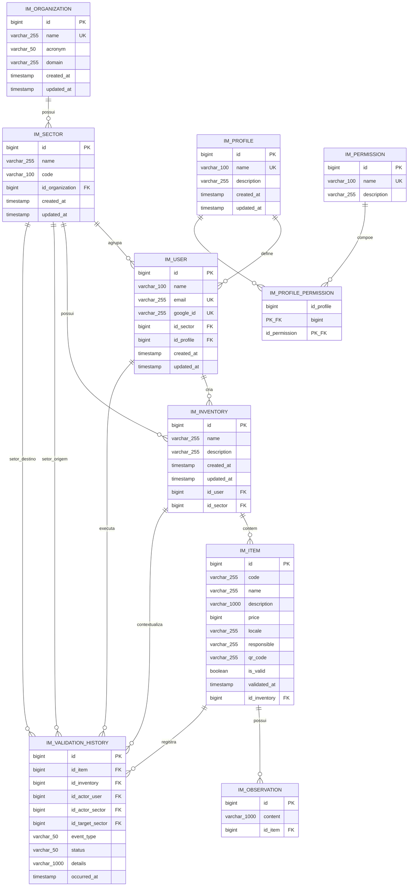
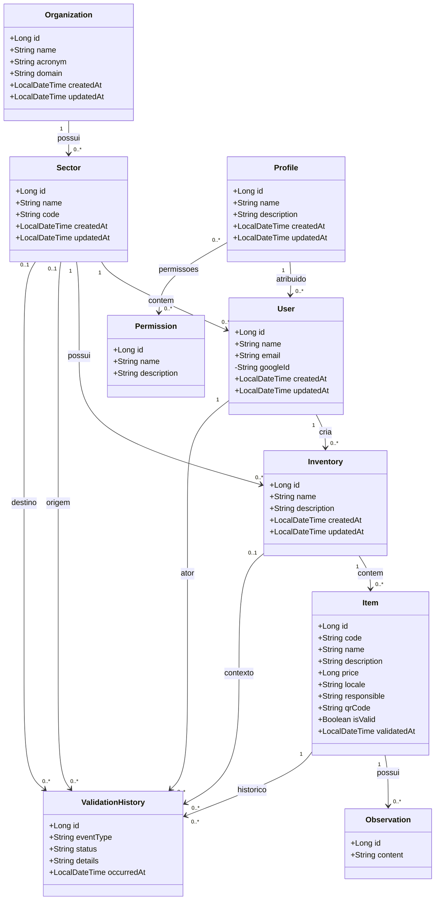

# Proposta de Modelagem: Organizacoes, Setores e Permissoes

Este documento registra uma proposta de evolucao do modelo de dados do Inventarium. Ele nao descreve o schema implementado hoje; a modelagem atual continua documentada em [Documento de Modelagem de Dados](./Documento-de-Modelagem-de-Dados).

O objetivo desta proposta e preparar o sistema para funcionar em um contexto multi-institucional e setorizado, permitindo que uma organizacao, como o IFPE, tenha varios setores, usuarios vinculados a setores, inventarios pertencentes a setores, perfis de acesso com permissoes e historico de validacao/tombamento.

## Motivacao

No modelo atual, os inventarios ficam vinculados diretamente ao usuario que os criou. Isso limita alguns fluxos reais de patrimonio:

- uma instituicao pode ter varios setores usando o sistema ao mesmo tempo;
- um setor pode ter mais de um usuario responsavel pelo levantamento patrimonial;
- um usuario deve atuar dentro do seu setor principal;
- um inventario precisa representar um setor ou unidade operacional, e nao apenas uma conta individual;
- uma pessoa pode escanear ou validar um patrimonio que pertence a outro setor;
- a aplicacao precisa registrar quem realizou a validacao, quando isso aconteceu e em qual contexto;
- as permissoes devem deixar de ser implicitas e passar a ser governadas por perfis.

## Entidades Propostas

### `im_organization`

Representa uma organizacao contratante ou mantenedora do uso do sistema. No contexto inicial, pode representar o IFPE, mas a modelagem permite outras universidades ou instituicoes.

| Campo | Tipo sugerido | Obrigatorio | Observacao |
| --- | --- | --- | --- |
| `id` | `BIGINT` | Sim | Chave primaria. |
| `name` | `VARCHAR(255)` | Sim | Nome completo da organizacao. |
| `acronym` | `VARCHAR(50)` | Nao | Sigla, como `IFPE`. |
| `domain` | `VARCHAR(255)` | Nao | Dominio institucional usado para apoio ao onboarding, quando aplicavel. |
| `created_at` | `TIMESTAMP` | Sim | Data de criacao. |
| `updated_at` | `TIMESTAMP` | Sim | Data de atualizacao. |

### `im_sector`

Representa um setor, departamento, campus, coordenacao ou unidade interna da organizacao.

| Campo | Tipo sugerido | Obrigatorio | Observacao |
| --- | --- | --- | --- |
| `id` | `BIGINT` | Sim | Chave primaria. |
| `name` | `VARCHAR(255)` | Sim | Nome do setor. |
| `code` | `VARCHAR(100)` | Nao | Codigo interno, se existir. |
| `id_organization` | `BIGINT` | Sim | FK para `im_organization.id`. |
| `created_at` | `TIMESTAMP` | Sim | Data de criacao. |
| `updated_at` | `TIMESTAMP` | Sim | Data de atualizacao. |

Regra principal: uma organizacao pode ter varios setores, mas um setor pertence a uma unica organizacao.

### `im_user`

Continua representando uma pessoa autenticada via Google, mas passa a ter vinculo operacional com setor e perfil.

Campos atuais devem ser preservados:

- `id`
- `name`
- `email`
- `google_id`
- `created_at`
- `updated_at`

Novos campos propostos:

| Campo | Tipo sugerido | Obrigatorio | Observacao |
| --- | --- | --- | --- |
| `id_sector` | `BIGINT` | Sim no modelo alvo | FK para `im_sector.id`. Cada usuario pertence a um unico setor. |
| `id_profile` | `BIGINT` | Sim no modelo alvo | FK para `im_profile.id`. Define o conjunto de permissoes do usuario. |

Observacao de migracao: durante a transicao, esses campos podem nascer opcionais para nao quebrar usuarios existentes criados pelo login Google. Depois de popular os dados, o backend pode tornar os vinculos obrigatorios.

### `im_inventory`

Continua representando um inventario patrimonial, mas o dono operacional passa a ser o setor.

Campos atuais devem ser preservados:

- `id`
- `name`
- `description`
- `created_at`
- `updated_at`
- `id_user`

Novo campo proposto:

| Campo | Tipo sugerido | Obrigatorio | Observacao |
| --- | --- | --- | --- |
| `id_sector` | `BIGINT` | Sim no modelo alvo | FK para `im_sector.id`. Define a qual setor o inventario pertence. |

O campo `id_user` pode continuar existindo como usuario criador/responsavel pela criacao do inventario, mas nao deve ser a unica base de ownership. Para autorizacao e listagem, o setor passa a ser a fronteira principal.

### `im_item`

Continua representando um bem patrimonial dentro de um inventario.

Campos atuais devem ser preservados:

- `id`
- `code`
- `name`
- `description`
- `price`
- `locale`
- `responsible`
- `qr_code`
- `is_valid`
- `validated_at`
- `id_inventory`

No modelo proposto, o setor esperado do item pode ser inferido por `item -> inventory -> sector`. Caso o sistema precise registrar transferencia ou localizacao setorial independente do inventario, pode ser avaliado um campo futuro `id_current_sector` em `im_item`, mas ele nao e necessario para a primeira versao da proposta.

### `im_profile`

Representa um perfil funcional de acesso.

| Campo | Tipo sugerido | Obrigatorio | Observacao |
| --- | --- | --- | --- |
| `id` | `BIGINT` | Sim | Chave primaria. |
| `name` | `VARCHAR(100)` | Sim | Nome unico do perfil, como `ADMIN`, `GESTOR_SETOR`, `OPERADOR_CAMPO`. |
| `description` | `VARCHAR(255)` | Nao | Descricao do papel. |
| `created_at` | `TIMESTAMP` | Sim | Data de criacao. |
| `updated_at` | `TIMESTAMP` | Sim | Data de atualizacao. |

### `im_permission`

Representa uma permissao granular do sistema.

| Campo | Tipo sugerido | Obrigatorio | Observacao |
| --- | --- | --- | --- |
| `id` | `BIGINT` | Sim | Chave primaria. |
| `name` | `VARCHAR(100)` | Sim | Nome unico da permissao, como `INVENTORY_CREATE`, `ITEM_VALIDATE`, `ITEM_VALIDATE_EXTERNAL_SECTOR`. |
| `description` | `VARCHAR(255)` | Nao | Descricao da permissao. |

### `im_profile_permission`

Tabela associativa entre perfis e permissoes.

| Campo | Tipo sugerido | Obrigatorio | Observacao |
| --- | --- | --- | --- |
| `id_profile` | `BIGINT` | Sim | FK para `im_profile.id`. |
| `id_permission` | `BIGINT` | Sim | FK para `im_permission.id`. |

Chave primaria sugerida: `id_profile, id_permission`.

Regra principal: um perfil pode ter varias permissoes, e uma permissao pode pertencer a varios perfis.

### `im_validation_history`

Representa o historico de tombamentos, validacoes e validacoes parciais. Essa tabela deve responder perguntas como: quem tombou ou validou qual patrimonio, em qual horario, partindo de qual setor e direcionado a qual setor.

| Campo | Tipo sugerido | Obrigatorio | Observacao |
| --- | --- | --- | --- |
| `id` | `BIGINT` | Sim | Chave primaria. |
| `id_item` | `BIGINT` | Sim | FK para `im_item.id`. Patrimonio afetado. |
| `id_inventory` | `BIGINT` | Nao | FK para `im_inventory.id`. Inventario no momento do evento. |
| `id_actor_user` | `BIGINT` | Sim | FK para `im_user.id`. Usuario que realizou a acao. |
| `id_actor_sector` | `BIGINT` | Nao | FK para `im_sector.id`. Setor do usuario no momento da acao. |
| `id_target_sector` | `BIGINT` | Nao | FK para `im_sector.id`. Setor dono/esperado do item. |
| `event_type` | `VARCHAR(50)` | Sim | Tipo do evento, como `VALIDATION`, `PARTIAL_VALIDATION`, `TRANSFER_REQUEST`. |
| `status` | `VARCHAR(50)` | Sim | Estado do evento, como `VALIDATED`, `PENDING_TARGET_SECTOR`, `REJECTED`, `CONFIRMED`. |
| `details` | `VARCHAR(1000)` | Nao | Observacao textual do evento. |
| `occurred_at` | `TIMESTAMP` | Sim | Data e hora do evento. |

## Diagrama Entidade-Relacionamento Proposto

## Diagrama de Classes Proposto

## Regras de Negocio Propostas

| Regra | Descricao |
| --- | --- |
| Organizacao possui setores | Uma organizacao pode ter nenhum ou varios setores. Um setor pertence a exatamente uma organizacao. |
| Usuario pertence a um setor | Um setor pode ter varios usuarios. Um usuario deve pertencer a um unico setor no modelo alvo. |
| Inventario pertence a um setor | Um setor pode ter varios inventarios. Um inventario deve pertencer a um unico setor no modelo alvo. |
| Criador do inventario continua rastreavel | `im_inventory.id_user` deve indicar quem criou o inventario, mesmo que o ownership operacional seja do setor. |
| Autorizacao passa por setor e perfil | O backend deve validar se o usuario tem permissao e se o recurso pertence ao seu setor, salvo permissoes administrativas. |
| Validacao fora do setor vira evento pendente/parcial | Se o usuario escanear ou validar item de outro setor, o sistema deve registrar evento em `im_validation_history` com status de pendencia para o setor dono. |
| Setor dono precisa ser notificado | A aplicacao deve exibir aviso para usuarios do setor alvo quando houver validacao parcial feita por outro setor. |
| Historico nao substitui estado atual | `im_validation_history` registra eventos. O estado atual do item continua em `im_item.is_valid` e `im_item.validated_at`, ou em campos futuros de workflow se o time optar por uma maquina de estados. |

## Fluxo de Validacao Entre Setores

1. O usuario autentica via Google e o backend identifica `user -> sector -> organization`.
2. O usuario escaneia um patrimonio por QR Code ou codigo patrimonial.
3. O backend localiza o item e identifica o setor esperado por `item -> inventory -> sector`.
4. Se o setor do usuario for igual ao setor do inventario, o item pode ser validado normalmente, respeitando as permissoes do perfil.
5. Se o setor do usuario for diferente, o backend registra uma validacao parcial em `im_validation_history`.
6. A tela do setor dono deve exibir um aviso informando que outro setor encontrou ou validou parcialmente aquele item.
7. Um usuario autorizado do setor dono confirma, rejeita ou resolve a pendencia.

## Permissoes Iniciais Sugeridas

| Permissao | Uso esperado |
| --- | --- |
| `ORGANIZATION_MANAGE` | Criar e editar organizacoes. |
| `SECTOR_MANAGE` | Criar e editar setores. |
| `USER_ASSIGN_SECTOR` | Vincular usuario a setor. |
| `USER_ASSIGN_PROFILE` | Vincular usuario a perfil. |
| `INVENTORY_CREATE` | Criar inventarios. |
| `INVENTORY_UPDATE` | Editar inventarios do setor. |
| `INVENTORY_DELETE` | Remover inventarios do setor. |
| `ITEM_IMPORT` | Importar itens por planilha. |
| `ITEM_UPDATE` | Editar dados de itens. |
| `ITEM_VALIDATE` | Validar itens do proprio setor. |
| `ITEM_VALIDATE_EXTERNAL_SECTOR` | Registrar validacao parcial de itens de outro setor. |
| `VALIDATION_RESOLVE_PENDING` | Confirmar ou rejeitar pendencias recebidas pelo setor. |
| `REPORT_EXPORT` | Exportar planilhas, PDFs e relatorios. |

## Perfis Iniciais Sugeridos

| Perfil | Descricao | Permissoes esperadas |
| --- | --- | --- |
| `ADMIN_ORGANIZATION` | Administra a organizacao inteira. | Todas as permissoes administrativas e operacionais. |
| `GESTOR_SETOR` | Gerencia inventarios, usuarios e pendencias do proprio setor. | Inventarios, itens, resolucao de pendencias e exportacao. |
| `OPERADOR_CAMPO` | Realiza levantamento em campo. | Consulta, edicao limitada e validacao parcial/normal conforme regra. |
| `CONSULTA` | Apenas consulta informacoes. | Leitura e visualizacao de inventarios/itens permitidos. |

## Impactos Esperados no Backend

Esta proposta deve orientar uma implementacao futura, provavelmente envolvendo:

- novas entidades JPA: `Organization`, `Sector`, `Profile`, `Permission`, `ValidationHistory`;
- novas tabelas Liquibase para organizacao, setor, perfil, permissao, associativa perfil-permissao e historico;
- novas FKs em `im_user` para setor e perfil;
- nova FK em `im_inventory` para setor;
- services/repositories para manutencao de organizacoes, setores, perfis e permissoes;
- revisao de autorizacao em todas as rotas que acessam inventarios, itens, exportacao, PDF e envio por e-mail;
- filtros de listagem por setor;
- endpoint ou consulta para pendencias de validacao por setor;
- testes negativos para acesso entre setores diferentes;
- estrategia de migracao para usuarios e inventarios ja existentes.

## Pontos em Aberto

| Ponto | Decisao pendente |
| --- | --- |
| Usuario pode trocar de setor? | Definir se a troca altera apenas o cadastro atual ou se exige historico de lotacao. |
| Setor e campus sao a mesma entidade? | Se o IFPE precisar separar campus de setor, pode ser necessario criar uma hierarquia adicional. |
| Inventario pode abranger mais de um setor? | A proposta assume um setor por inventario. Inventarios multi-setor exigiriam tabela associativa. |
| Validacao parcial altera `im_item.is_valid`? | A recomendacao inicial e nao alterar para `true` ate confirmacao do setor dono. |
| Como notificar o setor dono? | Pode ser por consulta de pendencias na tela inicial, badge, e-mail ou notificacao futura. |

## Historico

| Versao | Data | Descricao |
| --- | --- | --- |
| 1.0 | 2026-09-16 | Criacao da proposta de modelagem com organizacoes, setores, perfis, permissoes e historico de validacao. |
