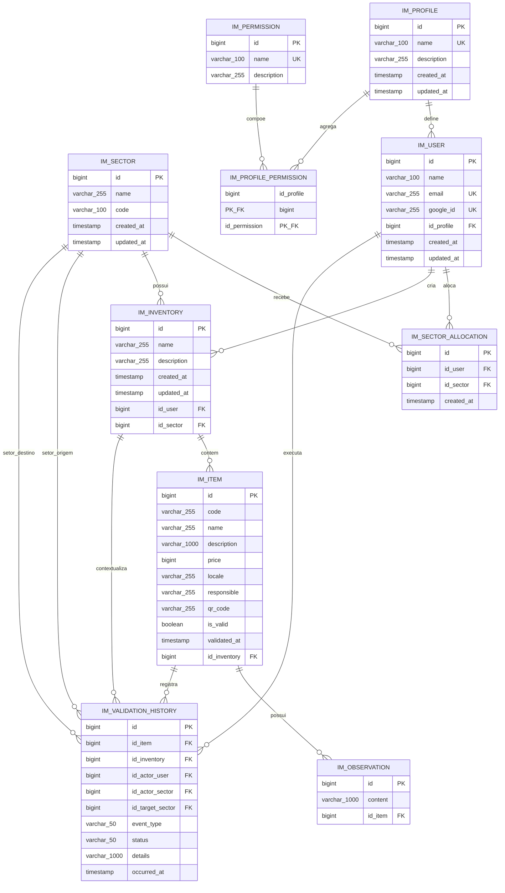
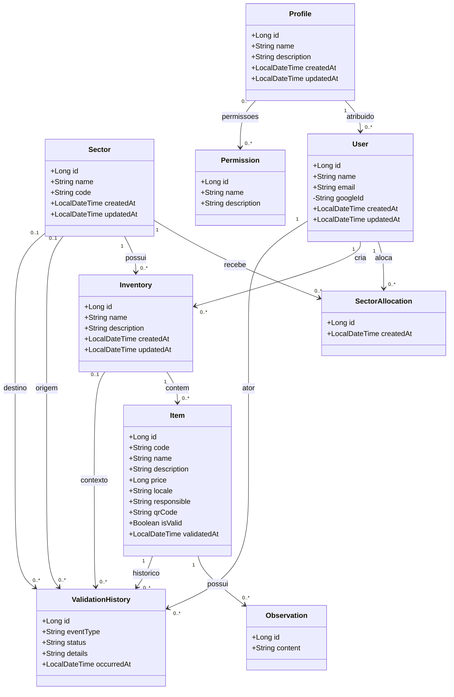

# Proposta de Modelagem: Setores e Permissoes

Este documento registra uma proposta de evolucao do modelo de dados do Inventarium. Ele nao descreve o schema implementado hoje; a modelagem atual continua documentada em [Documento de Modelagem de Dados](./Documento-de-Modelagem-de-Dados).

> Revisao 2.0: a versao original desta proposta (1.0) incluia uma entidade `im_organization`, pensada para um cenario multi-institucional. Essa camada foi removida — ver [Motivacao](#motivacao) e o historico ao final do documento.

O objetivo desta proposta e preparar o sistema para funcionar de forma setorizada, permitindo que o Inventarium tenha varios setores, usuarios vinculados a setores, inventarios pertencentes a setores, perfis de acesso com permissoes e historico de validacao/tombamento.

## Motivacao

No modelo atual, os inventarios ficam vinculados diretamente ao usuario que os criou. Isso limita alguns fluxos reais de patrimonio:

- um setor pode ter mais de um usuario responsavel pelo levantamento patrimonial;
- um usuario deve atuar dentro do seu setor principal;
- um inventario precisa representar um setor ou unidade operacional, e nao apenas uma conta individual;
- uma pessoa pode escanear ou validar um patrimonio que pertence a outro setor;
- a aplicacao precisa registrar quem realizou a validacao, quando isso aconteceu e em qual contexto;
- as permissoes devem deixar de ser implicitas e passar a ser governadas por perfis.

Cada implantacao do Inventarium atende a uma unica instituicao. A versao original desta proposta previa uma entidade `im_organization` para suportar varias instituicoes no mesmo banco de dados, mas essa necessidade nao se confirmou: nao ha, hoje, nenhum cenario de multi-tenancy entre instituicoes diferentes. Manter `im_organization` so acrescentava uma camada hierarquica (setor pertence a organizacao) sem nenhum caso de uso real por tras dela. A revisao 2.0 remove essa entidade: `im_sector` passa a existir de forma independente, sem vinculo com organizacao alguma.

## Entidades Propostas

### `im_sector`

Representa um setor, departamento, campus, coordenacao ou unidade interna da instituicao.

| Campo | Tipo sugerido | Obrigatorio | Observacao |
| --- | --- | --- | --- |
| `id` | `BIGINT` | Sim | Chave primaria. |
| `name` | `VARCHAR(255)` | Sim | Nome do setor. |
| `code` | `VARCHAR(100)` | Nao | Codigo interno, se existir. |
| `created_at` | `TIMESTAMP` | Sim | Data de criacao. |
| `updated_at` | `TIMESTAMP` | Sim | Data de atualizacao. |

Setores existem de forma independente, sem vinculo com nenhuma entidade superior.

### `im_sector_allocation`

Representa a alocacao de um usuario a um setor. Um usuario pode estar alocado a mais de um setor ao mesmo tempo (por exemplo, alguem que da suporte a dois departamentos) — por isso o vinculo entre `im_user` e `im_sector` deixa de ser um FK unico em `im_user` e passa a ser esta tabela associativa.

| Campo | Tipo sugerido | Obrigatorio | Observacao |
| --- | --- | --- | --- |
| `id` | `BIGINT` | Sim | Chave primaria. |
| `id_user` | `BIGINT` | Sim | FK para `im_user.id`. |
| `id_sector` | `BIGINT` | Sim | FK para `im_sector.id`. |
| `created_at` | `TIMESTAMP` | Sim | Data em que a alocacao foi criada. |

Regra principal: um usuario pode ter nenhuma, uma ou varias alocacoes; o par (`id_user`, `id_sector`) deve ser unico — nao faz sentido alocar o mesmo usuario duas vezes ao mesmo setor.

### `im_user`

Continua representando uma pessoa autenticada via Google, mas passa a ter vinculo operacional com setor(es) e perfil.

Campos atuais devem ser preservados:

- `id`
- `name`
- `email`
- `google_id`
- `created_at`
- `updated_at`

Novo campo proposto:

| Campo | Tipo sugerido | Obrigatorio | Observacao |
| --- | --- | --- | --- |
| `id_profile` | `BIGINT` | Sim no modelo alvo | FK para `im_profile.id`. Define o conjunto de permissoes do usuario. |

O vinculo com setor **nao** fica em `im_user` — um usuario pode estar em varios setores ao mesmo tempo, entao essa relacao vive inteiramente em `im_sector_allocation` (zero ou mais registros por usuario).

Observacao de migracao: `id_profile` pode nascer opcional para nao quebrar usuarios existentes criados pelo login Google. Depois de popular os dados, o backend pode tornar o vinculo obrigatorio.

### `im_inventory`

Continua representando um inventario patrimonial, mas o dono operacional passa a ser o setor.

Campos atuais devem ser preservados:

- `id`
- `name`
- `description`
- `created_at`
- `updated_at`
- `id_user`

Novo campo proposto:

| Campo | Tipo sugerido | Obrigatorio | Observacao |
| --- | --- | --- | --- |
| `id_sector` | `BIGINT` | Sim no modelo alvo | FK para `im_sector.id`. Define a qual setor o inventario pertence. |

O campo `id_user` pode continuar existindo como usuario criador/responsavel pela criacao do inventario, mas nao deve ser a unica base de ownership. Para autorizacao e listagem, o setor passa a ser a fronteira principal.

### `im_item`

Continua representando um bem patrimonial dentro de um inventario.

Campos atuais devem ser preservados:

- `id`
- `code`
- `name`
- `description`
- `price`
- `locale`
- `responsible`
- `qr_code`
- `is_valid`
- `validated_at`
- `id_inventory`

No modelo proposto, o setor esperado do item pode ser inferido por `item -> inventory -> sector`. Caso o sistema precise registrar transferencia ou localizacao setorial independente do inventario, pode ser avaliado um campo futuro `id_current_sector` em `im_item`, mas ele nao e necessario para a primeira versao da proposta.

### `im_profile`

Representa um perfil funcional de acesso.

| Campo | Tipo sugerido | Obrigatorio | Observacao |
| --- | --- | --- | --- |
| `id` | `BIGINT` | Sim | Chave primaria. |
| `name` | `VARCHAR(100)` | Sim | Nome unico do perfil, como `ADMIN`, `GESTOR_SETOR`, `OPERADOR_CAMPO`. |
| `description` | `VARCHAR(255)` | Nao | Descricao do papel. |
| `created_at` | `TIMESTAMP` | Sim | Data de criacao. |
| `updated_at` | `TIMESTAMP` | Sim | Data de atualizacao. |

### `im_permission`

Representa uma permissao granular do sistema.

| Campo | Tipo sugerido | Obrigatorio | Observacao |
| --- | --- | --- | --- |
| `id` | `BIGINT` | Sim | Chave primaria. |
| `name` | `VARCHAR(100)` | Sim | Nome unico da permissao, como `INVENTORY_CREATE`, `ITEM_VALIDATE`, `ITEM_VALIDATE_EXTERNAL_SECTOR`. |
| `description` | `VARCHAR(255)` | Nao | Descricao da permissao. |

### `im_profile_permission`

Tabela associativa entre perfis e permissoes.

| Campo | Tipo sugerido | Obrigatorio | Observacao |
| --- | --- | --- | --- |
| `id_profile` | `BIGINT` | Sim | FK para `im_profile.id`. |
| `id_permission` | `BIGINT` | Sim | FK para `im_permission.id`. |

Chave primaria sugerida: `id_profile, id_permission`.

Regra principal: um perfil pode ter varias permissoes, e uma permissao pode pertencer a varios perfis.

### `im_validation_history`

Representa o historico de tombamentos, validacoes e validacoes parciais. Essa tabela deve responder perguntas como: quem tombou ou validou qual patrimonio, em qual horario, partindo de qual setor e direcionado a qual setor.

| Campo | Tipo sugerido | Obrigatorio | Observacao |
| --- | --- | --- | --- |
| `id` | `BIGINT` | Sim | Chave primaria. |
| `id_item` | `BIGINT` | Sim | FK para `im_item.id`. Patrimonio afetado. |
| `id_inventory` | `BIGINT` | Nao | FK para `im_inventory.id`. Inventario no momento do evento. |
| `id_actor_user` | `BIGINT` | Sim | FK para `im_user.id`. Usuario que realizou a acao. |
| `id_actor_sector` | `BIGINT` | Nao | FK para `im_sector.id`. Setor do usuario no momento da acao. |
| `id_target_sector` | `BIGINT` | Nao | FK para `im_sector.id`. Setor dono/esperado do item. |
| `event_type` | `VARCHAR(50)` | Sim | Tipo do evento, como `VALIDATION`, `PARTIAL_VALIDATION`, `TRANSFER_REQUEST`. |
| `status` | `VARCHAR(50)` | Sim | Estado do evento, como `VALIDATED`, `PENDING_TARGET_SECTOR`, `REJECTED`, `CONFIRMED`. |
| `details` | `VARCHAR(1000)` | Nao | Observacao textual do evento. |
| `occurred_at` | `TIMESTAMP` | Sim | Data e hora do evento. |

## Diagrama Entidade-Relacionamento Proposto

```mermaid
erDiagram
    IM_SECTOR ||--o{ IM_SECTOR_ALLOCATION : recebe
    IM_USER ||--o{ IM_SECTOR_ALLOCATION : aloca
    IM_SECTOR ||--o{ IM_INVENTORY : possui
    IM_USER ||--o{ IM_INVENTORY : cria
    IM_INVENTORY ||--o{ IM_ITEM : contem
    IM_ITEM ||--o{ IM_OBSERVATION : possui
    IM_PROFILE ||--o{ IM_USER : define
    IM_PROFILE ||--o{ IM_PROFILE_PERMISSION : agrega
    IM_PERMISSION ||--o{ IM_PROFILE_PERMISSION : compoe
    IM_ITEM ||--o{ IM_VALIDATION_HISTORY : registra
    IM_INVENTORY ||--o{ IM_VALIDATION_HISTORY : contextualiza
    IM_USER ||--o{ IM_VALIDATION_HISTORY : executa
    IM_SECTOR ||--o{ IM_VALIDATION_HISTORY : setor_origem
    IM_SECTOR ||--o{ IM_VALIDATION_HISTORY : setor_destino

    IM_SECTOR {
        bigint id PK
        varchar_255 name
        varchar_100 code
        timestamp created_at
        timestamp updated_at
    }

    IM_SECTOR_ALLOCATION {
        bigint id PK
        bigint id_user FK
        bigint id_sector FK
        timestamp created_at
    }

    IM_USER {
        bigint id PK
        varchar_100 name
        varchar_255 email UK
        varchar_255 google_id UK
        bigint id_profile FK
        timestamp created_at
        timestamp updated_at
    }

    IM_INVENTORY {
        bigint id PK
        varchar_255 name
        varchar_255 description
        timestamp created_at
        timestamp updated_at
        bigint id_user FK
        bigint id_sector FK
    }

    IM_ITEM {
        bigint id PK
        varchar_255 code
        varchar_255 name
        varchar_1000 description
        bigint price
        varchar_255 locale
        varchar_255 responsible
        varchar_255 qr_code
        boolean is_valid
        timestamp validated_at
        bigint id_inventory FK
    }

    IM_OBSERVATION {
        bigint id PK
        varchar_1000 content
        bigint id_item FK
    }

    IM_PROFILE {
        bigint id PK
        varchar_100 name UK
        varchar_255 description
        timestamp created_at
        timestamp updated_at
    }

    IM_PERMISSION {
        bigint id PK
        varchar_100 name UK
        varchar_255 description
    }

    IM_PROFILE_PERMISSION {
        bigint id_profile PK_FK
        bigint id_permission PK_FK
    }

    IM_VALIDATION_HISTORY {
        bigint id PK
        bigint id_item FK
        bigint id_inventory FK
        bigint id_actor_user FK
        bigint id_actor_sector FK
        bigint id_target_sector FK
        varchar_50 event_type
        varchar_50 status
        varchar_1000 details
        timestamp occurred_at
    }
```

## Diagrama de Classes Proposto

```mermaid
classDiagram
    class Sector {
        +Long id
        +String name
        +String code
        +LocalDateTime createdAt
        +LocalDateTime updatedAt
    }

    class User {
        +Long id
        +String name
        +String email
        -String googleId
        +LocalDateTime createdAt
        +LocalDateTime updatedAt
    }

    class Inventory {
        +Long id
        +String name
        +String description
        +LocalDateTime createdAt
        +LocalDateTime updatedAt
    }

    class Item {
        +Long id
        +String code
        +String name
        +String description
        +Long price
        +String locale
        +String responsible
        +String qrCode
        +Boolean isValid
        +LocalDateTime validatedAt
    }

    class Observation {
        +Long id
        +String content
    }

    class SectorAllocation {
        +Long id
        +LocalDateTime createdAt
    }

    class Profile {
        +Long id
        +String name
        +String description
        +LocalDateTime createdAt
        +LocalDateTime updatedAt
    }

    class Permission {
        +Long id
        +String name
        +String description
    }

    class ValidationHistory {
        +Long id
        +String eventType
        +String status
        +String details
        +LocalDateTime occurredAt
    }

    Sector "1" --> "0..*" SectorAllocation : recebe
    User "1" --> "0..*" SectorAllocation : aloca
    Sector "1" --> "0..*" Inventory : possui
    User "1" --> "0..*" Inventory : cria
    Inventory "1" --> "0..*" Item : contem
    Item "1" --> "0..*" Observation : possui
    Profile "1" --> "0..*" User : atribuido
    Profile "0..*" --> "0..*" Permission : permissoes
    Item "1" --> "0..*" ValidationHistory : historico
    Inventory "0..1" --> "0..*" ValidationHistory : contexto
    User "1" --> "0..*" ValidationHistory : ator
    Sector "0..1" --> "0..*" ValidationHistory : origem
    Sector "0..1" --> "0..*" ValidationHistory : destino
```

## Regras de Negocio Propostas

| Regra | Descricao |
| --- | --- |
| Setor e uma entidade de primeiro nivel | Um setor nao depende de nenhuma entidade superior (nao ha mais `im_organization`). |
| Usuario pode ser alocado a varios setores | Um setor pode ter varios usuarios alocados, e um usuario pode estar alocado a varios setores ao mesmo tempo, via `im_sector_allocation`. Nao ha mais um unico "setor do usuario". |
| Inventario pertence a um setor | Um setor pode ter varios inventarios. Um inventario deve pertencer a um unico setor no modelo alvo. |
| Criador do inventario continua rastreavel | `im_inventory.id_user` deve indicar quem criou o inventario, mesmo que o ownership operacional seja do setor. |
| Autorizacao passa por setor e perfil | O backend deve validar se o usuario tem permissao e se o recurso pertence ao seu setor, salvo permissoes administrativas. |
| Validacao fora do setor vira evento pendente/parcial | Se o usuario escanear ou validar item de outro setor, o sistema deve registrar evento em `im_validation_history` com status de pendencia para o setor dono. |
| Setor dono precisa ser notificado | A aplicacao deve exibir aviso para usuarios do setor alvo quando houver validacao parcial feita por outro setor. |
| Historico nao substitui estado atual | `im_validation_history` registra eventos. O estado atual do item continua em `im_item.is_valid` e `im_item.validated_at`, ou em campos futuros de workflow se o time optar por uma maquina de estados. |

## Fluxo de Validacao Entre Setores

1. O usuario autentica via Google e o backend identifica `user -> alocacoes de setor` (pode ser nenhuma, uma ou varias).
2. O usuario escaneia um patrimonio por QR Code ou codigo patrimonial.
3. O backend localiza o item e identifica o setor esperado por `item -> inventory -> sector`.
4. Se o setor do item estiver entre os setores alocados ao usuario, o item pode ser validado normalmente, respeitando as permissoes do perfil.
5. Se o setor do item nao estiver entre as alocacoes do usuario (incluindo o caso de o usuario nao ter nenhuma alocacao), o backend registra uma validacao parcial em `im_validation_history`.
6. A tela do setor dono deve exibir um aviso informando que outro setor encontrou ou validou parcialmente aquele item.
7. Um usuario autorizado do setor dono confirma, rejeita ou resolve a pendencia.

## Permissoes Iniciais Sugeridas

| Permissao | Uso esperado |
| --- | --- |
| `SECTOR_MANAGE` | Criar e editar setores. |
| `USER_ASSIGN_SECTOR` | Alocar ou desalocar usuario de um setor. |
| `USER_ASSIGN_PROFILE` | Vincular usuario a perfil. |
| `INVENTORY_CREATE` | Criar inventarios. |
| `INVENTORY_UPDATE` | Editar inventarios do setor. |
| `INVENTORY_DELETE` | Remover inventarios do setor. |
| `ITEM_IMPORT` | Importar itens por planilha. |
| `ITEM_UPDATE` | Editar dados de itens. |
| `ITEM_VALIDATE` | Validar itens do proprio setor. |
| `ITEM_VALIDATE_EXTERNAL_SECTOR` | Registrar validacao parcial de itens de outro setor. |
| `VALIDATION_RESOLVE_PENDING` | Confirmar ou rejeitar pendencias recebidas pelo setor. |
| `REPORT_EXPORT` | Exportar planilhas, PDFs e relatorios. |

## Perfis Iniciais Sugeridos

| Perfil | Descricao | Permissoes esperadas |
| --- | --- | --- |
| `ADMIN_ORGANIZATION` | Administra o Inventarium como um todo (nome do perfil mantido por compatibilidade com o que ja esta seedado em `im_profile` — ver Pontos em Aberto). | Todas as permissoes administrativas e operacionais. |
| `GESTOR_SETOR` | Gerencia inventarios, usuarios e pendencias do proprio setor. | Inventarios, itens, resolucao de pendencias e exportacao. |
| `OPERADOR_CAMPO` | Realiza levantamento em campo. | Consulta, edicao limitada e validacao parcial/normal conforme regra. |
| `CONSULTA` | Apenas consulta informacoes. | Leitura e visualizacao de inventarios/itens permitidos. |

## Impactos Esperados no Backend

A maior parte do escopo original ja foi implementada: entidades JPA `Organization`, `Sector`, `Profile`, `Permission` e `ItemAudit` (equivalente ao `ValidationHistory` desta proposta, com a tabela renomeada para `im_item_audit`), FKs de setor/perfil em `im_user`, FK de setor em `im_inventory`, CRUDs de setor/perfil/permissao, endpoint de validacao de item com registro de auditoria, e testes E2E cobrindo os fluxos de sucesso e erro. Revisao completa de autorizacao por setor/perfil em todas as rotas, filtros de listagem por setor em todos os recursos, e o fluxo completo de pendencia entre setores (bloqueio, notificacao, confirmacao) continuam fora de escopo, como ja registrado nas versoes anteriores.

### Impactos da remocao de `im_organization` (revisao 2.0)

Como `Organization` ja estava implementada, remove-la exige desfazer parte do que foi construido:

- remover a entidade JPA `Organization`, `OrganizationRepository`, `OrganizationService`, `OrganizationController` e `OrganizationDto`;
- remover os endpoints `/organizations`;
- migration Liquibase removendo a FK `im_sector.id_organization` e a coluna, e removendo (ou preservando como tabela orfa, a depender da decisao de produto) `im_organization`;
- ajustar `Sector`, `SectorDto`, `SectorService`, `SectorController` para nao exigirem mais `organizationId` na criacao/atualizacao de setor;
- remover a permissao `ORGANIZATION_MANAGE` do seed de permissoes (e de qualquer perfil associado a ela);
- remover/ajustar os testes que criavam uma organizacao como pre-requisito para criar um setor (`SectorE2ETest`, `InventorySectorE2ETest`, `ItemValidationE2ETest`, etc.) e remover `OrganizationE2ETest`;
- avaliar se o perfil `ADMIN_ORGANIZATION` deve ser renomeado (ver Pontos em Aberto).

### Impactos da alocacao de usuario a multiplos setores (revisao 3.0)

`User.sector` (campo unico, endpoint `PATCH /users/{id}/sector`) ja esta implementado e precisa ser substituido pela nova entidade. Fica para uma proxima etapa de codigo:

- nova entidade JPA `SectorAllocation`, `SectorAllocationRepository`, `SectorAllocationService`;
- endpoints para alocar/desalocar usuario de um setor (ex.: `POST`/`DELETE /users/{id}/sectors/{sectorId}`, no mesmo estilo de `POST`/`DELETE /profiles/{id}/permissions/{permissionId}`), substituindo `PATCH /users/{id}/sector`;
- migration Liquibase criando `im_sector_allocation` e removendo `id_sector` (coluna e FK) de `im_user`;
- `GET /users?sectorId=` passa a precisar de uma junção com `im_sector_allocation` em vez de `findBySector_Id` direto em `User`;
- `ItemService.validateItem` passa a comparar o setor do item com o **conjunto** de setores alocados ao usuario (em vez de `actor.getSector()`), decidindo `VALIDATION` vs `PARTIAL_VALIDATION` conforme haja ou nao alguma alocacao que bata com o setor do item;
- ajuste nos testes que hoje assumem um unico setor por usuario (`UserSectorProfileE2ETest`, `ItemValidationE2ETest`, `SectorE2ETest`, `InventorySectorE2ETest`).

## Pontos em Aberto

| Ponto | Decisao pendente |
| --- | --- |
| Alocacao guarda historico ou so o estado atual? | Nesta revisao, uma alocacao e so um registro de "esta alocado agora" (sem `started_at`/`ended_at`) — desalocar e apagar a linha, sem rastro. Se o produto precisar de historico de lotacao (quem passou por qual setor, quando), a tabela precisaria de colunas adicionais. |
| Existe um setor "principal" entre as alocacoes de um usuario? | Hoje nenhuma alocacao e marcada como principal/padrao. Casos que precisem de um unico valor (ex.: relatorios, tela inicial) teriam que escolher um criterio (mais antiga? primeira cadastrada?) ou a UI simplesmente lista todas. |
| O que o audit registra quando nenhuma alocacao bate com o setor do item? | A recomendacao desta revisao e gravar `actor_sector = null` no evento (o ator nao tinha alocacao relevante), mantendo `event_type = PARTIAL_VALIDATION`. |
| Usuario pode trocar de setor? | Resolvido por esta revisao: "trocar de setor" deixa de fazer sentido como operacao unica — agora e alocar a um setor novo e, se for o caso, desalocar do antigo, via dois registros independentes em `im_sector_allocation`. |
| Setor e campus sao a mesma entidade? | Se o IFPE precisar separar campus de setor, pode ser necessario criar uma hierarquia adicional. |
| Inventario pode abranger mais de um setor? | A proposta assume um setor por inventario. Inventarios multi-setor exigiriam tabela associativa. |
| Validacao parcial altera `im_item.is_valid`? | A recomendacao inicial e nao alterar para `true` ate confirmacao do setor dono. |
| Como notificar o setor dono? | Pode ser por consulta de pendencias na tela inicial, badge, e-mail ou notificacao futura. |
| O perfil `ADMIN_ORGANIZATION` deve ser renomeado? | Sem `Organization`, o nome fica deslocado do que o perfil representa (administrador do sistema). Renomear exige migration de dados (perfis ja seedados) e ajuste em qualquer lugar que referencie o nome por string. |
| `im_organization` deve ser apagada ou so desvinculada? | Remover a tabela e definitivo; so remover a FK e os dados de `im_organization` continuam no banco, sem uso. Depende de haver algum dado real ja cadastrado em producao. |

## Historico

| Versao | Data | Descricao |
| --- | --- | --- |
| 1.0 | 2026-09-16 | Criacao da proposta de modelagem com organizacoes, setores, perfis, permissoes e historico de validacao. |
| 2.0 | 2026-10-02 | Remocao de `im_organization`: `im_sector` passa a existir sem vinculo com organizacao. Atualizados o diagrama ER, o diagrama de classes, as regras de negocio, a lista de permissoes e os impactos esperados no backend. |
| 3.0 | 2026-10-02 | Usuario pode estar alocado a mais de um setor ao mesmo tempo: nova entidade `im_sector_allocation` substitui o `id_sector` unico de `im_user`. Atualizados o diagrama ER, o diagrama de classes, as regras de negocio, o fluxo de validacao entre setores e os impactos esperados no backend. |
